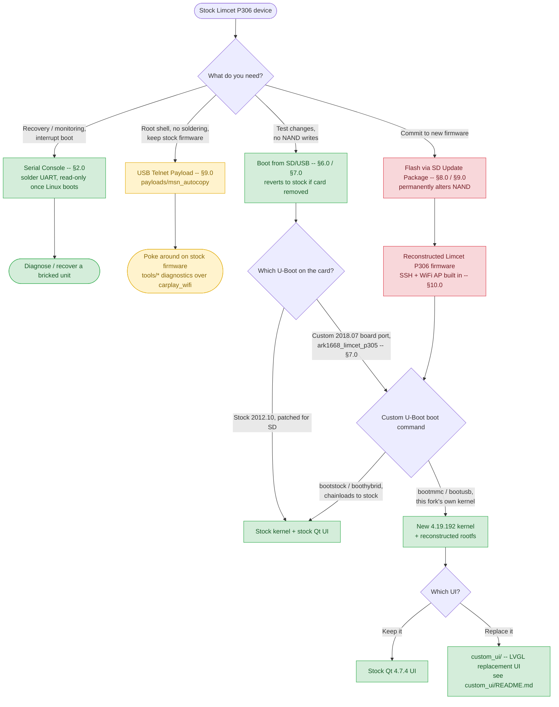

# Limcet P305 Toyota carplay & Android Auto piggy back module.

Limcet modules are available fairly cheaply through AliExpress and add support for android auto and carplay to the existing factory head unit. They work reasonably well but there is limit information avaliable on how they work or how to update.

Following a falled updated,this repo was developed to test device and identify how it operates. Serial access allow for dumping of the original partitions then the Holden firmware was flashed to the device via SD card and found to the work. The reconstructed firmware for typically uses the Holden base as that is a more recent build with hardware-specific overrides for the display panel, product identity. 

## Choose Your Path

Four independent ways to reach the device, from lowest to highest risk/commitment. Pick the branch that matches what you're trying to do — you don't need to follow the whole chart, and the first three don't touch NAND at all.



**Legend:** 🟢 no NAND writes, reversible · 🟡 stock firmware modified in RAM/via USB, NAND untouched · 🔴 permanently alters NAND.

## Table of Contents

- [Choose Your Path](#choose-your-path)
- [1.0 Hardware](#10-hardware)
- [2.0 Serial Console (recovery / monitoring)](#20-serial-console-recovery--monitoring)
- [3.0 NAND Partition Layout](#30-nand-partition-layout)
- [4.0 Boot Sequence (stock NAND)](#40-boot-sequence-stock-nand)
- [5.0 U-Boot Prompt](#50-u-boot-prompt)
- [6.0 Booting Stock Kernel from SD Card or USB (non-destructive)](#60-booting-stock-kernel-from-sd-card-or-usb-non-destructive)
- [7.0 Custom U-Boot Boot Chain (`ark1668_limcet_p305`)](#70-custom-u-boot-boot-chain-ark1668_limcet_p305)
- [8.0 Build & Flash Tool](#80-build--flash-tool)
- [9.0 Update Mechanisms](#90-update-mechanisms)
  - [Flashing via SD Card](#flashing-via-sd-card)
  - [USB Auto-Update (`payloads/msn_autocopy`)](#usb-auto-update-payloads/msn_autocopy)
- [10.0 Device Access](#100-device-access)
  - [WiFi Access Point](#wifi-access-point)
  - [SSH Access](#ssh-access)
  - [USB Networking](#usb-networking)
  - [10.1 Diagnostic & On-Device Utility Tools](#101-diagnostic--on-device-utility-tools)
- [11.0 Repository Structure](#110-repository-structure)
- [12.0 Sources](#120-sources)
- [13.0 Further Documentation](#130-further-documentation)

## 1.0 Hardware

### Limcet Board (DC_LIMCET_MB_REV_003)

The board running this firmware is a third-party **Limcet Box P306** aftermarket module, not a Toyota-made assembly — it's a piggyback module that ties into the existing factory head unit's harness and vehicle bus rather than replacing it outright. The existing factory LCD cable is connected to the board and then a second cable connects the device to the factory head unit (where the LCD cable originally connected) effectively intercepting the LCD display path.

Hardware on the device has been identified by opening the device and reviewing the board and ICs.

| Component | Part | Role |
|-----------|------|------|
| SoC | ARK1668 (die marking; ARK1680 in firmware/software — same device) ARK1680 (ARM Cortex-A5) | Main applications processor |
| Video decoder | Hantro `hx170dec` (on-SoC IP block, VDEC0 @ `0xe0900000`) | Hardware H.264 decode for Android Auto/CarPlay video — `/dev/hx170dec`, driven via `libmfc.so` (see `tools/hx170-test/`) |
| GPU | Vivante GC-series (on-SoC IP block @ `0xe0f00000`, IRQ 32; exact GC model not yet identified) | 2D/3D acceleration — used on stock's 3.4 kernel too, as a loadable `galcore.ko` module (`insmod`'d from stock's own `/etc/profile`, not compiled into the kernel image); confirmed working on this project's 4.19.192 kernel via its own `galcore.ko` 6.2.4.p1.8 + a matched `libGAL.so` (see `docs/AUDIO_SUBSYSTEM_INVESTIGATION.md`, `docs/DISPLAY_SUBSYSTEM.md`) |
| USB controller | MUSB (on-SoC, dual-port: `usb0`/`usb1`) | Host/gadget — `usb0` is the board's only externally-facing port (CDC-NCM to host PC at `192.168.7.1`, USB-stick boot, wired Android Auto); `usb1` has no external connector and is host mode purely for the onboard RTL8811CU WiFi chip; port role is boot-command-dependent (see §7.0) |
| MMC/SD controller | Synopsys DesignWare `dw-mshc` (MMC0 @ `0xec400000`, MMC1 @ `0xec800000`) | MMC0 = SD card slot, confirmed working (`mmc0: new SD card`); MMC1's DTS comment calls it "SDIO WiFi Controller" but this is confirmed wrong — the real WiFi chip enumerates on USB (`usb1`), not SDIO — MMC1's actual role is unconfirmed |
| UARTs | 6× on-SoC UART (`UART0`–`UART5`) + hsuart pair | UART0 = serial console `/dev/ttyS0` (§2.0); hsuart0 (UART4, `0xe4f00000`) = MCU link `/dev/ttyHS0`; hsuart1 (UART5, `0xe4800000`) = Bluetooth `/dev/ttyHS1`; a second, unexplained port `/dev/ttyS2` (4800 baud) carries real framed traffic to an unidentified peripheral (see `docs/MCU_ADAPTERS.md`) |
| NAND | Toshiba TC58BVG0S3HTA00, 128 MB SLC | Firmware/rootfs storage, on a soldered daughter module (the "Limcet Box" compute module) |
| MCU | STM32F105RBT6 (ARM Cortex-M3) | Vehicle-side I/O — CAN bus, touch/button/reverse/ACC-IGN signals — talks to the ARK1668 over `/dev/ttyHS0` |
| CAN transceiver | NXP TJA1042 | Bridges the MCU's CAN controller to the vehicle CANH/CANL lines |
| Bluetooth module | Feasycom FSC-BT8251 V1.1 (Realtek RTL-series BT SoC) | HFP/A2DP/AVRCP/iAP2, over `/dev/ttyHS1` at 1.5Mbps; enable pin `gpio91` |
| WiFi chip | Realtek RTL8811CU — confirmed via boot log across every available capture, no exceptions (`rtl8811cu` driver messages immediately after `usb 2-1: new high-speed USB device`) | Onboard, internally wired to `usb1` (no external connector on that port) — software AP only (`hostapd`), for Android Auto/CarPlay wireless, does not connect to external networks |
| Rear camera decoder | RN6752 | CVBS composite → ITU-656 digital video for the reversing camera feed |
| Audio DAC/ADC | ARK1668 on-SoC sigma-delta DAC (`ark_sddac`) + ADC (`ark_sdadc`), I2S1 @ `0xe4000000` (DAC) / `0xe8200000` (ADC) | The real, confirmed-only playback/capture path (stock's own `aplay -l`: `card 0: ARKSDDAC [ARK-SDDAC]`). A 2026-07-16 theory that playback instead routed through an external Cirrus Logic CS4334 chip was investigated and reverted — `cs4334_*` disassembles to no-op stubs in stock's own kernel, i.e. a vestigial board-file dai-link with no real chip behind it, not a second physical DAC (see `docs/AUDIO_SUBSYSTEM_INVESTIGATION.md`) |
| Audio IC | Rohm BD37033FV | 5.1-ch digital sound processor (volume/mixing/EQ, downstream of the DAC above), I2C bus 2 @ `0x40` — chip does not appear to respond: `bd37033_write_byte timeout` confirmed via `dmesg` on both stock and this project's firmware, root cause not fully resolved (see `docs/BD37033.md`, `docs/AUDIO_SUBSYSTEM_INVESTIGATION.md`) |
| Display adapter | DC_FUJITSU_CON96P_REV_002 (interposer) | Adapts the main board's edge connector to the LCD panel's 96-pin Fujitsu FPC |
| LCD Display | 800×480 RGB888 | Part of the factory head unit |

**Connecting to the existing car wiring:**

- A multi-pin wiring harness is used to intercept the existing harness and connect some of the wiring to the Limcet board. 
- Steering wheel controls are not believed to be read via an ADC voltage divider on a dedicated SWC wire, despite the `EnableSWCSwitchHardware` option in the ARK1668 config. The STM32F105 MCU instead decodes Toyota-specific messages directly off the vehicle's **CAN bus** (through the TJA1042 transceiver) and forwards translated key events to the ARK1668 over UART.
- The reversing camera connects as a standard CVBS composite feed, decoded by the RN6752 into digital video for the SoC. It's believed that this route is used for early camera loading (with 2s of boot) while the rest of the system is still initialising.

Full teardown details and board photos are in `hardware/BOARD_ANALYSIS.md` (linked below).

### Software

The device runs two distinct software stacks depending on which boot path is active (see [Choose Your Path](#choose-your-path) above): the stock 3.4-kernel firmware as shipped, and this project's own 4.19.192 port. Most of the userspace binaries/libraries are reused unmodified between the two — only the kernel, bootloader, and a handful of matched driver/library pairs actually differ.

| Component | Stock | This Project |
|-----------|-------|---------------|
| Product identity | `ProductId=Limcet-P306` (`MsnProductInfo.ini`) | unchanged |
| Boot ROM | SoC mask ROM, fixed-function, not user-modifiable — loads `Nboot` from NAND `0x000000` | unchanged |
| S-Loader — Nboot | `Nboot.bin`, 128 KB, NAND `0x000000` (MTD0) — proprietary, closed source | unchanged — **never flash via SD**, corruption bricks the board and requires JTAG to recover |
| S-Loader — Stepldr | `Stepldr.bin` — proprietary, closed source; initializes DDR3, checks the SD card FAT32 partition (p1) for `UBOOT.BIN` before falling back to NAND `0x020000`, and validates a 96-byte ARK header (magic `0x12345678`) before accepting any U-Boot binary | unchanged — the same binary chainloads both stock and this project's custom U-Boot; the header is injected into the custom build via `build_tools/inject_ark_header.py` so Stepldr accepts it |
| Bootloader | U-Boot 2012.10 — proprietary board port, closed source | U-Boot 2018.07 — `ark1668_limcet_p305` board port, built from `linux-arkmicro` source (§7.0) |
| Kernel | Linux 3.4.0 | Linux 4.19.192, built from `linux-arkmicro` source |
| Root filesystem | BusyBox 1.25.0-based | BusyBox 1.30.1, rebuilt from source (~390 applets, incl. `/sbin/init`) |
| UI framework | Qt 4.7.4 (QWS + DirectFB/fbdev), closed-source `MsnCoreApp` | stock UI runs unmodified on the new kernel; optional replacement: [`custom_ui/`](custom_ui/README.md) (LVGL-based, open source) |
| Main application | `MsnCoreApp` — head-unit UI, settings, USB auto-copy mechanism | unchanged (stock binary reused) |
| GPU driver/lib | `galcore.ko` + `libGAL.so` (Vivante, vendor-shipped) | `galcore.ko` 6.2.4.p1.8 + matched `libGAL.so`, rebuilt for 4.19.192 |
| Video decode | `libmfc.so` (Hantro `hx170dec` userspace API) | unchanged |
| Audio control | `libMsnSound.so` (`Sound_BD37033`/`Sound_PT2312`/`Sound_MCU` backends, selected via `SoundType`) | unchanged |
| MCU protocol | `libMcuCenter.so` (`McuType=6`, `MCUAdapter_BoxP300`, over `/dev/ttyHS0`) | unchanged |
| CAN adapter SDK | `libCanBus.so` — multi-vendor CAN decoder-box SDK; unused on this device (`CanType=0`, decoding done by the MCU instead) | unchanged |
| Bluetooth stack | `rtkbt` userspace stack (Realtek), over `/dev/ttyHS1` | unchanged |
| WiFi AP | `hostapd` + `udhcpd`, SSID `carplay_wifi` | unchanged |
| Remote access | none — serial console is receive-only once Linux boots | SSH (`/usr/bin/sshd`, OpenSSH 4.6p1) + USB CDC-NCM networking baked in; telnet available on stock too via the USB auto-copy payload (§9.0/§10.0) |

**Documentation:**

- [`hardware/BOARD_ANALYSIS.md`](hardware/BOARD_ANALYSIS.md) — board/component teardown (SoC, NAND, BT, MCU, CAN bus), with photos in the same folder.
- [`docs/SOURCES.md`](docs/SOURCES.md) — provenance of every file in this repo.
- [`docs/PARTITION_LAYOUT.md`](docs/PARTITION_LAYOUT.md) — NAND offsets, sizes, flash commands (see also [NAND Partition Layout](#30-nand-partition-layout) below).
- [`docs/historical/SD_BOOT_PLAN.md`](docs/historical/SD_BOOT_PLAN.md) — historical SD-boot planning doc, superseded by [Booting from SD Card or USB](#50-booting-from-sd-card-or-usb-non-destructive) below.

### Ways to access the device

Four ways to reach the device in the stock firmware:

| Method | Use for | Details |
|--------|---------|---------|
| Serial console | Recovery, monitoring, interrupting boot, low risk | [Serial console, requires physical access and soldering](#20-serial-console-recovery--monitoring) |
| Boot UBOOT from SD | Testing changes without touching NAND (low risk) | [Booting from SD Card or USB](#50-booting-from-sd-card-or-usb-non-destructive) |
| Update payload to enable telnet) via USB Drive | Using the auto update function,a modified file can be side loaded onto the device to enable telnet access via the existing carplay wifi.(medium risk)| [Device Access](#100-device-access) |
| Update package (flashes internal NAND) via SD | Permanently updating firmware on the unit (high risk)| [Flashing via SD Card](#90-flashing-via-sd-card) |

## 2.0 Serial Console (recovery / monitoring)

Connect via the UART header near the SD card slot. See the photos in the hardware Folder. Serial Settings: **115200 8N1**.

Colours of the attached wires and corresponding pin:
| Pin | Color |
|-----|--------|
| TX | Yellow |
| RX | Blue |
| GND | Black |

A generic USB-serial adapter (e.g. PL2303) or Raspberry Pi GPIO UART can be used to read the serial lines. A header or wiring can be soldered to the used pins on the board. The solder mask may need scraping to expose the metal for solder to adhere.

In stock configuration, the console output is available over serial through both U-Boot and the Linux kernel (boot log, `dmesg`, kernel messages). Keystroke input, however, only works at the U-Boot prompt. Once Linux has booted, the serial line is view-only, with no login shell or interactive input on it as the system doesn't load an interactive console by default. Refer to telnet payload for details on how to active a terminal using the existing wifi.

**Connecting via USB-serial adapter (Windows / PuTTY):**

1. Plug in the USB-serial adapter (e.g. PL2303) and note its COM port from Device Manager (Ports (COM & LPT)) — install the adapter's driver first if it doesn't show up.
2. Open PuTTY, set **Connection type** to `Serial`.
3. **Serial line**: the COM port from step 1 (e.g. `COM5`).
4. **Speed**: `115200`.
5. Under Connection → Serial, confirm **Data bits** `8`, **Stop bits** `1`, **Parity** `None`, **Flow control** `None`.
6. Click **Open**.

**Connecting via Raspberry Pi:**
```
minicom -D /dev/ttyS0 -b 115200
```
or 

```
picocom -D /dev/ttyS0 -b 115200
```

### U-Boot Console

To interrupt U-Boot and drop to the prompt: hold the spacebar continuously from the moment power is applied and keep holding until you see the `ark#` prompt.


`bootdelay=9` is read from the NAND env and printed in the message, but there is no countdown or sleep — the `%2d` is cosmetic. After the printf, there is one `tstc()` poll and then Linux boots immediately. You must already be holding space when that poll fires.

Access to the u-boot console can provide interface for dumping firmware, read env config or manually loading a different kernel.

### Kernel Console

Once U-Boot hands off, the same serial UART carries the Linux kernel's boot log and `dmesg` output — enabled via the `console=ttyS0,115200n8` kernel bootarg (see [Boot Sequence](#40-boot-sequence-stock-nand) below). This is receive-only, as noted above: there is no login shell or interactive input on this console once Linux is running. It's still the fastest way to see what's happening early in boot — e.g. checking which WiFi driver bound to `wlan0` (see [WiFi module detection](#wifi-module-detection)) or diagnosing a hang before userspace and SSH come up.

The same serial console is active during SD/USB boot and can be interactive if modifications have been made to the rootfs. A framebuffer Console output to the LCD was tried but not successful - see [Console on screen](#console-on-screen).

## 3.0 NAND Partition Layout

| Partition | Start | Size | Contents |
|-----------|-------|------|----------|
| S-Loader | `0x000000` | 128 KB | Nboot (do NOT update via SD) |
| U-Boot | `0x020000` | 512 KB | 2nd-stage bootloader |
| U-Boot_back | `0x0A0000` | 512 KB | U-Boot backup slot |
| U-Boot-Env | `0x120000` | 256 KB | U-Boot environment variables |
| arkdata | `0x160000` | 256 KB | Display / TvoutType config |
| kernel | `0x1A0000` | 4 MB | Linux 3.4.0 zImage |
| rootfs | `0x5A0000` | 106 MB | Root filesystem (UBIFS/UBI) |
| userdata | `0x6FA0000` | 6 MB | User settings / BT pairs (UBI) |
| bootlogo | `0x75A0000` | 512 KB | Boot splash screen |
| bootanimation | `0x7620000` | 3 MB | Boot animation |
| reversingtrack | `0x7920000` | 3 MB | Reversing-camera guide-line overlay |
| Unicode | `0x7C20000` | 256 KB | Unicode font data |

**Known bad block at 0x5FA0000** — inside the rootfs partition. `nand scrub` handles this automatically.

See also [`docs/PARTITION_LAYOUT.md`](docs/PARTITION_LAYOUT.md) for the same data plus flash commands.

## 4.0 Boot Sequence (stock NAND)

This is the default factory boot sequence:
1. **S-Loader (Nboot / Stepldr)** — executes from ROM; checks the SD card FAT32 partition (p1) for a `UBOOT.BIN` file and loads that in preference if present, otherwise loads U-Boot from NAND `0x020000` (see [Booting from SD Card or USB](#50-booting-from-sd-card-or-usb-non-destructive))
2. **U-Boot** — initialises hardware; loads NAND env from `0x120000` (CRC valid — `bootdelay=9`, `bootcmd=run nandboot`, `nandboot`, `setbootargs` etc. all active)
3. **SD update check** — inspects the SD card FAT32 partition for `UpConfig`; if present, runs `arkupdate` to flash partitions listed in the `update` script
4. **Single keypress poll** — prints `Press space key to stop autoboot:  9`, then one `tstc()` check with no delay; if spacebar already held, drops to `ark#` interactive shell; otherwise boots immediately
5. **`runs nandboot`** — executes `nandboot` from NAND env: `run setbootargs; bootnand`
   - `setbootargs` → `setenv bootargs console=ttyS0,115200n8 mem=180M ubi.mtd=6 root=ubi0:rootfs rootfstype=ubifs rootwait ro`
   - `bootnand` → custom compiled-in command: `nand read 0x1000000 <kernel_offset> <kernel_size>; bootz 0x1000000`
6. **Linux 3.4.0** hands off to kernel and starts Linux loading process.

## 5.0 U-Boot Prompt

Holding the interrupt key (see [Boot Sequence](#40-boot-sequence-stock-nand) above) drops you into `ark#`, U-Boot's interactive shell.

### Boot commands

Selected commands relevant to this device — type `help` at the `ark#` prompt for the full command list built into this U-Boot.

Two specific commands that are useful:

| Command | Effect |
|---------|--------|
| `run nandboot` | Boots the stock NAND firmware_source/kernel/rootfs — `run setbootargs; bootnand` (default `bootcmd` on stock NAND, see [Boot Sequence](#40-boot-sequence-stock-nand)) |
| `usb start` | Initialises the USB host controller — run this first to confirm USB works before attempting to boot from USB |

The stock U-Boot has a **custom boot loop** — disassembly of the binary (`TEXT_BASE=0x00030000`, function at `0x0003cf3c`) confirms the mechanism:

```
env_get("bootdelay")   → r4 = 9   (from NAND env — value is real but doesn't work)
env_get("bootcmd")     → r5 = "run nandboot"
printf("Press space key to stop autoboot: %2d", r4)  ← 9 is cosmetic only
tstc()                 → ONE keypress poll, no sleep
  space held → readline("> ") loop  (ark# interactive shell)
  no key     → run_command("run nandboot")  ← immediate boot
```

### Manual partition flash - DANGER HIGH RISK

At the `ark#` prompt you can manually flash any partition — this example loads a kernel image from the SD card and writes it to the kernel partition (see [NAND Partition Layout](#30-nand-partition-layout) for the offsets of other partitions):

```
fatload mmc 0 4000000 zImage
nand scrub 0x1a0000 0x400000 0x1a0000 0x400000
nand write 0x4000000 0x1a0000 ${filesize}
```

The built in update function used a similar update mechanism to deploy the SD update packages to each NAND partition.

## 6.0 Booting Stock Kernel from SD Card or USB (non-destructive)

| Method | Auto or manual | NAND writes | Status |
|--------|----------------|-------------|--------|
| [Manual SD Card Boot](#manual-sd-card-boot) (section 8.0) | Manual — retyped every boot | None | **Confirmed working: fatload kernel from MMC works but loading of rootfs from MMC is not supported because the MMC drivers are not compiled into the kernel** |
| [U-boot patching](#self-contained-sd-auto-boot-env-relocation) (below) | Automatic | None | **Confirmed working end-to-end on real hardware (hybrid boot with zImage_stock)** |
| [Manual USB boot](#usb-boot) (below) | Manual — retyped every boot | None | **Confirmed working: fatload kernel from USB works but loading of rootfs from MMC is not supported because the MMC drivers are not compiled into the kernel** |

Reflashing NAND for every kernel or rootfs change (see [Flashing via SD Card](#90-flashing-via-sd-card)) is slow. A bad image can also leave the device unbootable, with only a single-keypress recovery window (see [Boot Sequence](#40-boot-sequence-stock-nand)).

**SD card layout:**

| Partition | Filesystem | Contents |
|-----------|-----------|---------|
| p1 | FAT32 | `zImage`, plus `UBOOT.BIN` if using [Self-contained SD auto-boot](#self-contained-sd-auto-boot-env-relocation) |
| p2 | ext4 | rootfs (`/`), plus `/nanddata/` — see below |
| p3 | ext4 | userdata (`/data`) |

### ext4 filesystem constraints (3.4 kernel / U-Boot 2012.10)

The target runs **Linux 3.4.0** and **U-Boot 2012.10**, whose ext4 drivers
predate two features that modern `mkfs.ext4` (e2fsprogs ≥ 1.43, ~2016) enables
**by default**:

| Feature | Enabled by default by modern mkfs | Supported by Linux 3.4 / U-Boot 2012.10 |
|---------|-----------------------------------|-----------------------------------------|
| `64bit` | yes | **no** (kernel support added in 3.6) |
| `metadata_csum` | yes | **no** (kernel support added ~3.18) |

If either is left on, the results are:

- **Kernel:** refuses to mount root — `EXT4-fs (mmcblk0p2): couldn't mount because
  of unsupported optional features` — and the boot dies right after the rootfs
  device appears (well after `Starting kernel …`).
- **U-Boot:** `ext4ls` / `ext4load` fail with `Failed to mount ext2 filesystem…
  ** Bad ext2 partition or disk **` (it may misreport the partition as `0:1`).

**Fix — format the Linux partitions with those two features stripped:**

```sh
mkfs.ext4 -O ^64bit,^metadata_csum -L rootfs   /dev/sdX2
mkfs.ext4 -O ^64bit,^metadata_csum -L userdata /dev/sdX3
```

All the remaining ext4 features 3.4 *does* support (`extents`, `flex_bg`,
`huge_file`, `dir_nlink`, `extra_isize`, `sparse_super`, …) stay enabled, so you
keep ext4 proper — only the incompatible checksums/64-bit addressing are removed.
`build_bootable_sdcard.sh` applies this automatically (both at format time and in
the on-device factory-reset reformat). To audit an existing card or image, check
the superblock with `dumpe2fs -h /dev/sdX2 | grep 'Filesystem features'` — neither
`64bit` nor `metadata_csum` should be listed.

### Manual SD Card Boot

Manually booting an SD card image is possible but is challenging as the stock 3.4 kernel doesn't have the MMC drivers compiled in (they are external module) meaning that a filesystem can't be loaded from MMC during early boot. support for initramfs is also disabled in the stock kernel. Booting kernel from SD fat partition is possible but loading the file system the filesystem is the problem.

At the `ark#` prompt, with an SD card containing `zImage` on a FAT32 partition (p1) and an ext4 rootfs on a second partition (p2) — formatted without `64bit`/`metadata_csum`, see [ext4 filesystem constraints](#ext4-filesystem-constraints-34-kernel--u-boot-201210):

```
setenv bootargs console=ttyS0,115200n8 console=tty0 mem=180M root=/dev/mmcblk0p2 rootfstype=ext4 rootwait rw
fatload mmc ${mmcdev}:1 ${loadaddr} ${bootfile}
bootz ${loadaddr}
```

`${mmcdev}`, `${loadaddr}`, and `${bootfile}` are already defined in the device's real NAND env (`mmcdev=1`, `loadaddr=0x1000000`, `bootfile=zImage` — see `firmware_source/env/uboot-env.txt`), so nothing needs to be `setenv`'d for those. This has to be re-typed every boot — it isn't saved to NAND env (no `saveenv` is run), so the stock boot behavior is unaffected.

### Self-contained SD auto-boot (env relocation & hybrid boot)

**Confirmed working end-to-end on real hardware.** See [`docs/UBOOT_REVERSE_ENGINEERING.md`](docs/UBOOT_REVERSE_ENGINEERING.md) §10 for the full writeup.

Auto-boots from SD with **zero NAND writes of any kind**, preserving stock NAND fallback if the SD card is removed.

**The idea:** The stock `uboot.bin`'s compiled-in env has only ~52 bytes of safe space — nowhere near enough for custom boot commands. We relocate the default env into free image zero-space below `__bss_start` (`0x51161`), repoint internal literals, and update `himport` size immediates.

Combined with `--patch-nand-offset` (forces the real NAND env's CRC to fail so U-Boot falls back to the relocated default env) and placing the patched binary on the SD card (Stepldr already prefers SD over NAND), **all bootloader modifications live safely on the SD card**.

Generated via guided interactive tool:

```bash
python3 build_tools/patch_uboot_env.py
```

The interactive menu features:
- Single-keypress default path acceptance (`firmware_source/mtd1-mtd2_uboot/uboot.bin`)
- Preset selection: Hybrid Boot (`hybrid`), Drop to Console Prompt (`ubootconsole`), or Pure SD Boot (`sdboot`)
- Pre-flight confirmation box reviewing all parameters prior to patching
- Header banner version string patching (`U-Boot 2012.10 (hybrid YYYY-MM-DD HH:MM:SS)`)
- Automatic copying of stock kernel (`zImage`) to `sd_bootable/zImage_stock`

**SD card contents for Hybrid Boot:**

| Source file | Filename required on SD card | Partition | Notes |
|-------------|-------------------------------|-----------|-------|
| `sd_bootable/uboot_hybrid.bin` | `uboot_hybrid.bin` (or `UBOOT.BIN`) | p1 (FAT32) | Patched U-Boot (relocated env + NAND CRC invalidation) |
| `firmware_source/mtd5_kernel/zImage` | `zImage_stock` | p1 (FAT32) | Stock 3.4 kernel loaded by hybrid U-Boot |
| NAND partition 6 | — | NAND MTD 6 (`ubi0:rootfs`) | Stock NAND rootfs mounted by hybrid U-Boot |
| rootfs tree | — (copied as the partition's directory contents, not a single file) | p2 (ext4) |

### Building the SD image with `build_bootable_sdcard.sh`

`build_bootable_sdcard.sh` assembles the full bootable SD image (or writes directly to a block device): patches its own auto-detected U-Boot source via `build_tools/patch_uboot.py`, partitions and formats p1/p2/p3, syncs the rootfs and userdata trees, patches `rcS` on the p2 copy only (the source tree is never modified), and populates `/nanddata/` (see below). Output lands in `sd_bootable/` (gitignored).

> **U-Boot patching here is the same untested-on-hardware patch as [Self-contained SD auto-boot](#self-contained-sd-auto-boot-env-relocation) above** — the "Patch U-Boot for SD boot" toggle below now uses the env relocation method (safe on a raw/Holden-derived `uboot.bin`, avoiding the 52-byte compiled-in space limitation). Statically verified, not yet booted on real hardware — if it doesn't work, toggle U-Boot patching off (or pass `--uboot PATH`) and rely on [Manual SD Card Boot](#manual-sd-card-boot) (section 8.0) instead.

It uses the same interactive menu as `build_update.sh` — arrow keys move the highlighted row, Space/Enter toggles it, `a`/`n` select/deselect all, `g` builds, `q` quits:

```bash
sudo bash build_bootable_sdcard.sh
```

```
  ARK1680 Limcet P306 — Bootable SD Card Builder
  ────────────────────────────────────────────────────────
  BUILD OPTIONS
  ▶ [X]  Patch U-Boot for SD boot
    [X]  Patch NAND env offset redirect
    [X]  Include userdata (p3)
    [X]  Redirect bootlogo/bootanimation/etc to SD

  SD IMAGE CONTENTS  → sd_bootable/sd_boot.img
       Part Item                   File             Status
       p1   U-Boot                 uboot.bin        found
       p1   Kernel                 zImage           found
       p2   Rootfs                 rootfs           found
       p3   Userdata               userdata         found
  ────────────────────────────────────────────────────────
```

U-Boot, Kernel, and Rootfs aren't independently toggleable — they're required for a bootable image, and the build refuses to proceed if any is missing. Only the four **BUILD OPTIONS** are selectable; Userdata's inclusion follows the "Include userdata (p3)" toggle above.

"Redirect bootlogo/bootanimation/etc to SD" controls the `/nanddata/` symlink patch described [below](#runtime-nand-partition-data-nanddata): on (default) symlinks mtd8–11 to files on the SD card, off leaves `/dev/mtd8`–`/dev/mtd11` reading whatever's already in NAND — useful when testing a change without needing real dumps of those partitions.

Paths and sizes stay CLI-flag-only (the menu doesn't do free-text editing): `--image PATH` / `--device PATH` (output target, default `sd_bootable/sd_boot.img`), `--size MB` (default 512), `--uboot PATH` (use a prebuilt `UBOOT.BIN` as-is, skip patching), `--uboot-src` / `--kernel` / `--rootfs-dir` / `--userdata-dir` (override auto-detected paths), `--root DEVICE` (root device baked into the generated boot script's `bootargs`, default `/dev/mmcblk0p2`), `--no-mtd-redirect` (equivalent to toggling the fourth option off), `--non-interactive` (skip the menu, use flags/autodetected values as-is — needed for `--device`), `--dry-run`. Run with `--help` for the full list.

Requirements — `parted`, `mkfs.fat` (dosfstools), `mkfs.ext4` (e2fsprogs), `losetup` (util-linux), `rsync`, `python3` — are checked at startup, same as `build_update.sh`'s requirements check (plus `mtd-utils` if also building rootfs/userdata images via [Build & Flash Tool](#80-build--flash-tool)).

### `/data` mount on SD boot

The rootfs `rcS` copy on p2 is patched to try SD userdata first, falling back to the original NAND paths so the same rootfs image still boots correctly from NAND:

1. Try `mount -t ext4 /dev/mmcblk0p3 /data` (SD userdata)
2. Fall back to NAND UBIFS (`ubiattach` mtd7), then NAND yaffs2, matching the original stock `rcS` logic
3. `factory_reset=1` reformats whichever `/data` is currently active (SD ext4 or NAND UBI) and clears the flag

### Runtime NAND partition data (`/nanddata/`)

Four MTD partitions (bootlogo, bootanimation, reversingtrack, Unicode) are read by the running app via `/dev/mtdN` character devices but are not part of the rootfs or userdata images. A search of all rootfs binaries for MTD ioctls (`MEMGETINFO`, `MEMERASE`) found none of them are called on these partitions — access is plain `open()`/`read()` — so a regular file works as a transparent replacement for the character device.

`build_bootable_sdcard.sh` copies these into `/nanddata/` on p2 when the "Redirect bootlogo/bootanimation/etc to SD" build option is on (default; `--no-mtd-redirect` or toggling it off in the menu leaves `/dev/mtdN` reading whatever's already in NAND instead, and skips populating `/nanddata/` entirely):

| MTD | Partition | Source file | Status |
|-----|-----------|--------------|--------|
| 8 | bootlogo | `mtd8_bootlogo/bootlogo` | Dumped (31 KB used of 512 KB) |
| 9 | bootanimation | `mtd9_bootanimation/bootanimation` | Placeholder — erased during Holden flash, no dump yet |
| 10 | reversingtrack | `mtd10_reversingtrack/reversingtrack` | Dumped (1.2 MB, RSTK format — see below) |
| 11 | Unicode | `mtd11_unicode/unicode` | Placeholder — no dump yet |

The patched `rcS` replaces each `/dev/mtdN` node unconditionally after `mdev -s`:

```sh
for mtdmap in "8:bootlogo" "9:bootanimation" "10:reversingtrack" "11:unicode"; do
    num="${mtdmap%%:*}"; name="${mtdmap##*:}"
    rm -f /dev/mtd${num}
    ln -sf /nanddata/${name} /dev/mtd${num}
done
```

To replace a placeholder once a real dump is obtained (via serial console: `dd if=/dev/mtd9 of=/tmp/bootanimation`), drop the file into the matching `mtd*_*/` folder under `firmware_source/prado_reconstructed/` and rebuild the image.

**RSTK format (reversingtrack):** the reversing-camera guide-line overlay file is a custom container — 4-byte magic `"RSTK"`, file size, entry count (41), steering-position count (100), image dimensions (800×480), guide-line zone parameters, then a 41 × 20-byte index table (`index, index, file_offset, compressed_size, flag`) followed by 41 zlib-compressed overlay images. The 41 frames span full-left to full-right steering angles; frame sizes form a bell curve (31 KB at the extremes, 17 KB at centre) consistent with symmetric guide-line geometry compressing better near centre. The app decompresses the frame matching the current steering angle and composites it over the camera feed.

### USB boot

USB mass storage is compiled in (MUSB HCD). **Unverified on Limcet P306 hardware** — run `usb start` at the U-Boot prompt to confirm the host controller and GPIO assignments work on your unit before relying on this.

At the U-Boot prompt:

```
usb start
fatload usb 0:1 0x1000000 zImage
setenv bootargs "console=ttyS0,115200n8 console=tty0 mem=180M root=/dev/sda2 rootfstype=ext4 rootwait rw"
bootz 0x1000000
```

**USB drive layout:**

| Partition | Filesystem | Contents |
|-----------|-----------|---------|
| p1 | FAT32 | `zImage` |
| p2 | ext4 | rootfs |

The kernel sees the USB drive as `/dev/sda`. The ARK1668 uses MUSB (not EHCI) — USB 2.0 drives work; USB 3.0 drives that require USB 3.0 speeds will not enumerate.

## 7.0 Custom U-Boot Boot Chain (`ark1668_limcet_p305`)

Everything in sections 4.0–6.0 above describes the **stock or stocked & patched binary**  of this project. Since then, a full custom U-Boot board port (`ark1668_limcet_p305`, U-Boot 2018.07, compiled from `linux-arkmicro` source — not a patched stock binary) has been built up and is now the actively developed path. This section documents its current, confirmed-working state. Full technical/RE detail: [`docs/historical/HANDOFF_nand_ecc_uboot_vs_kernel.md`](docs/historical/HANDOFF_nand_ecc_uboot_vs_kernel.md), [`docs/UBOOT_REVERSE_ENGINEERING.md`](docs/UBOOT_REVERSE_ENGINEERING.md), and [`docs/UBOOT_BUILD_GUIDE.md`](docs/UBOOT_BUILD_GUIDE.md).

**Build u-boot from source:**
A custom working u-boot has been built from source and replicated the functionality of the original uboot with the benefit of additional commands and boot options. The main limitation of the new uboot build is that is can't boot the original stock kernel (reason unknown) and instead boots stock by chainloading the stock uboot binary which then loads the stock kernel.

**Boot Chain Constraints:**
The boot sequence is `ROM -> Nboot -> Stepldr -> UBOOT.BIN`. Critically, `Stepldr` initializes DDR3. The custom U-Boot must use `CONFIG_SKIP_LOWLEVEL_INIT` to avoid re-initializing DDR and hanging the system. Additionally, the stock binary relies on a proprietary 96-byte header with a `0x12345678` magic value. This header is injected post-build using `build_tools/inject_ark_header.py` so `Stepldr` accepts it.

**Bootlogo:** 
The original bootlogo used a hardware JPEG decoder (`jpeghw`). Since this driver isn't ported to the open-source U-Boot, the custom U-Boot displays a raw framebuffer (`bootlogo.raw`) via `ark_show_bootlogo()` loaded from the SD card.

**Build tree:** `/home/osboxes/Downloads/linux-arkmicro/u-boot` (separate git repo from this one — see that repo's own history for board-port commits).

| Command | Effect | Status |
|---------|--------|--------|
| `bootmmc` | Kernel+DTB from SD (`kernelfile`/`dtbfile` env vars), rootfs on SD (`mmcroot`, default `/dev/mmcblk0p2`) | **Confirmed working** |
| `bootusb` | Kernel+DTB+rootfs all from USB (`usbroot`, default `/dev/sda2`) — needs a two-partition USB stick, FAT (p1, `zImage`+DTB) + ext4 (p2, rootfs), same layout as the SD card. `rcS`'s userdata mount also follows the actual root device (see [`build_bootable_sdcard.sh`](#build_bootable_sdcardsh--current-capabilities) below), so `/data` lands on `/dev/sda3` too | Kernel-load-from-USB confirmed working; the `root=`/userdata device-following fix is newly built, not yet hardware-tested |
| `boothybrid` | Chainloads `uboot_hybrid.bin` from SD card (`hybridubootfile` env var, default `uboot_hybrid.bin`), which loads custom kernel `zImage_stock` from SD FAT partition 1 and mounts stock NAND rootfs (`ubi0:rootfs`) | **Confirmed working end-to-end** |
| `bootstock` | Chainloads the real stock U-Boot 2012.10 binary from an SD file (`stockubootfile`, default `uboot_stock.bin`), which then boots the stock kernel+rootfs+**full UI** from NAND with its own driver | **Confirmed working end-to-end** |
| `bootstockusb` | Same as `bootstock`, stock U-Boot binary sourced from USB instead of SD — NAND is still where the firmware_source/kernel/rootfs come from either way, USB/SD only supplies the stock U-Boot binary itself for that one handoff | Same code path as `bootstock`, not independently hardware-tested |
| `bootnand` | Direct kernel boot from NAND using *this* fork's own NAND driver (`run nandboot`) | NAND read fixed and reliable; kernel entry itself hangs — see below |
| `nandoobcheck <offset-hex>` | Diagnostic: raw OOB dump of a NAND page, bypassing ECC/BBT interpretation | Diagnostic tool, not a boot path |
| `switchecc <0\|1\|2>` | Switch the NAND driver's ECC scheme (0=normal, 1=bootstrap, 2=this chip's real firmware_source/kernel/rootfs/bootloader format) | `switchecc 2` is what fixed `bootnand`'s NAND reads |

**Default (non-interrupted) autoboot order:** `bootusb` → `boothybrid` → `bootstock` → `run nandboot` (last resort). Import of `uEnv.txt` from the SD card happens first and can override this (or any env var) without recompiling.

**Practical recommendation:** for a fully working boot to the real stock UI right now, use `bootstock`/`bootstockusb` (or just let default autoboot reach it) — not `bootnand`, which reads NAND correctly but hangs at kernel entry for reasons not yet found (this fork's 2018.07 U-Boot handing off to the stock 3.4 kernel is unproven territory; `bootstock` sidesteps it by handing the kernel boot to the binary it was actually built against).

### NAND ECC — needs review and confirmation. 

This chip's real on-flash format for firmware_source/kernel/rootfs/bootloader-type partitions is a 1024-byte ECC step (2 segments/page), 13-byte/7-bit BCH strength, ECC bytes at OOB offset 3 — not what the original driver assumed. Confirmed by reading the `BCH_CR` register live off a *working* stock U-Boot prompt right after a real successful read. Fixed in both the U-Boot and kernel `ark_nand.c` drivers (kernel side patched in source, not yet hardware-tested). Full writeup: [`docs/historical/HANDOFF_nand_ecc_uboot_vs_kernel.md`](docs/historical/HANDOFF_nand_ecc_uboot_vs_kernel.md) §1–2.

The actual`U-boot` NAND partition itself has proven unreadable by *any* U-Boot-level tool (this driver, any ECC mode, or stock's own native `switchecc`). Stepldr reads it via a raw path that bypasses `BCH_CR`/ECC entirely, confirmed via `objdump` disassembly of the real `Stepldr.bin`. Not a bug — `bootstock`/`bootstockusb` correctly source the stock U-boot binary from a file located on the mmc or usb drive instead then load the kernel from NAND.

### `build_bootable_sdcard.sh` — current capabilities

Beyond what's described in [Building the SD image with `build_bootable_sdcard.sh`](#building-the-sd-image-with-build_bootable_sdcardsh) above (which predates this board port), the script now also:

| Flag | Effect |
|------|--------|
| `--new-uboot` (default on) / `--no-new-uboot` | Use the freshly compiled `ark1668_limcet_p305` U-Boot instead of stock |
| `--new-kernel` (default on) / `--no-new-kernel` | Use the freshly compiled Limcet P305 kernel instead of the stock 3.4 kernel |
| `--stock-uboot PATH` / `--no-stock-uboot` | Copy a stock U-Boot binary to `p1/stock_uboot.bin` for `bootstock`. Defaults to the dump already in this repo (`firmware_dumps/Prado firmware dump/mtd1-mtd2_uboot/extracted/uboot.bin`) |
| `--bootlogo PATH` | Raw 800×480×32bpp framebuffer (see `build_tools/convert_bootlogo.py`) copied to `p1/bootlogo.raw` for the compiled U-Boot's boot logo |

Diagnostic tools are no longer a build-time install step — they ship as
part of `firmware_overlay/prado/usr/bin/` (see that directory's
`README.md`), unconditionally present on every build. To skip one,
delete it from `firmware_overlay/prado/usr/bin/` directly.

All of `kernelfile`, `dtbfile`, `mmcroot`, `bootargs_common`, `stockubootfile`, `machid` are U-Boot env vars with compiled-in defaults (see [Boot commands](#boot-commands) above) — editable via `setenv` at the prompt or by dropping a `uEnv.txt` on the SD card's p1, without recompiling U-Boot or rerunning the build script.

## 8.0 Build & Flash Tool

CAUTION: this update process will permanently alter the NAND contents. Use with caution!
`build_update.sh` is an interactive terminal tool that combines building firmware images and generating a NAND flash update package staged on an SD card into a single workflow. This flashes internal NAND — it is **not** the non-destructive SD-boot image described in [Booting from SD Card or USB](#50-booting-from-sd-card-or-usb-non-destructive) (that's `build_bootable_sdcard.sh`). Run it under Linux or WSL:

```bash
bash build_update.sh
```

### Menu layout

The whole menu is one line per item — no per-item description text — so it fits a standard ~24-line terminal without scrolling. Full detail for whichever row is highlighted is shown once, on the detail line just above the command bar, instead of repeated for every row:

```
  ARK1680 Limcet P306 — Build & Flash Tool
  ────────────────────────────────────────────────────────
  BUILD
    [ ]  Build rootfs image         no image yet
    [ ]  Build userdata image       no image yet
  ▶ [ ]  Build U-Boot env image     no image yet

  NAND PARTITIONS  (staged on SD, flashed to internal NAND on boot)
         MTD  Partition              File
    [ ]  1-2  U-Boot                 uboot.bin        found ⚠
    [ ]  3    U-Boot Env             uboot-env.bin    missing - build first
    [ ]  4    Display Config         arkdata.ini      found
    [ ]  5    Linux Kernel           zImage           found
    [X]  6    Root Filesystem        rootfs.img       missing - build first
    [X]  7    User Data              userdata.img     missing - build first
    [ ]  8    Boot Logo              bootlogo         found
    [ ]  9    Boot Animation         bootanimation    found
    [ ]  10   Reversing Track        reversingtrack   found
    [ ]  11   Unicode Font           unicode          found
  ────────────────────────────────────────────────────────
  Build U-Boot env image: Compiles firmware_source/env/uboot-env.txt into uboot-env.bin (256 KB, mkenvimage)
  ↑/↓ move   Space/Enter toggle   a/n all/none   g go   q quit
```

Rows are listed in MTD numerical order (U-Boot spans mtd1 and mtd2, since the same binary is written to both the primary and backup slots).

The `▶` marker shows which row is highlighted — move it with the arrow keys; the line above the command bar always shows the description, offset, and size for that row. `rootfs.img`, `userdata.img`, and `uboot-env.bin` all have a corresponding build step above, so their missing-status hints to build first instead of just saying "missing".

**Defaults:** rootfs and userdata are selected by default. Kernel, U-Boot, arkdata, U-Boot Env, and other early-boot partitions default to off — they must be explicitly enabled to avoid accidental reflash.

### Output

Generated files land in `firmware_source/sd_update_template/output/`. Copy all files to the root of a FAT32 SD card to flash.

### Standalone scripts

The individual scripts are retained for use without the interactive menu:

| Script | Purpose |
|--------|---------|
| `build_rootfs.sh` | Build rootfs UBI image only |
| `build_userdata.sh` | Build userdata UBI image only |

### Requirements

Build steps require `mkfs.ubifs`, `ubinize` (rootfs/userdata), and `mkenvimage` (U-Boot env):

```bash
sudo apt install mtd-utils u-boot-tools   # Debian / Ubuntu / WSL
```

`build_update.sh` checks for all three on startup and prints their status before showing the menu. Missing tools only block the build steps that need them — you can still select partitions and generate the SD package without them.

`mtd-utils`, `u-boot-tools`, `parted`, `dosfstools`, `e2fsprogs`, and `util-linux` all install their binaries to `/usr/sbin` or `/sbin`, which isn't always on `$PATH` for non-root shells (WSL, non-login shells). `build_update.sh`, `build_bootable_sdcard.sh`, `build_rootfs.sh`, and `build_userdata.sh` all add `/usr/sbin:/sbin` to `$PATH` themselves, so this should be transparent — but if you see "not found" for a tool `dpkg -l` shows as installed, check `which mkfs.ubifs` / `which ubinize` / `which mkenvimage` / `which parted` / `which mkfs.fat` / `which mkfs.ext4` / `which losetup` for the actual path.

## 9.0 Update Mechanisms

### Flashing via SD Card

On power-on, U-Boot checks for a FAT32 SD card. If a file named `UpConfig` is present in the SD root, U-Boot runs `arkupdate`, which reads the `update` script and flashes each listed partition in sequence. After completion the unit reboots — remove the SD card so it doesn't re-flash. See [NAND Partition Layout](#30-nand-partition-layout) below for offsets and sizes.

### Quick start

**Step 1 — Build firmware images**

| Image | Command | Notes |
|-------|---------|-------|
| `rootfs.img` | `bash build_rootfs.sh` (Linux/WSL) | ~106 MB UBI image |
| `userdata.img` | `bash build_userdata.sh` (Linux/WSL) | ~6 MB UBI image |

**Step 2 — Generate the update script**

Use `bash build_update.sh` (see [Build & Flash Tool](#80-build--flash-tool) above) to select partitions and generate the SD package — it does the build and package generation for Steps 1–2 in one interactive session.

**Step 3 — Prepare SD card**

Format as FAT32 (max 32 GB). Copy everything from `firmware_source/sd_update_template/output/` to the SD root.

**Step 4 — Flash**

1. Power off the head unit
2. Insert the SD card
3. Power on — update progress shown on screen
4. Wait for automatic reboot (do **not** interrupt power)
5. Remove the SD card

### Manual update script

The `update` file is a plain list of partition keywords, one per line — **not** raw U-Boot commands. `arkupdate` has the NAND offsets and sizes for each keyword compiled in; the SD file never states them:

```
uboot
bootlogo
kernel
filesystem
userdata
arkdata
reversingtrack
bootanimation
```

Confirmed against the reference packages (`firmware_dumps/Holden firmware update/update`, `firmware_dumps/Prado firmware recovery holden based/update`, `firmware_source/sd_update_template/update.example` — all identical) and cross-checked against the literal `"*****Now update <name> ......"` strings compiled into `uboot.bin`. Note `filesystem` is the keyword for the rootfs partition, and `kernel` expects a file named `zImage` on the SD card, not `kernel.img` or similar — filenames must match exactly what's shown in the [NAND Partition Layout](#30-nand-partition-layout) table below.

`uboot-env` and `unicode` are deliberately left out of `build_update.sh`'s generated `update` file — neither is an independent arkupdate keyword:

- **U-Boot Env — confirmed on real hardware**: it's only flashed as a side effect of updating `uboot` itself, not addressable on its own. Matches the different compiled-in message format (`"Update U-boot-Env ......"` vs `"*****Now update X ......"` for everything above) — it's a sub-step of the uboot routine, not its own top-level keyword. Selecting U-Boot Env without also selecting U-Boot is a no-op on the device; `build_update.sh` warns about this both ways (env selected without uboot, or uboot selected without env — the latter because flashing uboot touches env regardless, so what state it ends up in without a known-good `uboot-env.bin` alongside it isn't confirmed).
- **Unicode** — mechanism still unconfirmed; no reference package includes it either.

Both stay flashable manually from the U-Boot prompt instead — see [4.0 U-Boot Prompt](#50-u-boot-prompt) above.

### Safety notes

- **Never flash S-Loader (Nboot) via SD** — corruption bricks the board (requires JTAG to recover)
- **U-Boot** writes to both primary (`0x20000`) and backup (`0xA0000`) slots with the same binary, and also touches U-Boot Env as a side effect — see above
- **userdata flash** erases all paired BT devices, call history, and user settings — recreated on first boot
- **rootfs flash** replaces the entire filesystem; bad block at 0x5FA0000 is handled automatically

### USB Auto-Update (`payloads/msn_autocopy`)

`MsnCoreApp` (the main head-unit application) has a built-in, **unauthenticated** file-drop mechanism —
almost certainly meant for factory/dealer servicing (patch the device without a full firmware reflash),
found and traced via disassembly in [`docs/UI_AND_APP_ANALYSIS.md`](docs/UI_AND_APP_ANALYSIS.md). No
password, PIN, or confirmation dialog gates it — just physically inserting the media.

**How it works:** `DiskDeviceWatcher::mountDiskPartition()` runs automatically whenever the device
auto-mounts a newly inserted USB drive or SD card (the same hotplug flow used everywhere else in this
project). If a folder named exactly `payloads/msn_autocopy` exists at the root of that media, it runs:

```
mount -o remount,rw / && cp -rf <mountpath>payloads/msn_autocopy/* /
```

| | |
|---|---|
| **Copies from** | `payloads/msn_autocopy/` at the root of the inserted USB drive or SD card |
| **Copies to** | `/` — the live root filesystem (the `rootfs` UBIFS partition, see [§9.0 NAND Partition Layout](#30-nand-partition-layout)), remounted read-write for the operation |
| **Trigger** | Automatic, on normal disk auto-mount — no button press, no menu, no confirmation prompt |
| **Runs as** | root (the whole userspace already runs as root on this device) |

**Practical use:** put a folder named `payloads/msn_autocopy` at the root of a USB drive or SD card, with any
files inside it laid out exactly as they should land under `/` (e.g. `payloads/msn_autocopy/usr/bin/whatever`
lands at `/usr/bin/whatever`), insert it, and the device copies them in on its own the moment it
auto-mounts the media. No SSH, no serial console, no U-Boot interrupt needed.

**Not confirmed:** the exact runtime mount-point path the device assigns to inserted media (e.g. whether
it's a fixed `/media/`-style prefix or something else) — `<mountpath>` above is whatever
`DiskDeviceWatcher` resolves it to at mount time, not independently verified against a live device in
this pass. The destination (`/`, the real rootfs) and the trigger condition (folder named `payloads/msn_autocopy`
present) are both confirmed directly from the binary's disassembly, not inferred.

See [`docs/UI_AND_APP_ANALYSIS.md`](docs/UI_AND_APP_ANALYSIS.md) for the full disassembly trace and
[`docs/SECURITY_REVIEW.md`](docs/SECURITY_REVIEW.md) for this project's broader credential/access-path review.

**Ready-to-use payload:** [`payloads/msn_autocopy/`](payloads/msn_autocopy/) contains a pre-built `payloads/msn_autocopy/etc/rc.d/rcS`
— stock's own dumped `rcS` with `busybox telnetd -l /bin/sh` (already compiled into stock's busybox,
no binary transplant needed) added as a passwordless root telnet listener on port 23. **Confirmed
working on real hardware, 2026-07-13.** Copy the folder to the root of a FAT32 USB drive/SD card,
insert into the head unit, reboot, then `telnet <device-ip> 23` over the `carplay_wifi` AP for an
immediate root shell — no login prompt. See [`payloads/msn_autocopy/README.md`](payloads/msn_autocopy/README.md) for
full deployment steps, the debugging history (why the first attempt silently failed —
`/dev/pts` wasn't mounted), and the diagnostic-log-to-USB fallback for retrieving logs without a
working shell.

## 10.0 Device Access

### WiFi Access Point

A WPA2 access point starts automatically on boot via `/etc/wifi_ap.sh`, providing network access for SSH without needing a physical connection.

> **Note:** joining `carplay_wifi` only gets you an IP address on `192.168.43.0/24` — the AP itself doesn't expose any open ports. It's only useful for reaching SSH once the [SSH](#ssh-access)-patched reconstructed rootfs is the one actually running on the device; on stock/Holden firmware (or before flashing) there's nothing listening at `192.168.43.1`.

| Item | Value |
|------|-------|
| SSID | `carplay_wifi` |
| Password | `88888888` |
| AP IP | `192.168.43.1` |
| DHCP range | `192.168.43.20 – 192.168.43.254` |
| Config | `/etc/hostapd/hostapd.conf`, `/etc/udhcpd.conf` |

**To connect:**

```sh
# Connect to carplay_wifi (WPA2, password: 88888888)
ssh root@192.168.43.1
```

#### WiFi module detection

Five Realtek drivers are bundled in `/lib/modules/3.4.0/`. At early boot, `wifi_ap.sh` probes them in order until one loads successfully:

| Priority | Module | Chip | Interface |
|----------|--------|------|-----------|
| 1 | `wlan_rtl8821cs.ko` | RTL8821CS | SDIO |
| 2 | `wlan_rtl8822cs.ko` | RTL8822CS | SDIO |
| 3 | `wlan_rtl8189fs.ko` | RTL8189FS | SDIO |
| 4 | `wlan_rtl8821cu.ko` | RTL8821CU | USB |
| 5 | `wlan_rtl8811cu.ko` | RTL8811CU | USB — **the confirmed chip on this hardware**, see [§1.0 Hardware](#10-hardware) |

The other four modules are kept for other board variants — this project's own unit has the RTL8811CU confirmed (onboard, internally wired to `usb1`), so `wlan_rtl8811cu.ko` is what actually loads. If the main app (`MsnCoreApp`) has already placed the correct driver at `/tmp/wlan.ko`, that is used instead. On a different unit where `wlan0` doesn't come up, check `dmesg` on the serial console to identify which chip is present and adjust the probe order in `wifi_ap.sh`.

### SSH Access

SSH is enabled in the reconstructed rootfs and starts automatically on boot.

| Item | Value |
|------|-------|
| Binary | `/usr/bin/sshd` (OpenSSH 4.6p1) |
| Config | `/etc/ssh/sshd_config` |
| Host keys | `/etc/ssh/ssh_host_rsa_key` (RSA 2048), `/etc/ssh/ssh_host_dsa_key` |
| Login | `root` with existing password hash from `/etc/shadow` |

**To connect:**

```sh
ssh root@192.168.7.1
```

### USB Networking

The ARK1680 USB gadget stack is configured to use CDC-NCM (`g_ncm.ko`), which creates a `usb0` network interface when connected to a host PC.

| Item | Value |
|------|-------|
| Device IP | `192.168.7.1` |
| Subnet | `255.255.255.0` |
| Set PC address to | `192.168.7.2` (static) |

**Platform notes:**
- **macOS / Linux** — CDC-NCM supported natively; interface appears automatically
- **Windows** — may require the CDC-NCM host driver from Windows Update

`g_zero.ko` has been removed from `firmware_source/prado_reconstructed/mtd6_rootfs/rootfs/etc/all.sh` — it was overriding the NCM gadget registration and breaking both USB host mode and the network interface.

### 10.1 Diagnostic & On-Device Utility Tools

`tools/` holds static ARM binaries (and a few POSIX shell wrappers), each with its own `README.md`. Synced into `firmware_overlay/prado/usr/bin/`, so they're unconditionally part of every build's rootfs (see that directory's `README.md`) — no separate install step or toggle. All statically linked, no dependency on anything else in the rootfs — they work even while chasing a boot/crash problem elsewhere in the system.

**I2C / GPIO / pinmux:**

| Tool | Purpose |
|------|---------|
| `i2c-scan` | Scan I2C buses for ACKing devices |
| `i2c-dump` | Dump registers off a specific I2C address |
| `i2c-write` | Raw single-register I2C write, bypassing any kernel driver bound to that address |
| `i2c-read-raw` | Plain multi-byte I2C read — no register-address write phase, no repeated start |
| `i2c-gpio-bruteforce` | Bit-bangs every candidate pin pair as SCL/SDA to find a chip's real wiring when the DTS assignment is wrong |
| `gpio-i2c-probe` | Bit-bang GPIO/I2C probing, independent of the kernel's own i2c-gpio driver |
| `pin-dump` | Live SoC pinmux register dump, cross-checked against the pinctrl driver's table |
| `pin-force` | Forces an ARK1668 LCD RGB888 data pin into GPIO mode at a specific level (or restores it), via raw register writes |
| `pinmux-watch` | Tight-loop poller for the LCD RGB888 pad-mux registers, to catch a live function-select change in the act |

**Display / video:**

| Tool | Purpose |
|------|---------|
| `lcd-test` | Raw `/dev/fb0` framebuffer test — info dump, then cycles fills/bars/gradient |
| `fb-scan` | Locates solid-color rectangles in the live framebuffer and predicts the correct color for near-black cells |
| `fb-alpha-test` | Paints labeled bands into `/dev/fb0` to determine the LCDC OSD1 layer's real alpha-blend/channel-order behavior |
| `lcdc-regdump` | Dumps every named ARK1668 LCDC register by name, for stock-vs-build diffing |
| `hx170-test` | Standalone test of the Hantro `hx170dec` H.264 decoder via `libmfc.so`, bypassing `sink`/Android Auto/network |
| `mem-dump` | Hex-dumps physical memory via `mmap()`'d `/dev/mem` — reaches DMA carve-out regions `dd`/`/dev/mem` reads can't |
| `mem-fill` | Write-side companion to `mem-dump` — fills a physical memory range with a repeating pattern |

**Touch / MCU / misc hardware:**

| Tool | Purpose |
|------|---------|
| `ark1680-ts-test` | ARK1680 resistive-ADC touchscreen driver diagnostic — register dump + evdev event watcher |
| `mcu-handshake` | Native C reimplementation of the MCU UART handshake protocol |
| `dmesg` | Static util-linux `dmesg` — timestamps/facility-decoding/color that BusyBox's built-in applet lacks |
| `strace` | Upstream syscall tracer (static build) |
| `audio-test` / `touch-selftest` / `uart-test` / `bt-test` / `usb-test` / `mmc-test` | Automated pass/fail wrapper scripts, one per subsystem |

**General shell utilities** (not diagnostic-specific, but this rootfs's busybox lacks them):

| Tool | Purpose |
|------|---------|
| `nano` | Text editor, for editing config/log files directly on the device |
| `less` | Proper pager (busybox only has a bare `more`) |
| `htop` | Interactive process/CPU/memory viewer |
| `tmux` | Terminal multiplexer — sessions survive a dropped serial/telnet connection |
| `gdbserver` | Live remote debugging — attach a host `gdb`/`gdb-multiarch` over TCP for real register/stack/memory state, instead of reconstructing it from a post-mortem minidump and disassembly (see `docs/AUDIO_SUBSYSTEM_INVESTIGATION.md` for exactly the kind of investigation this replaces) |
| `nss-stub` | Static-linkage NSS stub object linked into `nano`/`htop`/`tmux`/`gdbserver` and busybox itself — see [Static ARM+glibc NSS crash workaround](tools/nss-stub/README.md) |

**Host-side scripts** (run on a dev machine, not on the device):

| Tool | Purpose |
|------|---------|
| `msncore_analyze.py` | Deconstructs the `MsnCoreApp` Qt UI binary using its unstripped sibling build's symbol table, for targeted patching |
| `rcc_extract.py` | Extracts a Qt binary resource bundle (`.rcc`) to a directory |

`nano`/`less`/`htop`/`tmux` are linked against a static `ncurses` build with `vt100`/`linux`/`xterm`/`ansi` terminal descriptions compiled directly in, since this rootfs has no terminfo database — the serial console's `TERM=vt100` (`/etc/inittab`) is covered. `tmux` additionally links a static `libevent`. Both persisted in the separate `linux-arkmicro` repo (`buildroot-external/arm-static-libs/`) so future tool builds don't need to rebuild them from source.

## 11.0 Repository Structure

```
firmware_dumps/Prado firmware dump/                  Raw MTD partition dumps from the live device
  mtd1-mtd2_uboot/           U-Boot binaries (raw + extracted)
  mtd3_firmware_source/env/                  U-Boot environment (raw + extracted)
  mtd4_arkdata/              Panel/hardware config (raw + extracted)
  mtd5_firmware_source/kernel/               Kernel zImage (raw + extracted)
  mtd6_rootfs/               Root filesystem UBIFS dump (raw)
  mtd6_rootfs_raw/           Raw MTD6 bin (Git LFS)

firmware_source/prado_reconstructed/         Reconstructed firmware for flashing
  mtd0_sloader/              Nboot.bin, Stepldr.bin
  mtd1-mtd2_uboot/           uboot.bin
  mtd3_firmware_source/env/                  (placeholder — reconstructed env lives in firmware_source/env/uboot-env.txt instead)
  mtd4_arkdata/              arkdata.ini (Limcet P306 panel config — copy of firmware_source/display/arkdata.ini)
  mtd5_firmware_source/kernel/               zImage (reconstructed kernel — see note on top-level firmware_source/kernel/ below)
  mtd6_rootfs/
    rootfs/                  Modified rootfs tree (Limcet P306 libs + SSH + WiFi AP)
  mtd7_userdata/
    userdata/                Userdata tree (Limcet P306 settings overlay)
  mtd8_bootlogo/             bootlogo
  mtd9_bootanimation/        (placeholder — no content yet)
  mtd10_reversingtrack/      reversingtrack
  mtd11_unicode/             unicode (placeholder — no content yet)

firmware_dumps/Holden firmware update/               Stock Holden update package (reference — validated it boots on Limcet P306 hw)
firmware_dumps/Prado firmware recovery holden based/ Stock Holden package repackaged with Limcet P306 msn_factory_configs, for recovery

hardware/
  BOARD_ANALYSIS.md         Board/component teardown notes (SoC, NAND, BT, MCU, CAN bus)
  *.jpg                     Board photos referenced from BOARD_ANALYSIS.md

vendor_source/README.md    Pointer only — the ASTRI ARK1680 vendor source and ArkMicro U-Boot/kernel BSP
                            that used to be vendored directly into this repo now live in the separate
                            linux-arkmicro repo (https://github.com/yogihybo/linux-arkmicro) — the
                            actual buildable U-Boot/kernel source tree, see §7.0

ui/                Qt 4.7.4 UI analysis and resource extraction — see ui/UI.md
  UI.md                      Qt module layout, key binaries, /msnprofile/ filesystem layout
  qm_extracted/              Decompiled translation strings (lang_en.txt, lang_arabic.txt, ...)
  rcc_extracted/             Decompiled Qt resource bundles, one dir per screen/resolution
  tools/
    extract_qm.py            Decompiles .qm translation files to text
    extract_rcc.py           Decompiles .rcc resource bundles

tools/              On-device diagnostic/utility binaries — static ARM builds, one subdirectory
                    per tool with its own README.md, synced into firmware_overlay/prado/usr/bin/
                    so every build's rootfs has them unconditionally. See §10.1 below for the
                    full list.

firmware_source/kernel/            zImage (from Holden base — identical kernel_size to firmware_dumps/Prado firmware dump; gitignored, not present in every checkout — firmware_source/prado_reconstructed/mtd5_firmware_source/kernel/zImage is the copy actually used for builds)
firmware_source/display/
  arkdata.ini                Limcet P306 panel config (from MTD4 live dump) — build source for mtd4
  mtd4_arkdata_prado_dump.bin  Raw MTD4 dump the .ini was derived from
  arkdata_holden.ini         Holden standard reference
  arkdata_holden_0324.ini    Holden March 2024 update reference
firmware_source/msn_factory_configs/
  FactoryConfig.ini          Limcet P306 identity + Holden firmware settings
  MsnProductInfo.ini         Hardware identity (Limcet-P306)
firmware_source/env/
  uboot-env.txt              Reconstructed env (bootdelay=9, 106m/6m layout)
  mtd3_env_prado_firmware_dump.bin    Raw env from live device (gitignored)
  sdboot_script.txt          Legacy boot script source — superseded by env relocation
firmware_source/sd_update_template/
  UpConfig                   SD update trigger file
  update.example             Static reference script (generated version goes to output/)
  output/                    Generated SD card package (gitignored)
docs/
  SOURCES.md                 Where each file came from and why
  PARTITION_LAYOUT.md        NAND offsets, sizes, flash commands
  UBOOT_REVERSE_ENGINEERING.md  U-Boot SD-boot corruption investigation, env relocation fix, bootlogo/RE ports
  historical/SD_BOOT_PLAN.md Historical SD-boot planning doc — superseded, see below
build_update.sh              Combined interactive build and flash tool
build_rootfs.sh              Standalone rootfs UBI image builder
build_userdata.sh            Standalone userdata UBI image builder
build_tools/patch_uboot.py               Patches compiled-in env and NAND offset in a U-Boot binary
build_bootable_sdcard.sh     Interactive bootable SD card image builder (same arrow-key menu as build_update.sh)
sd_bootable/                 Generated bootable SD image output (gitignored — sd_boot.img + patched uboot_sdboot.bin)
```

## 12.0 Sources

See [`docs/SOURCES.md`](docs/SOURCES.md) for full provenance of each file.

## 13.0 Further Documentation

**`docs/`**

*Provenance & hardware reference*

- [`SOURCES.md`](docs/SOURCES.md) — provenance of every firmware source used
- [`PARTITION_LAYOUT.md`](docs/PARTITION_LAYOUT.md) — NAND offsets, sizes, flash commands
- [`HARDWARE_AND_SOC_REFERENCE.md`](docs/HARDWARE_AND_SOC_REFERENCE.md) — SoC identity, Ghidra RE of the firmware_source/kernel/userspace binaries, full pin-mux table, cross-checked against real ASTRI/ArkMicro vendor source
  - [`DRIVER_TEST_PLAN.md`](docs/DRIVER_TEST_PLAN.md) — companion driver-by-driver test plan for the findings above
- [`VENDOR_BSP_RESEARCH.md`](docs/VENDOR_BSP_RESEARCH.md) — research pass over sibling ArkMicro vendor/BSP source trees (`ark1668ed-bsp`, `cstech-ip17-rootfs`); WiFi/audio driver branches, wired-AA lead
- [`SECURITY_REVIEW.md`](docs/SECURITY_REVIEW.md) — credential/access-path review: stock root password, an unresolved second UID-0 account, update-integrity check

*UI & application*

- [`UI_AND_APP_ANALYSIS.md`](docs/UI_AND_APP_ANALYSIS.md) — binary-level review of `MsnCoreApp`: the unauthenticated `system()` USB auto-copy call, layout deconstruction/geometry-patch workflow (see also `tools/msncore_analyze.py`), and UI skinning (`DefaultStyleSheet.xml`, `.rcc` sprite bundles — see also `tools/rcc_extract.py`)
- [`SETTINGS_REFERENCE.md`](docs/SETTINGS_REFERENCE.md) — full key-by-key reference for `MsnProductInfo.ini` and `FactoryConfig.ini`: load sequence, every setting grouped by function, and cross-product value tables

*Kernel*

- [`KERNEL_REFERENCE.md`](docs/KERNEL_REFERENCE.md) — kernel image analysis (`mtd5_firmware_source/kernel/zImage`) and build tree reference: DTS, I2C bus assignments, camera decoder chip

*U-Boot*

- [`UBOOT_BUILD_GUIDE.md`](docs/UBOOT_BUILD_GUIDE.md) — plan and guide for compiling a fresh U-Boot from `linux-arkmicro` source: config deltas, SD-only test sequence, boot chain constraints, ARK header injection
- [`UBOOT_REVERSE_ENGINEERING.md`](docs/UBOOT_REVERSE_ENGINEERING.md) — U-Boot SD-boot patch corruption investigation and the env relocation fix; boot logo, reverse-engineered command ports (`regr`/`regw`/`gpiotest`/`jpeghw`/`itu656`), LCD timing fix, USB dual-port bring-up, and the Stepldr chainload findings for the custom `ark1668_limcet_p305` U-Boot port (see [§7.0](#70-custom-u-boot-boot-chain-ark1668_limcet_p305))

*Display*

- [`DISPLAY_SUBSYSTEM.md`](docs/DISPLAY_SUBSYSTEM.md) — panel display configuration presets and register-level meaning; screen configuration and hue investigation
  - [`ARK_DISP_STOCK_DECOMPILATION.md`](docs/ARK_DISP_STOCK_DECOMPILATION.md) — raw decompiled `ark_disp` driver function listings
  - [`LCD_PIN_CONFLICT_TEST_PROCEDURE.md`](docs/LCD_PIN_CONFLICT_TEST_PROCEDURE.md) — test procedure for the LCD RGB/I2C pin-conflict color-corruption bug
- [`ARK1680_TS_REVERSE_ENGINEERING.md`](docs/ARK1680_TS_REVERSE_ENGINEERING.md) — touchscreen driver (`ark1680_ts.ko`) RE; the finding that supersedes the older MCU/I2C touch-activation theory (see [`docs/historical/HANDOFF_touch_and_bootargs_fix.md`](docs/historical/HANDOFF_touch_and_bootargs_fix.md) below)

*Audio*

- [`AUDIO_SUBSYSTEM_INVESTIGATION.md`](docs/AUDIO_SUBSYSTEM_INVESTIGATION.md) — audio subsystem investigation
  - [`BD37033.md`](docs/BD37033.md) — `Sound_BD37033` audio-codec driver class RE, inside `libMsnSound.so`

*Wireless / MCU / CAN / storage*

- [`WIRELESS_AND_INIT.md`](docs/WIRELESS_AND_INIT.md) — WiFi/BT pin mapping, module init, and command sequence
- [`MCU_ADAPTERS.md`](docs/MCU_ADAPTERS.md) — MCU adapter types reverse-engineered from `libMcuCenter.so`
- [`CANBUS.md`](docs/CANBUS.md) — CAN bus investigation for this board
  - [`REAR_DVD_CANBUS_INVESTIGATION.md`](docs/REAR_DVD_CANBUS_INVESTIGATION.md) — open investigation: controlling the factory rear DVD/RSE unit from the Limcet box via CAN bus
- [`USERDATA_REVIEW.md`](docs/USERDATA_REVIEW.md) — userdata partition review

*Historical (superseded, kept for background)*

- [`historical/HANDOFF_nand_ecc_uboot_vs_kernel.md`](docs/historical/HANDOFF_nand_ecc_uboot_vs_kernel.md) — the NAND ECC root cause (U-Boot fixed and confirmed, kernel fixed in source but untested), why the `U-boot` NAND partition is unreadable by any U-Boot-level tool, and every patch behind [§7.0](#70-custom-u-boot-boot-chain-ark1668_limcet_p305)
- [`historical/HANDOFF_touch_and_bootargs_fix.md`](docs/historical/HANDOFF_touch_and_bootargs_fix.md) — touchscreen I2C bus fix, SD bootargs fix, and the NAND "417 false bad blocks" ECC/BBT investigation (touch-activation theory later superseded, see `ARK1680_TS_REVERSE_ENGINEERING.md` above)
- [`historical/SD_BOOT_PLAN.md`](docs/historical/SD_BOOT_PLAN.md) — historical SD-boot planning doc (superseded, still useful background)
- [`historical/DEVICE_TEST_CHECKLIST_2026-07-18.md`](docs/historical/DEVICE_TEST_CHECKLIST_2026-07-18.md) — dated session working log (DirectFB/black-screen/audio investigations); many individual findings self-marked superseded inline, kept for the debugging history

**Elsewhere in the repo**

- [`hardware/BOARD_ANALYSIS.md`](hardware/BOARD_ANALYSIS.md) — physical board/component teardown notes (SoC, NAND, BT, MCU, CAN bus)
- [`hardware/MCU/MCU_FIRMWARE_REVIEW.md`](hardware/MCU/MCU_FIRMWARE_REVIEW.md) — STM32F105 MCU firmware review
- [`ui/UI.md`](ui/UI.md) — Qt UI analysis and resource extraction
- [`custom_ui/README.md`](custom_ui/README.md) / [`custom_ui/docs/ARCHITECTURE.md`](custom_ui/docs/ARCHITECTURE.md) / [`custom_ui/docs/IMPLEMENTATION_PLAN.md`](custom_ui/docs/IMPLEMENTATION_PLAN.md) — the LVGL-based replacement UI: architecture and implementation status
- [`vendor_source/README.md`](vendor_source/README.md) — the ASTRI ARK1680 vendor source and ArkMicro U-Boot/kernel BSP that used to be vendored directly into this repo now live in the separate [`linux-arkmicro`](https://github.com/yogihybo/linux-arkmicro) repo (the actual buildable U-Boot/kernel source tree — see [§7.0](#70-custom-u-boot-boot-chain-ark1668_limcet_p305)); this file is a pointer, not a copy
- [`payloads/msn_autocopy/README.md`](payloads/msn_autocopy/README.md) — USB payload that exploits the `payloads/msn_autocopy` auto-copy mechanism to install and autostart `sshd` on a stock device
