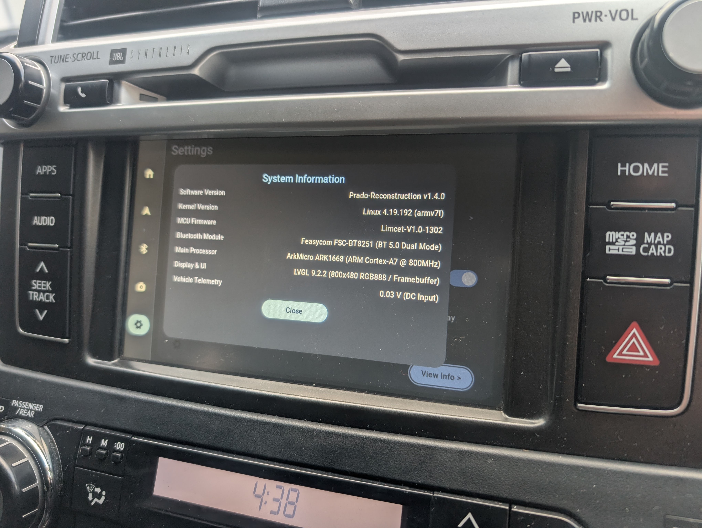
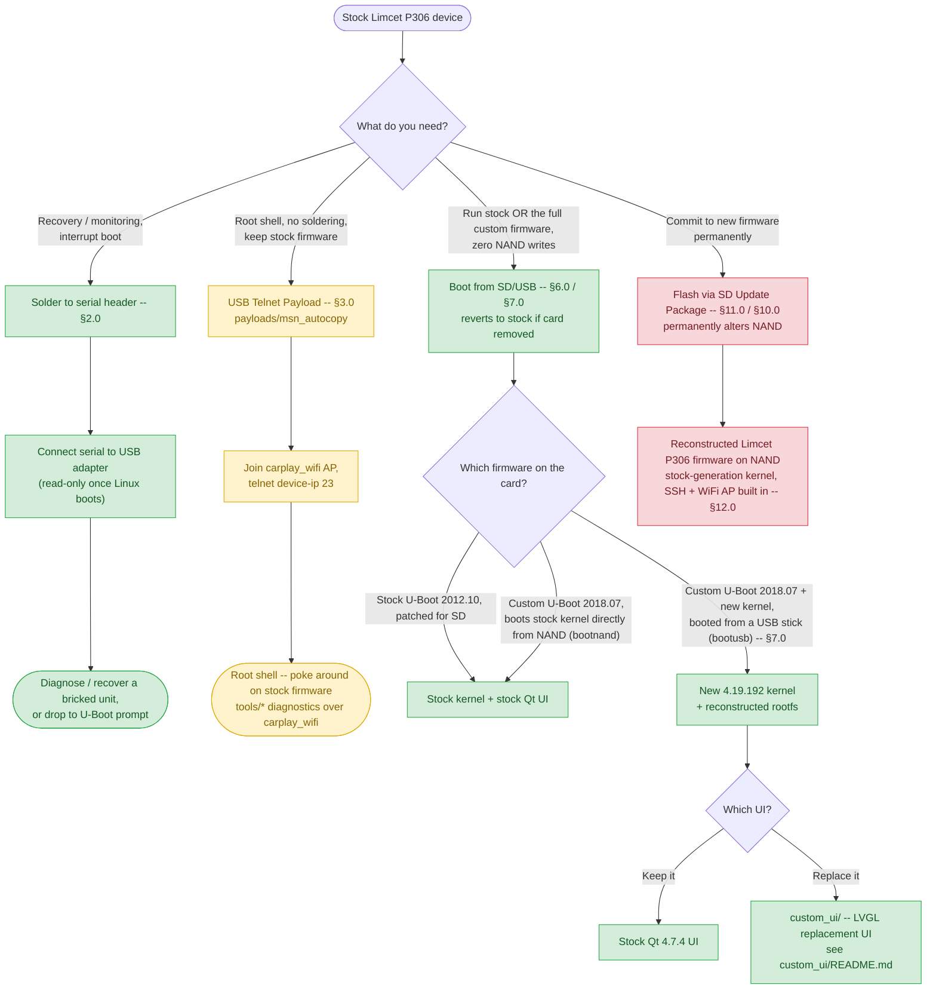
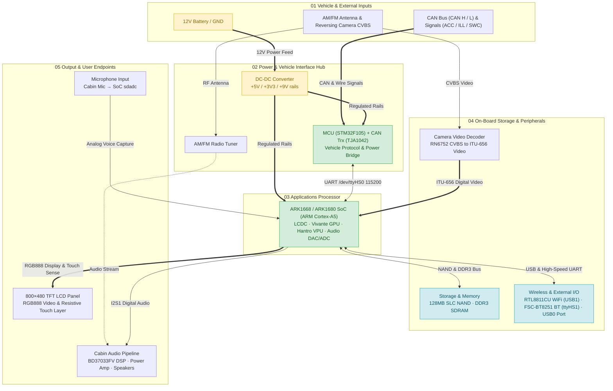
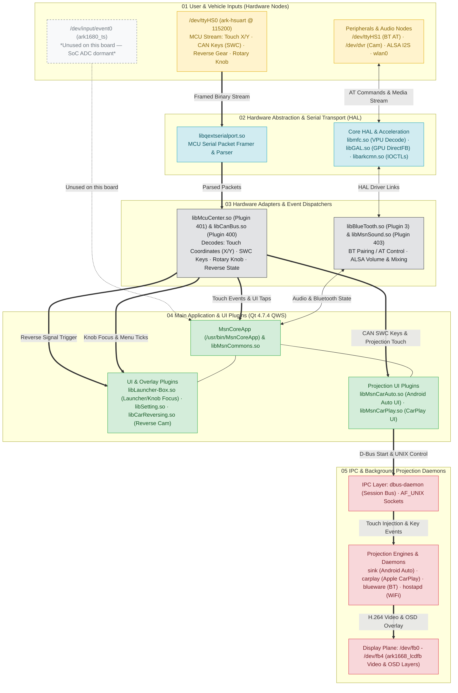

# Limcet P305/P306 CarPlay & Android Auto Piggyback Module

Limcet modules (and various other branded versions) are inexpensive aftermarket boxes (available on AliExpress) that add Android Auto and CarPlay to an existing factory head unit. They work reasonably well, but the vendor provides almost no information on how they operate or how to update them.

This repo exists because a Limcet update failed and left the device unresponsive. Serial access made it possible to dump the original partitions; a same-family firmware package was then flashed via SD card and found to boot successfully. Further development since has focused on building a full tool chain from source including UBoot, a more modern kernel and a custom UI.



## Choose Your Path

Four independent ways to reach the device, from lowest to highest risk/commitment. Pick the branch that matches what you're trying to do — you don't need to follow the whole chart, and the first three don't touch NAND at all. Notably, running the **full custom stack — new U-Boot, new 4.19.192 kernel, optionally the new UI** — is itself a zero-NAND-write option: it boots entirely from a USB stick or SD card (§7.0), the same way as booting stock unmodified.



**Legend:** 🟢 no NAND writes, reversible · 🟡 stock firmware modified via USB payload · 🔴 permanently alters NAND.

## Table of Contents

- [Choose Your Path](#choose-your-path)
- [1.0 Hardware](#10-hardware)
- [2.0 Serial Console (recovery / monitoring)](#20-serial-console-recovery--monitoring)
- [3.0 USB Auto-Update (`payloads/msn_autocopy`)](#30-usb-auto-update-payloadsmsn_autocopy)
- [4.0 Boot Sequence (stock NAND)](#40-boot-sequence-stock-nand)
- [5.0 U-Boot Prompt](#50-u-boot-prompt)
- [6.0 Booting Stock Kernel from SD Card or USB (non-destructive)](#60-booting-stock-kernel-from-sd-card-or-usb-non-destructive)
- [7.0 Custom U-Boot and Kernel](#70-custom-u-boot-and-kernel)
- [8.0 Building a Bootable SD Card or USB Drive](#80-building-a-bootable-sd-card-or-usb-drive)
- [9.0 NAND Partition Layout](#90-nand-partition-layout)
- [10.0 Update Mechanisms](#100-update-mechanisms)
- [11.0 Build & Flash Tool](#110-build--flash-tool)
- [12.0 Device Access](#120-device-access)
  - [WiFi Access Point](#wifi-access-point)
  - [SSH Access](#ssh-access)
  - [USB Networking](#usb-networking)
  - [12.1 Diagnostic & On-Device Utility Tools](#121-diagnostic--on-device-utility-tools)
- [13.0 Repository Structure](#130-repository-structure)
- [14.0 Sources](#140-sources)
- [15.0 Further Documentation](#150-further-documentation)

## 1.0 Hardware

### Limcet Board (DC_LIMCET_MB_REV_003)

The board running this firmware is a third-party **Limcet Box P306** aftermarket module, not a Toyota-made assembly — a piggyback unit that taps into the factory head unit's harness and vehicle bus instead of replacing it. The factory LCD cable plugs into the board, and a second cable runs from the board to the head unit's original LCD connector, intercepting the display path in between.

Hardware on the device has been identified by opening the device and reviewing the board and ICs.

| Component | Part | Role |
|-----------|------|------|
| SoC | ARK1668 (die marking; ARK1680 in firmware/software — same device) ARK1680 (ARM Cortex-A5) | Main applications processor |
| Video decoder | Hantro `hx170dec` (on-SoC IP block, VDEC0 @ `0xe0900000`) | Hardware H.264 decode for Android Auto/CarPlay video — `/dev/hx170dec`, driven via `libmfc.so` (see `tools/hx170-test/`). Background: [§1.1](docs/1.1_HARDWARE_AND_SOC_REFERENCE.md) |
| GPU | Vivante GC-series (on-SoC IP block @ `0xe0f00000`, IRQ 32; exact GC model not yet identified) | 2D/3D acceleration — used on stock's 3.4 kernel too, as a loadable `galcore.ko` module (`insmod`'d from stock's own `/etc/profile`, not compiled into the kernel image); confirmed working on this project's 4.19.192 kernel via its own `galcore.ko` 6.2.4.p1.8 + a matched `libGAL.so`. Background: [§1.1](docs/1.1_HARDWARE_AND_SOC_REFERENCE.md), [§1.5](docs/1.5_AUDIO_SUBSYSTEM_INVESTIGATION.md), [§1.7](docs/1.7_DISPLAY_SUBSYSTEM.md) |
| USB controller | MUSB (on-SoC, dual-port: `usb0`/`usb1`) | Host/gadget — `usb0` is the board's only externally-facing port (CDC-NCM to host PC at `192.168.7.1`, USB-stick boot, wired Android Auto); `usb1` has no external connector and is host mode purely for the onboard RTL8811CU WiFi chip; port role is boot-command-dependent (see §7.0). Background: [§1.1](docs/1.1_HARDWARE_AND_SOC_REFERENCE.md) |
| MMC/SD controller | Synopsys DesignWare `dw-mshc` (MMC0 @ `0xec400000`, MMC1 @ `0xec800000`) | MMC0 = SD card slot, confirmed working (`mmc0: new SD card`); MMC1's DTS comment calls it "SDIO WiFi Controller" but this is confirmed wrong — the real WiFi chip enumerates on USB (`usb1`), not SDIO — MMC1's actual role is unconfirmed. Background: [§1.1](docs/1.1_HARDWARE_AND_SOC_REFERENCE.md) |
| UARTs | 6× on-SoC UART (`UART0`–`UART5`) + hsuart pair | UART0 = serial console `/dev/ttyS0` (§2.0); hsuart0 (UART4, `0xe4f00000`) = MCU link `/dev/ttyHS0`; hsuart1 (UART5, `0xe4800000`) = Bluetooth `/dev/ttyHS1`; a second, unexplained port `/dev/ttyS2` (4800 baud) carries real framed traffic to an unidentified peripheral. Background: [§1.3](docs/1.3_MCU_ADAPTERS.md) |
| NAND | Toshiba TC58BVG0S3HTA00, 128 MB SLC | Firmware/rootfs storage, on a soldered daughter module (the "Limcet Box" compute module). Background: [§9.0](#90-nand-partition-layout) |
| MCU | STM32F105RBT6 (ARM Cortex-M3) | Vehicle-side I/O — CAN bus, touch/button/reverse/ACC-IGN signals — talks to the ARK1668 over `/dev/ttyHS0`. Background: [§1.3](docs/1.3_MCU_ADAPTERS.md) |
| CAN transceiver | NXP TJA1042 | Bridges the MCU's CAN controller to the vehicle CANH/CANL lines. Background: [§1.2](docs/1.2_CANBUS.md) |
| Bluetooth module | Feasycom FSC-BT8251 V1.1 (Realtek RTL8761B / RTL-series BT SoC) | HFP/A2DP/AVRCP/iAP2, over `/dev/ttyHS1` at 1.5Mbps; enable pin `gpio91`. Background: [§1.4](docs/1.4_WIRELESS_AND_INIT.md) |
| WiFi chip | Realtek RTL8811CU | Onboard, over USB (`usb1`). Background: [§1.4](docs/1.4_WIRELESS_AND_INIT.md) |
| Rear camera decoder | RN6752 | CVBS composite → ITU-656 digital video for the reversing camera feed. Background: [§1.1](docs/1.1_HARDWARE_AND_SOC_REFERENCE.md) |
| Audio DAC/ADC | ARK1668 on-SoC sigma-delta DAC (`ark_sddac`) + ADC (`ark_sdadc`), I2S1 @ `0xe4000000` (DAC) / `0xe8200000` (ADC) | The real, confirmed-only playback/capture path (stock's own `aplay -l`: `card 0: ARKSDDAC [ARK-SDDAC]`). A 2026-07-16 theory that playback instead routed through an external Cirrus Logic CS4334 chip was investigated and reverted — `cs4334_*` disassembles to no-op stubs in stock's own kernel, i.e. a vestigial board-file dai-link with no real chip behind it, not a second physical DAC. Background: [§1.5](docs/1.5_AUDIO_SUBSYSTEM_INVESTIGATION.md) |
| Audio IC | Rohm BD37033FV | 5.1-ch digital sound processor (volume/mixing/EQ) — **EMPIRICALLY CONFIRMED DORMANT/UNPOPULATED I2C BUS** via `tools/bd37033-test` (no ACK at `0x40`/`0x41` across `/dev/i2c-0`, `/dev/i2c-1`, direct bit-bang GPIO 9/121 and GPIO 3/2 under both GPIO 34=0 and 34=1). This explains why stock firmware shipped with `SoundType=0` (audio routes from on-SoC ARK-SDDAC directly to the analog preamp/power amplifier in bypass mode). Background: [§1.5](docs/1.5_AUDIO_SUBSYSTEM_INVESTIGATION.md), [§1.6](docs/1.6_BD37033.md) |
| Display adapter | DC_FUJITSU_CON96P_REV_002 (interposer) | Adapts the main board's edge connector to the LCD panel's 96-pin Fujitsu FPC. Background: [§1.7](docs/1.7_DISPLAY_SUBSYSTEM.md) |
| LCD Display | 800×480 RGB888 | Part of the factory head unit. Background: [§1.7](docs/1.7_DISPLAY_SUBSYSTEM.md) |
| Touchscreen | ARK1668 on-SoC resistive ADC/TSC block (`ark_adc_mmio_base`, phys `0xe4500000`) | SoC ADC node `/dev/input/event0` (`ark1680_ts`) is unused/dormant on this board — vehicle touch panel events are read directly by the STM32F105 MCU and forwarded over `/dev/ttyHS0` (`libMcuCenter.so`). Background: [§1.3](docs/1.3_MCU_ADAPTERS.md), [§1.8](docs/1.8_ARK1680_TS_REVERSE_ENGINEERING.md) |

**Connecting to the existing car wiring:**

- A multi-pin harness intercepts the vehicle's existing wiring and routes a subset of it to the Limcet board.
- Steering wheel controls are not believed to be read via an ADC voltage divider on a dedicated SWC wire, despite the `EnableSWCSwitchHardware` option in the ARK1668 config. The STM32F105 MCU instead decodes Toyota-specific messages directly off the vehicle's **CAN bus** (through the TJA1042 transceiver) and forwards translated key events to the ARK1668 over UART. Detailed MCU discrete GPIO pinout and firmware registers: [`docs/1.3.1_MCU_FIRMWARE_DECOMPILATION.md` §7](docs/1.3.1_MCU_FIRMWARE_DECOMPILATION.md#7-stm32-mcu-discrete-gpio-pinout--hardware-controls).
- The reversing camera connects as a standard CVBS composite feed, decoded by the RN6752 into digital video for the SoC. It's believed that this route is used for early camera loading (with 2s of boot) while the rest of the system is still initialising.
- Dual-input microphone multiplexing: The board supports switching between the external 3.5mm aftermarket jack and the Toyota 28-pin factory roof console microphone via an onboard analog switch controlled by the MCU (`GPIOB Pin 6`, `CMD 0xA0 [0x09]`). Full hardware wiring, `MACC` +5V power requirements, and ALSA capture details: [`docs/1.5_AUDIO_SUBSYSTEM_INVESTIGATION.md`](docs/1.5_AUDIO_SUBSYSTEM_INVESTIGATION.md#confirmed-microphone-hardware-architecture--analog-input-multiplexer).

#### Hardware Block Architecture



Full teardown details and board photos are in `hardware/BOARD_ANALYSIS.md` (linked below).

### Software

The device runs two distinct software stacks depending on which boot path is active (see [Choose Your Path](#choose-your-path) above): the stock 3.4-kernel firmware as shipped, and this project's own 4.19.192 port. Most of the userspace binaries/libraries are reused unmodified between the two — only the kernel, bootloader, and a handful of matched driver/library pairs actually differ.

| Component | Stock | This Project |
|-----------|-------|---------------|
| Product identity | `ProductId=Limcet-P306` (`MsnProductInfo.ini`) | unchanged |
| Boot ROM | SoC mask ROM, fixed-function, not user-modifiable — loads `Nboot` from NAND `0x000000` | unchanged |
| S-Loader — Nboot | `Nboot.bin`, 128 KB, NAND `0x000000` (MTD0) — proprietary, closed source | unchanged — **never flash via SD**, corruption bricks the board and requires JTAG to recover |
| S-Loader — Stepldr | `Stepldr.bin` — proprietary, closed source; initializes DDR3, checks the SD card FAT32 partition (p1) for `UBOOT.BIN` before falling back to NAND `0x020000`, and validates a 96-byte ARK header (magic `0x12345678`) before accepting any U-Boot binary | unchanged — the same binary chainloads both stock and this project's custom U-Boot; the header is injected into the custom build via `build_tools/inject_ark_header.py` so Stepldr accepts it |
| Bootloader | U-Boot 2012.10 — proprietary board port, closed source | U-Boot 2018.07 — `ark1668_limcet_p305` board port, built from `linux-arkmicro` source (§7.0) |
| Kernel | Linux 3.4.0 | Linux 4.19.192, built from `linux-arkmicro` source |
| Root filesystem | BusyBox 1.25.0-based | BusyBox 1.30.1, rebuilt from source (~390 applets, incl. `/sbin/init`) |
| UI framework | Qt 4.7.4 (QWS + DirectFB/fbdev), closed-source `MsnCoreApp` | stock UI runs unmodified on the new kernel; optional replacement: [`custom_ui/`](custom_ui/README.md) (LVGL-based, open source) |
| Main application | `MsnCoreApp` — head-unit UI, settings, USB auto-copy mechanism | unchanged (stock binary reused) |
| GPU driver/lib | `galcore.ko` + `libGAL.so` (Vivante, vendor-shipped) | `galcore.ko` 6.2.4.p1.8 + matched `libGAL.so`, rebuilt for 4.19.192 — background: [§1.1](docs/1.1_HARDWARE_AND_SOC_REFERENCE.md), [§1.5](docs/1.5_AUDIO_SUBSYSTEM_INVESTIGATION.md) |
| Video decode | `libmfc.so` (Hantro `hx170dec` userspace API) | unchanged — background: [§1.1](docs/1.1_HARDWARE_AND_SOC_REFERENCE.md) |
| Audio control | `libMsnSound.so` (`Sound_BD37033`/`Sound_PT2312`/`Sound_MCU` backends, selected via `SoundType`) | unchanged — background: [§1.5](docs/1.5_AUDIO_SUBSYSTEM_INVESTIGATION.md), [§1.6](docs/1.6_BD37033.md) |
| MCU protocol | `libMcuCenter.so` (`McuType=6`, `MCUAdapter_BoxP300`, over `/dev/ttyHS0`) | unchanged — background: [§1.3](docs/1.3_MCU_ADAPTERS.md) |
| CAN adapter SDK | `libCanBus.so` — multi-vendor CAN decoder-box SDK; unused on this device (`CanType=0`, decoding done by the MCU instead) | unchanged — background: [§1.2](docs/1.2_CANBUS.md) |
| Bluetooth stack | `rtkbt` userspace stack (Realtek / Feasycom `blueware`), over `/dev/ttyHS1` | stock `blueware`/`rtkbt` stack runs with recovered firmware blobs (§1.4); optional open stack: upstream Linux **BlueZ 5.66** + kernel `hci0` (via `rtk_hciattach` 3-Wire H5 @ 1.5 Mbps, `bluetoothd`, A2DP/AVRCP/PAN, D-Bus `org.bluez`) — hardware-confirmed functional. Wireless Android Auto's RFCOMM pairing now runs on this BlueZ path in production (`custom_ui/src/hal/bluez_aa_profile.cpp`, `Profile1`/`NewConnection` fd-passing) — required rebuilding a real static `dbus-daemon` 1.14.10, since this device's stock `dbus-daemon` is D-Bus 1.0.2 and has no fd-passing support at all (`tools/bluetoothd-test/`). Background: [`docs/BLUEZ_AND_KERNEL_BLUETOOTH_HANDOFF.md`](docs/BLUEZ_AND_KERNEL_BLUETOOTH_HANDOFF.md), [`custom_ui/docs/BLUEZ_MIGRATION_AND_BLUEWARE_DEPRECATION_HANDOFF.md`](custom_ui/docs/BLUEZ_MIGRATION_AND_BLUEWARE_DEPRECATION_HANDOFF.md), [§1.4](docs/1.4_WIRELESS_AND_INIT.md) |
| WiFi AP | `hostapd` + `udhcpd`, SSID `carplay_wifi` | unchanged — background: [§1.4](docs/1.4_WIRELESS_AND_INIT.md) |
| Remote access | none — serial console is receive-only once Linux boots | SSH (`/usr/bin/sshd`, OpenSSH 4.6p1) + USB CDC-NCM networking baked in; telnet available on stock too via the USB auto-copy payload (§3.0) |

#### MsnCoreApp & Userspace Architecture



**Documentation:**

- [`hardware/BOARD_ANALYSIS.md`](hardware/BOARD_ANALYSIS.md) — board/component teardown (SoC, NAND, BT, MCU, CAN bus), with photos in the same folder.
- [`docs/14.1_SOURCES.md`](docs/14.1_SOURCES.md) — provenance of every file in this repo.
- [`docs/9.1_PARTITION_LAYOUT.md`](docs/9.1_PARTITION_LAYOUT.md) — NAND offsets, sizes, flash commands (see also [NAND Partition Layout](#90-nand-partition-layout) below).
- [`docs/historical/SD_BOOT_PLAN.md`](docs/historical/SD_BOOT_PLAN.md) — historical SD-boot planning doc, superseded by [Booting from SD Card or USB](#60-booting-stock-kernel-from-sd-card-or-usb-non-destructive) below.

### Ways to access the device

The four ways to reach the device are covered above in [Choose Your Path](#choose-your-path) — this section (§2.0 onward) goes into the detail behind each one.

## 2.0 Serial Console (recovery / monitoring)

Connect via the UART header near the SD card slot (see the photos in `hardware/`). Serial settings: **115200 8N1**.

Colours of the attached wires and corresponding pin:
| Pin | Color |
|-----|--------|
| TX | Yellow |
| RX | Blue |
| GND | Black |

A generic USB-serial adapter (e.g. PL2303) or Raspberry Pi GPIO UART can be used to read the serial lines. A header or wiring can be soldered to the used pins on the board. The solder mask may need scraping to expose the metal for solder to adhere.

In stock configuration, both U-Boot and the Linux kernel write their output to this serial line (boot log, `dmesg`, kernel messages), but keystroke input only works at the U-Boot prompt — once Linux has booted, the line is receive-only, since the stock rootfs doesn't run a console on it. For an interactive shell instead, see the [USB Auto-Update telnet payload](#30-usb-auto-update-payloadsmsn_autocopy), which enables telnet over the existing WiFi AP.

**Connecting via USB-serial adapter (Windows / PuTTY):**

1. Plug in the USB-serial adapter (e.g. PL2303) and note its COM port from Device Manager (Ports (COM & LPT)) — install the adapter's driver first if it doesn't show up.
2. Open PuTTY, set **Connection type** to `Serial`.
3. **Serial line**: the COM port from step 1 (e.g. `COM5`).
4. **Speed**: `115200`.
5. Under Connection → Serial, confirm **Data bits** `8`, **Stop bits** `1`, **Parity** `None`, **Flow control** `None`.
6. Click **Open**.

**Connecting via Raspberry Pi:**
```
minicom -D /dev/ttyS0 -b 115200
```
or 

```
picocom -D /dev/ttyS0 -b 115200
```

### U-Boot Console

To interrupt U-Boot and drop to the prompt: hold the spacebar continuously from the moment power is applied, until you see the `ark#` prompt.

`bootdelay=9` is read from the NAND env and printed in the message, but there is no countdown or sleep — the `%2d` is cosmetic. After the printf, there is one `tstc()` poll and then Linux boots immediately. You must already be holding space when that poll fires.

The U-Boot console lets you dump firmware, read env config, or manually load a different kernel.

### Kernel Console

Once U-Boot hands off, the same serial UART carries the Linux kernel's boot log and `dmesg` output — enabled via the `console=ttyS0,115200n8` kernel bootarg (see [Boot Sequence](#40-boot-sequence-stock-nand) below). This is receive-only, as noted above: there is no login shell or interactive input on this console once Linux is running. It's still the fastest way to see what's happening early in boot — e.g. checking which WiFi driver bound to `wlan0` (see [WiFi module detection](#wifi-module-detection)) or diagnosing a hang before userspace and SSH come up.

The same serial console stays active during SD/USB boot, and can be made interactive if the rootfs is modified accordingly. A framebuffer console on the LCD (via `console=tty0`) was attempted but never produced visible output.

## 3.0 USB Auto-Update (`payloads/msn_autocopy`)

`MsnCoreApp` (the main head-unit application) has a built-in, **unauthenticated** file-drop mechanism —
almost certainly meant for factory/dealer servicing (patch the device without a full firmware reflash).
No password, PIN, or confirmation dialog gates it — just physically inserting the media.

| | |
|---|---|
| **Copies from** | `payloads/msn_autocopy/` at the root of the inserted USB drive or SD card |
| **Copies to** | `/` — the live root filesystem (the `rootfs` UBIFS partition, see [§9.0 NAND Partition Layout](#90-nand-partition-layout)), remounted read-write for the operation |
| **Trigger** | Automatic, on normal disk auto-mount — no button press, no menu, no confirmation prompt |
| **Runs as** | root (the whole userspace already runs as root on this device) |

**Practical use:** put a folder named `payloads/msn_autocopy` at the root of a USB drive or SD card, with any
files inside it laid out exactly as they should land under `/` (e.g. `payloads/msn_autocopy/usr/bin/whatever`
lands at `/usr/bin/whatever`), insert it, and the device copies them in on its own the moment it
auto-mounts the media. No SSH, no serial console, no U-Boot interrupt needed.

**Ready-to-use payload:** [`payloads/msn_autocopy/`](payloads/msn_autocopy/) contains a pre-built `payloads/msn_autocopy/etc/rc.d/rcS`
— stock's own dumped `rcS` with `busybox telnetd -l /bin/sh` (already compiled into stock's busybox,
no binary transplant needed) added as a passwordless root telnet listener on port 23. **Confirmed
working on real hardware, 2026-07-13.** Copy the folder to the root of a FAT32 USB drive/SD card,
insert into the head unit, reboot, then `telnet <device-ip> 23` over the `carplay_wifi` AP for an
immediate root shell — no login prompt. See [`payloads/msn_autocopy/README.md`](payloads/msn_autocopy/README.md) for
full deployment steps, the debugging history (why the first attempt silently failed —
`/dev/pts` wasn't mounted), and the diagnostic-log-to-USB fallback for retrieving logs without a
working shell.

**Background:** for the full disassembly trace of `DiskDeviceWatcher::mountDiskPartition()` and how it was found, see [`docs/3.1_UI_AND_APP_ANALYSIS.md`](docs/3.1_UI_AND_APP_ANALYSIS.md); for this project's broader credential/access-path review, see [`docs/3.2_SECURITY_REVIEW.md`](docs/3.2_SECURITY_REVIEW.md).

## 4.0 Boot Sequence (stock NAND)

This is the default factory boot sequence:
1. **S-Loader (Nboot / Stepldr)** — executes from ROM; checks the SD card FAT32 partition (p1) for a `UBOOT.BIN` file and loads that in preference if present, otherwise loads U-Boot from NAND `0x020000` (see [Booting from SD Card or USB](#60-booting-stock-kernel-from-sd-card-or-usb-non-destructive))
2. **U-Boot** — initialises hardware; loads NAND env from `0x120000` (CRC valid — `bootdelay=9`, `bootcmd=run nandboot`, `nandboot`, `setbootargs` etc. all active)
3. **SD update check** — inspects the SD card FAT32 partition for `UpConfig`; if present, runs `arkupdate` to flash partitions listed in the `update` script
4. **Single keypress poll** — prints `Press space key to stop autoboot:  9`, then one `tstc()` check with no delay; if spacebar already held, drops to `ark#` interactive shell; otherwise boots immediately
5. **`runs nandboot`** — executes `nandboot` from NAND env: `run setbootargs; bootnand`
   - `setbootargs` → `setenv bootargs console=ttyS0,115200n8 mem=180M ubi.mtd=6 root=ubi0:rootfs rootfstype=ubifs rootwait ro`
   - `bootnand` → custom compiled-in command: `nand read 0x1000000 <kernel_offset> <kernel_size>; bootz 0x1000000`
6. **Linux 3.4.0** hands off to kernel and starts Linux loading process.

**Background:** [`docs/4.1_UBOOT_REVERSE_ENGINEERING.md`](docs/4.1_UBOOT_REVERSE_ENGINEERING.md) — the stock boot loop's actual disassembly.

## 5.0 U-Boot Prompt

Holding the interrupt key (see [Boot Sequence](#40-boot-sequence-stock-nand) above) drops you into `ark#`, U-Boot's interactive shell.

### Boot commands

Two commands are especially useful — type `help` at the `ark#` prompt for the full list built into this U-Boot:

| Command | Effect |
|---------|--------|
| `run nandboot` | Boots the stock NAND firmware_source/kernel/rootfs — `run setbootargs; bootnand` (default `bootcmd` on stock NAND, see [Boot Sequence](#40-boot-sequence-stock-nand)) |
| `usb start` | Initialises the USB host controller — run this first to confirm USB works before attempting to boot from USB |

The stock U-Boot has a custom boot loop, not a standard countdown — this is why interrupting boot requires holding the spacebar continuously from power-on rather than reacting to a countdown (see background link below for the disassembly).

### Manual partition flash - DANGER HIGH RISK

At the `ark#` prompt you can manually flash any partition — this example loads a kernel image from the SD card and writes it to the kernel partition (see [NAND Partition Layout](#90-nand-partition-layout) for the offsets of other partitions):

```
fatload mmc 0 4000000 zImage
nand scrub 0x1a0000 0x400000 0x1a0000 0x400000
nand write 0x4000000 0x1a0000 ${filesize}
```

The built-in update function (§10.0) uses this same manual-flash mechanism to deploy SD update packages to each NAND partition.

**Background:** for the full stock boot-loop disassembly, see [`docs/4.1_UBOOT_REVERSE_ENGINEERING.md`](docs/4.1_UBOOT_REVERSE_ENGINEERING.md).

## 6.0 Booting Stock Kernel from SD Card or USB (non-destructive)

U-Boot can always load a kernel image from an SD card or USB stick — it has its own MMC and USB
drivers, independent of what's compiled into the Linux kernel it then boots. **The rootfs is a
different story, and it rules out both media, not just one**: on the stock 3.4 kernel, neither the
MMC controller driver (`ark_dw_mmc.ko`) nor the USB host controller driver (`musb_hdrc.ko`/
`ark1680_musb.ko`) is built into the kernel image — both are loadable modules, `insmod`'d by the
rootfs's own `/etc/all.sh` **after** NAND rootfs is already mounted (confirmed in
`firmware_source/mtd6_rootfs/etc/all.sh`). With no initramfs either, there's no path for the
kernel to see an SD card or a USB stick at the point it needs to mount root — so a root filesystem
can never come from removable media on this kernel, only from NAND (or, as below, from being
avoided entirely). None of the methods below write to NAND, so a bad image just fails to boot
rather than bricking the device (reflashing NAND for every change is also slow, see
[§10.0](#100-update-mechanisms)).

| Method | Auto or manual | Kernel load | Rootfs |
|--------|----------------|--------------|--------|
| Manual SD card boot | Manual — retyped every boot | **Confirmed working** | **Can't work** — MMC controller driver isn't available until after a rootfs is already mounted (see above) |
| Self-contained SD auto-boot (env relocation & hybrid boot) | Automatic | **Confirmed working** | **Confirmed working** — sidesteps the problem entirely by mounting the existing **stock NAND rootfs** (UBI), not a filesystem on the SD card |
| Manual USB boot | Manual — retyped every boot | **Confirmed working** | **Can't work** — same reason as SD: the USB host controller driver isn't available until after a rootfs is already mounted |

**What "env relocation" actually does:** the stock `uboot.bin`'s factory-compiled-in default
environment is only ~73 bytes — too small to fit a full SD auto-boot command (bootargs + fatload +
bootz) in place. `patch_uboot_env.py` (**confirmed working on real hardware**) doesn't grow that
buffer; it writes a longer environment into unused, verified-zero space elsewhere in the same
image, repoints the binary's internal pointer literals that reference the environment, and widens
two hardcoded size constants that would otherwise truncate the import back to 73 bytes on load —
no code injection, just a handful of data patches to an existing binary. Because this only touches
the stock `uboot.bin`'s data, its factory 96-byte ARK header (magic `0x12345678`, checked by
`Stepldr` before accepting *any* U-Boot binary — see [§1.0](#10-hardware)) is never touched and
stays valid automatically. This is different from the ground-up custom build in
[§7.0](#70-custom-u-boot-and-kernel), which compiles a fresh, header-less
binary from source and needs an explicit post-build step (`build_tools/inject_ark_header.py`) to
add a valid header before `Stepldr` will accept it.

The target's 3.4-kernel/2012.10-U-Boot ext4 drivers predate `64bit`/`metadata_csum` (modern
`mkfs.ext4` defaults) and won't mount a partition formatted with either on — building the image
via [§8.0](#80-building-a-bootable-sd-card-or-usb-drive) strips both automatically.

**Background:** full command sequences for all three methods (manual SD/USB `bootz` commands,
the `build_tools/patch_uboot_env.py` env-relocation technique, `/data` mount fallback order, and
the `/nanddata/` MTD-redirect mechanism) live in [`docs/6.1_SD_USB_BOOT_REFERENCE.md`](docs/6.1_SD_USB_BOOT_REFERENCE.md);
for the env-relocation technique's own RE writeup, ext4 constraint rationale, and `/nanddata/`
MTD-ioctl audit, see [`docs/4.1_UBOOT_REVERSE_ENGINEERING.md`](docs/4.1_UBOOT_REVERSE_ENGINEERING.md).

## 7.0 Custom U-Boot and Kernel

Everything in §4.0–§6.0 above describes the stock U-Boot binary, patched or not. Since then, a full custom board port (`ark1668_limcet_p305`, U-Boot 2018.07, compiled from `linux-arkmicro` source rather than patched from the stock binary) has been built up and is now the actively developed path. This section documents its current, confirmed-working state. Full technical/RE detail: [`docs/historical/HANDOFF_nand_ecc_uboot_vs_kernel.md`](docs/historical/HANDOFF_nand_ecc_uboot_vs_kernel.md), [`docs/4.1_UBOOT_REVERSE_ENGINEERING.md`](docs/4.1_UBOOT_REVERSE_ENGINEERING.md), and [`docs/7.1_UBOOT_BUILD_GUIDE.md`](docs/7.1_UBOOT_BUILD_GUIDE.md).

**Building U-Boot from source:** the custom build replicates the stock binary's functionality and adds extra commands/boot options. It boots the stock kernel directly and reliably — `bootnand` reads the real stock `kernel`/`rootfs` straight from NAND with this fork's own driver, sets the same UBI-rootfs bootargs stock itself uses, and jumps straight to it, no chainload involved (**hardware-confirmed working end-to-end**, see the command table below). `bootstock`/`bootstockusb`/`boothybrid` chainload the real stock U-Boot binary instead, for a separate reason — the NAND partition holding *stock's own U-Boot binary* uses an undocumented raw read path only `Stepldr` can use (see below), not because this custom build is unable to boot the stock kernel itself.

**Boot chain constraints:** the boot sequence is `ROM → Nboot → Stepldr → UBOOT.BIN`. `Stepldr` initializes DDR3, so the custom U-Boot must set `CONFIG_SKIP_LOWLEVEL_INIT` to avoid re-initializing DDR and hanging the system. The stock binary format also requires a proprietary 96-byte header with magic value `0x12345678`; `build_tools/inject_ark_header.py` injects this post-build so `Stepldr` accepts the custom binary.

**Bootlogo:** the original bootlogo used a hardware JPEG decoder (`jpeghw`), which isn't ported to the open-source U-Boot — the custom build instead displays a raw framebuffer (`bootlogo.raw`) via `ark_show_bootlogo()`, loaded from the SD card.

**Build tree:** the [`linux-arkmicro`](https://github.com/yogihybo/linux-arkmicro) repo, `u-boot/` — a separate git repo from this one; see its own history for board-port commits.

| Command | Effect | Status |
|---------|--------|--------|
| `bootmmc` | Kernel+DTB from SD (`kernelfile`/`dtbfile` env vars), rootfs on SD (`mmcroot`, default `/dev/mmcblk0p2`) | **Confirmed working** |
| `bootusb` | Kernel+DTB+rootfs all from USB (`usbroot`, default `/dev/sda2`) — needs a two-partition USB stick, FAT (p1, `zImage`+DTB) + ext4 (p2, rootfs), same layout as the SD card. `rcS`'s userdata mount also follows the actual root device (see [§8.0](#80-building-a-bootable-sd-card-or-usb-drive)), so `/data` lands on `/dev/sda3` too | Kernel-load-from-USB confirmed working; the `root=`/userdata device-following fix is newly built, not yet hardware-tested |
| `boothybrid` | Chainloads `uboot_hybrid.bin` from SD card (`hybridubootfile` env var, default `uboot_hybrid.bin`), which loads custom kernel `zImage_stock` from SD FAT partition 1 and mounts stock NAND rootfs (`ubi0:rootfs`) | **Confirmed working end-to-end** — manual command only, not part of automatic boot (see below) |
| `bootstock` | Chainloads the real stock U-Boot 2012.10 binary from an SD file (`stockubootfile`, default `uboot_stock.bin`), which then boots the stock kernel+rootfs+**full UI** from NAND with its own driver | **Confirmed working end-to-end** — manual command only, not part of automatic boot (see below) |
| `bootstockusb` | Same as `bootstock`, stock U-Boot binary sourced from USB instead of SD — NAND is still where the firmware_source/kernel/rootfs come from either way, USB/SD only supplies the stock U-Boot binary itself for that one handoff | Same code path as `bootstock`, not independently hardware-tested; manual command only |
| `bootnand` | Direct kernel boot from NAND using *this* fork's own NAND driver (`run nandboot`) | **Confirmed working end-to-end** — NAND reads and the kernel-entry hang are both fixed |
| `nandoobcheck <offset-hex>` | Diagnostic: raw OOB dump of a NAND page, bypassing ECC/BBT interpretation | Diagnostic tool, not a boot path |
| `switchecc <0\|1\|2>` | Switch the NAND driver's ECC scheme (0=normal, 1=bootstrap, 2=this chip's real firmware_source/kernel/rootfs/bootloader format) | `switchecc 2` is what fixed `bootnand`'s NAND reads |

**Default (non-interrupted) autoboot order:** `bootusb` → `run nandboot` (fallback), gated by a `bootcheck` bootcount limit (default 3 unconfirmed attempts) that skips straight to `nandboot` if exceeded. `boothybrid`/`bootstock`/`bootstockusb` are **not** part of the automatic chain — they remain available as manual commands at the prompt. Import of `uEnv.txt` from the SD card happens first and can override any of this (including `bootcmd` itself) without recompiling. `bootmmc`/`bootusb`/`bootnand` are all hardware-confirmed working; watchdog-arm-before-jump + the bootcount fallback (see [`docs/4.1_UBOOT_REVERSE_ENGINEERING.md`](docs/4.1_UBOOT_REVERSE_ENGINEERING.md)) protect the automatic chain against a hung/failed jump.

**Why `bootstock`/`bootstockusb` load the U-Boot *binary* from SD/USB instead of NAND:** the NAND
partition that stores the stock U-Boot binary itself uses a different, undocumented raw read path
(only `Stepldr`, the earlier-stage loader, can read it — confirmed by disassembly) — not even
stock's own U-Boot tooling can read that partition from NAND. This is unrelated to the *kernel*
NAND partition, which is a separate partition with normal ECC and reads fine (that's what
`bootnand` and stock's own kernel boot both rely on). So `bootstock`/`bootstockusb` supply the
U-Boot binary externally (SD/USB file) to work around the unreadable U-Boot partition, and once
that binary is running, it loads the kernel from NAND normally, same as stock always did. Full
NAND ECC root-cause writeup: [`docs/historical/HANDOFF_nand_ecc_uboot_vs_kernel.md`](docs/historical/HANDOFF_nand_ecc_uboot_vs_kernel.md).

Building a bootable SD card or USB drive image for this custom U-Boot/kernel path (including the
`--new-uboot`/`--new-kernel`/`--stock-uboot`/`--bootlogo` flags specific to it) is covered in
[§8.0](#80-building-a-bootable-sd-card-or-usb-drive).

**Background:** [`docs/historical/HANDOFF_nand_ecc_uboot_vs_kernel.md`](docs/historical/HANDOFF_nand_ecc_uboot_vs_kernel.md) (NAND ECC root cause), [`docs/4.1_UBOOT_REVERSE_ENGINEERING.md`](docs/4.1_UBOOT_REVERSE_ENGINEERING.md), and [`docs/7.1_UBOOT_BUILD_GUIDE.md`](docs/7.1_UBOOT_BUILD_GUIDE.md) (build from source).

## 8.0 Building a Bootable SD Card or USB Drive

One tool, `build_bootable_sdcard.sh`, builds the image used by both the stock env-relocated
auto-boot path ([§6.0](#60-booting-stock-kernel-from-sd-card-or-usb-non-destructive)) and the
custom U-Boot/kernel path ([§7.0](#70-custom-u-boot-and-kernel)) — despite the script's name, the
image it produces works the same way whether written to an SD card or a USB drive; only the
target device differs.

**Image layout:**

| Partition | Filesystem | Contents |
|-----------|-----------|---------|
| p1 | FAT32 | `zImage` (+ DTB for the custom kernel path) and `UBOOT.BIN` |
| p2 | ext4 | rootfs |
| p3 | ext4 | userdata |

ext4 partitions are formatted without `64bit`/`metadata_csum` automatically (see
[§6.0](#60-booting-stock-kernel-from-sd-card-or-usb-non-destructive) for why that matters on this
target).

Build (recommended path — zero NAND writes, falls back to stock if the card/drive is removed):

```bash
sudo bash build_bootable_sdcard.sh
```

Then write the resulting image to either an SD card or a USB drive:

```sh
sudo dd if=sd_bootable/sd_boot.img of=/dev/sdX bs=4M status=progress && sync
```

**Background:** full interactive menu, CLI-flag reference (including the custom-board-port flags
`--new-uboot`/`--new-kernel`/`--stock-uboot`/`--bootlogo`), and build requirements:
[`docs/8.1_BUILD_BOOTABLE_IMAGE.md`](docs/8.1_BUILD_BOOTABLE_IMAGE.md).

## 9.0 NAND Partition Layout

| Partition | Start | Size | Contents |
|-----------|-------|------|----------|
| S-Loader | `0x000000` | 128 KB | Nboot (do NOT update via SD) |
| U-Boot | `0x020000` | 512 KB | 2nd-stage bootloader |
| U-Boot_back | `0x0A0000` | 512 KB | U-Boot backup slot |
| U-Boot-Env | `0x120000` | 256 KB | U-Boot environment variables |
| arkdata | `0x160000` | 256 KB | Display / TvoutType config |
| kernel | `0x1A0000` | 4 MB | Linux 3.4.0 zImage |
| rootfs | `0x5A0000` | 106 MB | Root filesystem (UBIFS/UBI) |
| userdata | `0x6FA0000` | 6 MB | User settings / BT pairs (UBI) |
| bootlogo | `0x75A0000` | 512 KB | Boot splash screen |
| bootanimation | `0x7620000` | 3 MB | Boot animation |
| reversingtrack | `0x7920000` | 3 MB | Reversing-camera guide-line overlay |
| Unicode | `0x7C20000` | 256 KB | Unicode font data |

**Known bad block at 0x5FA0000** — inside the rootfs partition. `nand scrub` handles this automatically.

**Background:** [`docs/9.1_PARTITION_LAYOUT.md`](docs/9.1_PARTITION_LAYOUT.md) — same data plus flash commands and the `reversingtrack` RSTK format.

## 10.0 Update Mechanisms

On power-on, U-Boot checks for a FAT32 SD card. If a file named `UpConfig` is present in the SD root, U-Boot runs `arkupdate`, which reads the `update` script and flashes each listed NAND partition in sequence, then reboots — remove the SD card afterward so it doesn't re-flash. See [§9.0 NAND Partition Layout](#90-nand-partition-layout) for offsets/sizes.

**Quick start:** build `rootfs.img`/`userdata.img` (`build_rootfs.sh`/`build_userdata.sh`), use `build_update.sh` (§11.0) to select partitions and generate the SD package, copy `firmware_source/sd_update_template/output/` to a FAT32 SD card (max 32 GB), then power-cycle the head unit with the card inserted and wait for the automatic reboot before removing it.

**Safety:** never flash S-Loader (Nboot) via SD — corruption bricks the board and needs JTAG to recover. userdata flash erases all paired BT devices/call history/settings (recreated on first boot); rootfs flash replaces the entire filesystem (a known bad block is handled automatically).

**Background:** the `update` script's keyword list, why `uboot-env`/`unicode` aren't independently flashable, and full safety notes: [`docs/10.1_UPDATE_MECHANISMS.md`](docs/10.1_UPDATE_MECHANISMS.md).

## 11.0 Build & Flash Tool

CAUTION: this update process will permanently alter the NAND contents. Use with caution!
`build_update.sh` is an interactive terminal tool that combines building firmware images and generating a NAND flash update package staged on an SD card into a single workflow. This flashes internal NAND — it is **not** the non-destructive SD-boot image described in [§6.0](#60-booting-stock-kernel-from-sd-card-or-usb-non-destructive) (that's `build_bootable_sdcard.sh`). Run it under Linux or WSL:

```bash
bash build_update.sh
```

An arrow-key menu selects which images to build (rootfs, userdata, U-Boot env) and which NAND partitions to include in the generated SD update package; rootfs and userdata are selected by default, early-boot partitions (kernel, U-Boot, arkdata) default to off to avoid accidental reflash. Output lands in `firmware_source/sd_update_template/output/` — copy to a FAT32 SD card to flash. Requires `mtd-utils` and `u-boot-tools` (`sudo apt install mtd-utils u-boot-tools`).

**Background:** full menu layout, the standalone `build_rootfs.sh`/`build_userdata.sh` scripts, and dependency/`$PATH` detail: [`docs/11.1_BUILD_FLASH_TOOL.md`](docs/11.1_BUILD_FLASH_TOOL.md).

## 12.0 Device Access

### WiFi Access Point

A WPA2 access point starts automatically on boot via `/etc/wifi_ap.sh`, providing network access for SSH without needing a physical connection.

> **Note:** joining `carplay_wifi` only gets you an IP address on `192.168.43.0/24` — the AP itself doesn't expose any open ports. It's only useful for reaching SSH once the [SSH](#ssh-access)-patched reconstructed rootfs is the one actually running on the device; on stock/Holden firmware (or before flashing) there's nothing listening at `192.168.43.1`.

| Item | Value |
|------|-------|
| SSID | `carplay_wifi` |
| Password | `88888888` |
| AP IP | `192.168.43.1` |
| DHCP range | `192.168.43.20 – 192.168.43.254` |
| Config | `/etc/hostapd/hostapd.conf`, `/etc/udhcpd.conf` |

**To connect:**

```sh
# Connect to carplay_wifi (WPA2, password: 88888888)
ssh root@192.168.43.1
```

#### WiFi module detection

Five Realtek drivers are bundled in `/lib/modules/3.4.0/`. At early boot, `wifi_ap.sh` probes them in order until one loads successfully:

| Priority | Module | Chip | Interface |
|----------|--------|------|-----------|
| 1 | `wlan_rtl8821cs.ko` | RTL8821CS | SDIO |
| 2 | `wlan_rtl8822cs.ko` | RTL8822CS | SDIO |
| 3 | `wlan_rtl8189fs.ko` | RTL8189FS | SDIO |
| 4 | `wlan_rtl8821cu.ko` | RTL8821CU | USB |
| 5 | `wlan_rtl8811cu.ko` | RTL8811CU | USB — **the confirmed chip on this hardware**, see [§1.0 Hardware](#10-hardware) |

The other four modules are kept for other board variants — this project's own unit has the RTL8811CU confirmed (onboard, internally wired to `usb1`), so `wlan_rtl8811cu.ko` is what actually loads. If the main app (`MsnCoreApp`) has already placed the correct driver at `/tmp/wlan.ko`, that is used instead. On a different unit where `wlan0` doesn't come up, check `dmesg` on the serial console to identify which chip is present and adjust the probe order in `wifi_ap.sh`.

### SSH Access

SSH is enabled in the reconstructed rootfs and starts automatically on boot.

| Item | Value |
|------|-------|
| Binary | `/usr/bin/sshd` (OpenSSH 4.6p1) |
| Config | `/etc/ssh/sshd_config` |
| Host keys | `/etc/ssh/ssh_host_rsa_key` (RSA 2048), `/etc/ssh/ssh_host_dsa_key` |
| Login | `root` with existing password hash from `/etc/shadow` |

**To connect:**

```sh
ssh root@192.168.7.1
```

### USB Networking

The ARK1680 USB gadget stack is configured to use CDC-NCM (`g_ncm.ko`), which creates a `usb0` network interface when connected to a host PC.

| Item | Value |
|------|-------|
| Device IP | `192.168.7.1` |
| Subnet | `255.255.255.0` |
| Set PC address to | `192.168.7.2` (static) |

**Platform notes:**
- **macOS / Linux** — CDC-NCM supported natively; interface appears automatically
- **Windows** — may require the CDC-NCM host driver from Windows Update

`g_zero.ko` has been removed from `firmware_source/mtd6_rootfs/rootfs/etc/all.sh` — it was overriding the NCM gadget registration and breaking both USB host mode and the network interface.

### 12.1 Diagnostic & On-Device Utility Tools

`tools/` holds static ARM binaries (and a few POSIX shell wrappers), each with its own `README.md`. Synced into `firmware_overlay/prado/usr/bin/`, so they're unconditionally part of every build's rootfs (see that directory's `README.md`) — no separate install step or toggle. All statically linked, no dependency on anything else in the rootfs — they work even while chasing a boot/crash problem elsewhere in the system.

Full tool-by-tool breakdown (I2C/GPIO/pinmux, display/video, touch/MCU, general shell utilities, host-side scripts): [`tools/README.md`](tools/README.md).

## 13.0 Repository Structure

```
firmware_dumps/Prado firmware dump/                  Raw MTD partition dumps from the live device
  mtd1-mtd2_uboot/           U-Boot binaries (raw + extracted)
  mtd3_env/                  U-Boot environment (raw + extracted)
  mtd4_arkdata/              Panel/hardware config (raw + extracted)
  mtd5_kernel/               Kernel zImage (raw + extracted)
  mtd6_rootfs/               Root filesystem UBIFS dump (raw)
  mtd6_rootfs_raw/           Raw MTD6 bin (Git LFS)

firmware_source/                                     Reconstructed firmware for flashing
  mtd0_sloader/              Nboot.bin, Stepldr.bin
  mtd1-mtd2_uboot/           uboot.bin
  mtd3_env/                  uboot-env.txt (reconstructed env: bootdelay=9, 106m/6m layout)
  mtd4_arkdata/              arkdata.ini (Limcet P306 panel config)
  mtd5_kernel/               zImage (reconstructed kernel)
  mtd6_rootfs/
    rootfs/                  Modified rootfs tree (Limcet P306 libs + SSH + WiFi AP)
  mtd7_userdata/
    userdata/                Userdata tree (Limcet P306 settings overlay)
  mtd8_bootlogo/             bootlogo
  mtd9_bootanimation/        (placeholder — no content yet)
  mtd10_reversingtrack/      reversingtrack
  mtd11_unicode/             unicode (placeholder — no content yet)

firmware_dumps/Holden firmware update/               Stock Holden update package (reference — validated it boots on Limcet P306 hw)
firmware_dumps/Prado firmware recovery holden based/ Stock Holden package repackaged with Limcet P306 msn_factory_configs, for recovery

hardware/
  BOARD_ANALYSIS.md         Board/component teardown notes (SoC, NAND, BT, MCU, CAN bus)
  *.jpg                     Board photos referenced from BOARD_ANALYSIS.md

vendor_source/README.md    Pointer only — the ASTRI ARK1680 vendor source and ArkMicro U-Boot/kernel BSP
                            that used to be vendored directly into this repo now live in the separate
                            linux-arkmicro repo (https://github.com/yogihybo/linux-arkmicro) — the
                            actual buildable U-Boot/kernel source tree, see §7.0


tools/              On-device diagnostic/utility binaries — static ARM builds, one subdirectory
                    per tool with its own README.md, synced into firmware_overlay/prado/usr/bin/
                    so every build's rootfs has them unconditionally. See tools/README.md for the
                    full list.

firmware_source/mtd5_kernel/       zImage (from Holden base — identical kernel_size to firmware_dumps/Prado firmware dump; gitignored, not present in every checkout)
firmware_source/mtd4_arkdata/
  arkdata.ini                Limcet P306 panel config (from MTD4 live dump) — build source for mtd4
firmware_source/mtd3_env/
  uboot-env.txt              Reconstructed env (bootdelay=9, 106m/6m layout)
firmware_source/sd_update_template/
  UpConfig                   SD update trigger file
  update.example             Static reference script (generated version goes to output/)
  output/                    Generated SD card package (gitignored)
docs/
  14.1_SOURCES.md                 Where each file came from and why
  9.1_PARTITION_LAYOUT.md        NAND offsets, sizes, flash commands
  4.1_UBOOT_REVERSE_ENGINEERING.md  U-Boot SD-boot corruption investigation, env relocation fix, bootlogo/RE ports
  historical/SD_BOOT_PLAN.md Historical SD-boot planning doc — superseded, see below
build_update.sh              Combined interactive build and flash tool
build_rootfs.sh              Standalone rootfs UBI image builder
build_userdata.sh            Standalone userdata UBI image builder
build_tools/                  U-Boot patching, bootlogo generation, rootfs repair scripts — see build_tools/README.md
build_bootable_sdcard.sh     Interactive bootable SD card image builder (same arrow-key menu as build_update.sh)
sd_bootable/                 Generated bootable SD image output (gitignored — sd_boot.img + patched uboot_sdboot.bin)
```

## 14.0 Sources

See [`docs/14.1_SOURCES.md`](docs/14.1_SOURCES.md) for full provenance of each file.

## 15.0 Further Documentation

**`docs/`**

*Provenance & hardware reference*

- [`14.1_SOURCES.md`](docs/14.1_SOURCES.md) — provenance of every firmware source used
- [`9.1_PARTITION_LAYOUT.md`](docs/9.1_PARTITION_LAYOUT.md) — NAND offsets, sizes, flash commands
- [`1.1_HARDWARE_AND_SOC_REFERENCE.md`](docs/1.1_HARDWARE_AND_SOC_REFERENCE.md) — SoC identity, Ghidra RE of the kernel/userspace binaries, full pin-mux table, cross-checked against real ASTRI/ArkMicro vendor source; per-driver confirmation status and open test procedures live in its own "Open items" section
- [`1.11_VENDOR_BSP_RESEARCH.md`](docs/1.11_VENDOR_BSP_RESEARCH.md) — research pass over sibling ArkMicro vendor/BSP source trees (`ark1668ed-bsp`, `cstech-ip17-rootfs`); WiFi/audio driver branches, wired-AA lead
- [`3.2_SECURITY_REVIEW.md`](docs/3.2_SECURITY_REVIEW.md) — credential/access-path review: stock root password, an unresolved second UID-0 account, update-integrity check

*Architecture & interactive diagrams*

- [`HARDWARE_ARCHITECTURE.md`](docs/HARDWARE_ARCHITECTURE.md) — visual hardware interconnect, pinmux, and bus layout diagram
- [`MSN_APP_ARCHITECTURE.md`](docs/MSN_APP_ARCHITECTURE.md) — visual userspace architecture, IPC, and daemon dependency diagram

*UI & application*

- [`3.1_UI_AND_APP_ANALYSIS.md`](docs/3.1_UI_AND_APP_ANALYSIS.md) — binary-level review of `MsnCoreApp`: the unauthenticated `system()` USB auto-copy call, layout deconstruction/geometry-patch workflow (see also `tools/msncore_analyze.py`), and UI skinning (`DefaultStyleSheet.xml`, `.rcc` sprite bundles — see also `tools/rcc_extract.py`)
- [`1.10_SETTINGS_REFERENCE.md`](docs/1.10_SETTINGS_REFERENCE.md) — full key-by-key reference for `MsnProductInfo.ini` and `FactoryConfig.ini`: load sequence, every setting grouped by function, and cross-product value tables

*Kernel*

- [`1.9_KERNEL_REFERENCE.md`](docs/1.9_KERNEL_REFERENCE.md) — kernel image analysis (`mtd5_kernel/zImage`) and build tree reference: DTS, I2C bus assignments, camera decoder chip

*U-Boot*

- [`7.1_UBOOT_BUILD_GUIDE.md`](docs/7.1_UBOOT_BUILD_GUIDE.md) — plan and guide for compiling a fresh U-Boot from `linux-arkmicro` source: config deltas, SD-only test sequence, boot chain constraints, ARK header injection
- [`4.1_UBOOT_REVERSE_ENGINEERING.md`](docs/4.1_UBOOT_REVERSE_ENGINEERING.md) — U-Boot SD-boot patch corruption investigation and the env relocation fix; boot logo, reverse-engineered command ports (`regr`/`regw`/`gpiotest`/`jpeghw`/`itu656`), LCD timing fix, USB dual-port bring-up, and the Stepldr chainload findings for the custom `ark1668_limcet_p305` U-Boot port (see [§7.0](#70-custom-u-boot-and-kernel))
- [`6.1_SD_USB_BOOT_REFERENCE.md`](docs/6.1_SD_USB_BOOT_REFERENCE.md) — full command sequences for SD/USB booting the stock kernel (see [§6.0](#60-booting-stock-kernel-from-sd-card-or-usb-non-destructive))
- [`8.1_BUILD_BOOTABLE_IMAGE.md`](docs/8.1_BUILD_BOOTABLE_IMAGE.md) — `build_bootable_sdcard.sh` menu, CLI-flag reference, and image contents for building a bootable SD card or USB drive (see [§8.0](#80-building-a-bootable-sd-card-or-usb-drive))

*Display*

- [`1.7_DISPLAY_SUBSYSTEM.md`](docs/1.7_DISPLAY_SUBSYSTEM.md) — panel display configuration presets and register-level meaning; screen configuration and hue investigation
  - [`1.7.1_ARK_DISP_STOCK_DECOMPILATION.md`](docs/1.7.1_ARK_DISP_STOCK_DECOMPILATION.md) — raw decompiled `ark_disp` driver function listings
  - [`1.7.2_LCD_PIN_CONFLICT_TEST_PROCEDURE.md`](docs/1.7.2_LCD_PIN_CONFLICT_TEST_PROCEDURE.md) — test procedure for the LCD RGB/I2C pin-conflict color-corruption bug
- [`1.8_ARK1680_TS_REVERSE_ENGINEERING.md`](docs/1.8_ARK1680_TS_REVERSE_ENGINEERING.md) — touchscreen driver (`ark1680_ts.ko`) RE; the finding that supersedes the older MCU/I2C touch-activation theory (see [`docs/historical/HANDOFF_touch_and_bootargs_fix.md`](docs/historical/HANDOFF_touch_and_bootargs_fix.md) below)

*Audio*

- [`1.5_AUDIO_SUBSYSTEM_INVESTIGATION.md`](docs/1.5_AUDIO_SUBSYSTEM_INVESTIGATION.md) — audio subsystem investigation
  - [`1.6_BD37033.md`](docs/1.6_BD37033.md) — `Sound_BD37033` audio-codec driver class RE, inside `libMsnSound.so`

*Wireless / MCU / CAN / storage*

- [`1.4_WIRELESS_AND_INIT.md`](docs/1.4_WIRELESS_AND_INIT.md) — WiFi/BT pin mapping, module init, and command sequence
  - [`BLUEWARE_AT_COMMANDS.md`](docs/BLUEWARE_AT_COMMANDS.md) — Realtek/Blueware Bluetooth stack AT command reference and protocol
- [`1.3_MCU_ADAPTERS.md`](docs/1.3_MCU_ADAPTERS.md) — MCU adapter types reverse-engineered from `libMcuCenter.so`
- [`1.2_CANBUS.md`](docs/1.2_CANBUS.md) — CAN bus investigation for this board
  - [`1.2.1_REAR_DVD_CANBUS_INVESTIGATION.md`](docs/1.2.1_REAR_DVD_CANBUS_INVESTIGATION.md) — open investigation: controlling the factory rear DVD/RSE unit from the Limcet box via CAN bus
- [`9.2_USERDATA_REVIEW.md`](docs/9.2_USERDATA_REVIEW.md) — userdata partition review

*Build & update tooling*

- [`11.1_BUILD_FLASH_TOOL.md`](docs/11.1_BUILD_FLASH_TOOL.md) — `build_update.sh` menu layout, standalone scripts, dependency detail (see [§11.0](#110-build--flash-tool))
- [`10.1_UPDATE_MECHANISMS.md`](docs/10.1_UPDATE_MECHANISMS.md) — SD update quick-start steps, the `update` script keyword list, safety notes (see [§10.0](#100-update-mechanisms))

*Historical (superseded, kept for background)*

- [`historical/HANDOFF_nand_ecc_uboot_vs_kernel.md`](docs/historical/HANDOFF_nand_ecc_uboot_vs_kernel.md) — the NAND ECC root cause (U-Boot fixed and confirmed, kernel fixed in source but untested), why the `U-boot` NAND partition is unreadable by any U-Boot-level tool, and every patch behind [§7.0](#70-custom-u-boot-and-kernel)
- [`historical/HANDOFF_touch_and_bootargs_fix.md`](docs/historical/HANDOFF_touch_and_bootargs_fix.md) — touchscreen I2C bus fix, SD bootargs fix, and the NAND "417 false bad blocks" ECC/BBT investigation (touch-activation theory later superseded, see `1.8_ARK1680_TS_REVERSE_ENGINEERING.md` above)
- [`historical/HANDOFF_2026-07-17_boot_display_nand_wifi.md`](docs/historical/HANDOFF_2026-07-17_boot_display_nand_wifi.md) — boot, display, NAND, and WiFi bringup handoff notes
- [`historical/HANDOFF_bootlog_v6_review.md`](docs/historical/HANDOFF_bootlog_v6_review.md) — early v6 bootlog review and UART/NAND analysis
- [`historical/HANDOFF_kernel_build_camera_and_touch.md`](docs/historical/HANDOFF_kernel_build_camera_and_touch.md) — kernel build, camera decoder, and resistive touch bringup handoff
- [`historical/boot_experiment_log.md`](docs/historical/boot_experiment_log.md) — historical boot and memory map experiments
- [`historical/SD_BOOT_PLAN.md`](docs/historical/SD_BOOT_PLAN.md) — historical SD-boot planning doc (superseded, still useful background)
- [`historical/DEVICE_TEST_CHECKLIST_2026-07-18.md`](docs/historical/DEVICE_TEST_CHECKLIST_2026-07-18.md) — dated session working log (DirectFB/black-screen/audio investigations); many individual findings self-marked superseded inline, kept for the debugging history

**Elsewhere in the repo**

- [`hardware/BOARD_ANALYSIS.md`](hardware/BOARD_ANALYSIS.md) — physical board/component teardown notes (SoC, NAND, BT, MCU, CAN bus)
- [`hardware/MCU/MCU_FIRMWARE_REVIEW.md`](hardware/MCU/MCU_FIRMWARE_REVIEW.md) — STM32F105 MCU firmware review
- [`build_tools/README.md`](build_tools/README.md) — what each U-Boot patching/bootlogo-generation/rootfs-repair script and vendor tool is for
- [`tools/README.md`](tools/README.md) — full breakdown of the on-device diagnostic/utility binaries (see [§12.1](#121-diagnostic--on-device-utility-tools))
- [`custom_ui/README.md`](custom_ui/README.md) / [`custom_ui/docs/ARCHITECTURE.md`](custom_ui/docs/ARCHITECTURE.md) / [`custom_ui/docs/IMPLEMENTATION_PLAN.md`](custom_ui/docs/IMPLEMENTATION_PLAN.md) — the LVGL-based replacement UI: architecture and implementation status
- [`vendor_source/README.md`](vendor_source/README.md) — the ASTRI ARK1680 vendor source and ArkMicro U-Boot/kernel BSP that used to be vendored directly into this repo now live in the separate [`linux-arkmicro`](https://github.com/yogihybo/linux-arkmicro) repo (the actual buildable U-Boot/kernel source tree — see [§7.0](#70-custom-u-boot-and-kernel)); this file is a pointer, not a copy
- [`payloads/msn_autocopy/README.md`](payloads/msn_autocopy/README.md) — USB payload that exploits the `payloads/msn_autocopy` auto-copy mechanism to install and autostart `sshd` on a stock device
