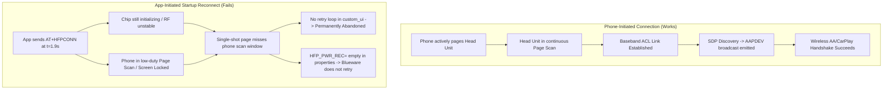

# Bluetooth Startup Reconnection & Auto-Connect Technical Reference

**Date:** 2026-08-17  
**Location:** `custom_ui/docs/BLUETOOTH_RECONNECT_HANDOFF.md`  
**Focus Area:** Bluetooth Connection Subsystem (`blueware`, `custom_ui/src/hal/bluetooth.cpp`, `blueware-bw121.properties`)  
**Symptom:** Bluetooth connection establishes reliably when initiated from the phone, but fails to reconnect at startup when initiated by the head unit app (`auto_reconnect_paired_device()`).

---

## 1. Executive Summary & Root Cause Analysis

The failure of app-initiated Bluetooth reconnection at startup versus phone-initiated connection is driven by five compounding factors across baseband physics, software timing, and configuration defaults:



### Key Technical Findings

1. **Smartphone Baseband Asymmetry (Page Scan Duty Cycle):**
   * **Phone $\to$ Unit:** Head unit BT radio (RTL8761B) is continuously powered and listening in fast Page Scan mode (`DEVSTAT=3`). It answers the phone's baseband paging immediately.
   * **Unit $\to$ Phone:** Modern smartphones (Android 10+ / iOS) enforce aggressive power management. When the phone is locked in a pocket/console, page scan occurs only in narrow windows every 1.28s–2.56s (or longer). A brief paging burst from the head unit almost always misses this window.

2. **Early Startup Race Condition ($t \approx 1.9\text{s}$):**
   * In `custom_ui/src/main.cpp`, `auto_reconnect_paired_device()` executes within ~1.9s of process launch.
   * At this instant, `/usr/bin/blueware` has only just opened `/dev/bw_serial` ($t=0.24\text{s}$) and is still uploading the RTL8761B SRAM firmware blob (`rtl8761bt_fw` via `librtkvnd.so`), toggling GPIO 91, and initializing HCI profiles (`+PWRSTAT=1`).
   * `blueware` acknowledges `AT+HFPCONN` with `OK` (syntax acceptance), but the baseband paging packet is dropped or aborted by the initializing radio firmware.

3. **Single-Shot Execution Without Retries in `custom_ui`:**
   * `auto_reconnect_paired_device()` in `custom_ui/src/hal/bluetooth.cpp` calls `connect_device()` exactly once at boot.
   * It does not check whether a link actually came up (`+HFPDEV=` or `+HFPSTAT=`), and contains no backoff/retry loop.

4. **Disabled Stack-Level Reconnect in Blueware Configuration:**
   * In `/etc/blueware-bw121.properties`:
     ```ini
     # auto reconnect hfp profile after power on [default:1]
     HFP_PWR_REC=
     ```
   * With `HFP_PWR_REC` unset, `blueware` starts with `[RECONNECT:0]`, completely disabling its internal daemon-level paging retries.

5. **Profile Scope: `HFPCONN` vs SDP Projection Discovery:**
   * `AT+HFPCONN` only requests an HFP RFCOMM channel.
   * Wireless projection (Android Auto) requires SDP discovery of the AA service UUID (`4de17a00-52cb-11e6-bdf4-0800200c9a66`) to trigger `+AAPDEV=`. Phone-initiated connections trigger this automatically; a bare HFP request does not.

---

## 2. Action Plan & Proposed Code Changes

### Step 1: Enable Native Blueware Auto-Reconnect
**Target File:** `/etc/blueware-bw121.properties` (and overlay `firmware_overlay/etc/blueware-bw121.properties`)
```diff
-# auto reconnect hfp profile after power on [default:1]
-HFP_PWR_REC=
+# auto reconnect hfp profile after power on [default:1]
+HFP_PWR_REC=1
```

### Step 2: Add Startup Delay and Bounded Retry Loop in `custom_ui`
**Target File:** `custom_ui/src/main.cpp` & `custom_ui/src/hal/bluetooth.cpp`

* Defer `auto_reconnect_paired_device()` until `blueware` has emitted `+DEVSTAT=3` (or add a 3–5 second post-boot delay).
* Implement a 3-attempt retry loop with fixed 2s backoff, terminating early if `+HFPDEV=` or `+AAPDEV=` is observed.

### Step 3: Ensure Continuous Discoverability (`SCAN=1`)
* Ensure `AT+SCAN=1` is sent at boot so the head unit remains discoverable to the smartphone's background vehicle-detection scan.

---

## 3. Verification & Validation Plan

1. **Hardware Boot Log Inspection:**
   * Monitor `/dev/bw_serial` for `[RECONNECT:1]` in `blueware` startup logs.
   * Verify `AT+HFPCONN=<MAC>` is dispatched after `+DEVSTAT=3` / `+PWRSTAT=1`.
2. **Cold Boot Scenario:**
   * Leave phone locked in pocket.
   * Boot the system and verify whether `+AAPDEV=` or `+HFPDEV=` is received within 5–10s without touching the phone.
3. **Dual Phone / Stale Device Handling:**
   * Verify bounded retries abort cleanly after 3 attempts if the paired device is out of range.
