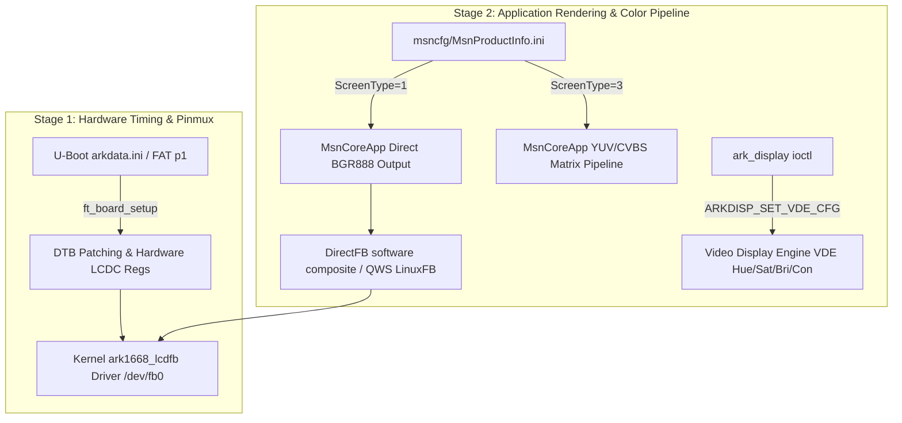

# 1.7 Display Subsystem

Background doc for [README §1.0 Hardware](../README.md#10-hardware) — Display adapter and LCD Display rows.

**Status:** Reference
**Last Updated:** 2026-07-16

## Overview
Consolidated document containing: SCREEN.md, ARKDATA_VARIANTS.md, I2C_GPIO0_LCD_PIN_CONFLICT.md

### Display Subsystem Architecture & Handoff Flow



## Milestone: factory `LCDTest -qws` renders its test pattern on real hardware (2026-07-16)

**First confirmed end-to-end working LCD test-pattern output on this
reconstructed kernel.** Running the stock firmware's own `LCDTest`
binary (`/usr/bin/LCDTest`, from the original Limcet P306 dump) with `-qws`
on this project's reconstructed kernel/rootfs produced a visible test
pattern on the real panel.

This independently confirms the full display pipeline is genuinely
working end-to-end on this reconstruction, not just individually-tested
pieces: kernel `ark1668_lcdfb` driver → `/dev/fb0` → `mmap` →
DirectFB's `fbdev` system module → Qt's DirectFB QWS screen driver
(`libqdirectfbscreen.so`) → Qt QWS → the app's own paint/draw calls. All
of LCD panel timing, pinmux, DMA-buffer addressing, and OSD1 layer
enable (see `ark1668_lcdfb_set_par()`/`ark1668_lcdfb_pan_display()`)
have to be correct simultaneously for this to render, so this is
significantly stronger evidence than any prior individual signal (boot
log probe messages, `lcd-test info` register dumps) — matching this
project's own standing caution
(`feedback_bootlog_evidence_weak`) that only an actual observed result,
not a clean log line, counts as confirmation.

**Traced what actually draws the pixels, for the record:**
`LCDTest` itself is a plain Qt widget app (`QMainWindow`/`QPushButton`)
with no `/dev/`, `ioctl`, or framebuffer symbols of its own — confirmed
via `nm -D`/`strings` on the stripped binary. It delegates entirely to
Qt's QWS backend. `/etc/directfbrc` (`system=fbdev`) confirms DirectFB
uses the generic upstream `libdirectfb_fbdev.so` system module (plain
`/dev/fb0` + `FBIOGET/PUT_VSCREENINFO` + `mmap`), not any vendor-custom
low-level display code; the only vendor-specific userspace piece is
`libdirectfb_gal.so`, which is a Vivante GPU 2D-acceleration backend
(`galBlit`/`galFillRectangle`/`galStretchBlit`), not a panel-timing
driver. **The real vendor-specific hardware-driving logic lives entirely
in the kernel** (`ark1668_lcdfb.c`, already part of this project's own
`linux-arkmicro` tree) — there is no separate userspace "secret sauce"
left to reverse-engineer for basic panel output; `LCDTest` succeeding is
really a confirmation of this project's own kernel driver work, not of
anything in the stock userspace binary.

## Open bug: this project's own `tools/lcd-test` still doesn't show anything

Despite the `LCDTest -qws` success above proving the kernel `/dev/fb0`
path genuinely works, this project's own minimal C diagnostic
(`tools/lcd-test`, no Qt/DirectFB involved — raw `open`/`mmap`/`ioctl`
on `/dev/fb0`) has **never** produced a visible result, even after the
2026-07-14 panning/double-buffering fix (`open_fb()` now force-pans to
`(0,0)` via `FBIOPAN_DISPLAY`).

**Leading hypothesis, not yet live-tested:** `ark1668_lcdfb_set_par()`
(`ark1668_lcdfb.c`) is what actually programs and **enables the OSD1
display layer** (`ARK1668_LCDC_OSD1_CTL`, `1 <<
ARK1668_LCDC_OSD1_EN_OFFSET`) — it's called once at probe time (before
`register_framebuffer()`), so OSD1 should already be enabled by the
time any userspace program runs. `lcd-test`'s `open_fb()` only ever
calls `FBIOGET_VSCREENINFO` and, to fix the panning bug,
`FBIOPAN_DISPLAY` — which maps to `.fb_pan_display`
(`ark1668_lcdfb_pan_display()`, just repoints `OSD1_ADDR`), **never**
`.fb_set_par` (`FBIOPUT_VSCREENINFO`, the one that touches the OSD1
enable bit). Qt/DirectFB's mode-setting path does call
`FBIOPUT_VSCREENINFO`. If OSD1 somehow isn't actually enabled at the
point `lcd-test` runs (e.g. something later in boot re-disables it, or
probe-time `set_par()` is failing/being skipped silently), `lcd-test`'s
writes would land in the correct DMA buffer but never actually be
scanned out — while anything that goes through `FBIOPUT_VSCREENINFO`
first (like Qt/DirectFB) would incidentally re-trigger the OSD1-enable
path and work. Not yet confirmed against real hardware.

**Also worth checking first, simpler explanation:** `lcd-test`'s own
README already documents that if `MsnCoreApp` (or any other QWS/
DirectFB-owning process) is still running and actively repainting, it
will simply redraw over whatever `lcd-test` just wrote within the next
frame or two — a real, successful write that looks like nothing
happened. Since `LCDTest -qws` likely required stopping whatever else
owned the display first (only one QWS server can own `/dev/fb0` at a
time), this precondition may not have been met on prior `lcd-test`
attempts. Cheapest thing to rule out before chasing the OSD1 theory.

**Fix applied (2026-07-16):** `tools/lcd-test/lcd-test.c`'s `open_fb()`
now unconditionally calls `FBIOPUT_VSCREENINFO` (re-applying the mode
it just read back via `FBIOGET_VSCREENINFO`, not changing anything)
before the existing panning fix and `mmap`. Matches what DirectFB's
`fbdev` module does that this tool previously never did. Rebuilt
(`arm-linux-gnueabihf-gcc -static -O2`, stripped) — binary and README
updated.

**`FBIOPUT_VSCREENINFO` theory refuted (2026-07-16) — root cause found in
`ark1668_lcdfb_set_par()` itself, not in `lcd-test`.** Confirmed on
real hardware that the 2026-07-16 fix above still didn't make `lcd-test`
visible. Reading `ark1668_lcdfb_set_par()` line-by-line explains why —
and corrects two things the hypothesis above got wrong:

1. **Wrong register.** The OSD1 enable bit lives in `ARK1668_LCDC_CONTROL`
   (offset `0x04` from the LCDC's `0xe0500000` base, bit 7 —
   `ARK1668_LCDC_OSD1_EN_OFFSET`), not `ARK1668_LCDC_OSD1_CTL` (offset
   `0x74`, which only holds format/size fields).
2. **`FBIOPUT_VSCREENINFO` can never re-trigger it, by design — not just
   "in practice."** The enable write is inside a `static int set_par = 0;`
   local to the function — a one-shot latch shared across **every**
   caller for the entire life of the kernel, not per-caller/per-fd state:

   ```c
   static int ark1668_lcdfb_set_par(struct fb_info *info)
   {
       ...
       static int set_par = 0;          // persists across ALL calls, any caller
       ...
       if (!set_par) {                  // wiring-mode/interrupt init (unrelated to OSD1)
           value = (6 << 23) | (1 << 0);
           ...
           lcdc_writel(sinfo, ARK1668_LCDC_CONTROL, value);   // full overwrite, not RMW
       }
       ...
       if (!set_par) {                  // <-- THE ACTUAL OSD1 ENABLE
           value = lcdc_readl(sinfo, ARK1668_LCDC_CONTROL);
           value |= (1 << ARK1668_LCDC_OSD1_EN_OFFSET);
           lcdc_writel(sinfo, ARK1668_LCDC_CONTROL, value);
       }
       ...
       set_par = 1;                      // latched forever after the FIRST call, from ANY caller
   }
   ```

   Only the very first `.fb_set_par` call of the boot — from *any*
   source: probe-time init, DirectFB's mode-set, or `lcd-test`'s own
   `FBIOPUT_VSCREENINFO` — can ever run the OSD1-enable block. Every
   subsequent call, forever, silently no-ops it, regardless of what
   caused it or what state `ARK1668_LCDC_CONTROL` bit 7 is actually in
   at that moment. This is exactly why `LCDTest -qws` worked (its
   mode-set happened to be the first `.fb_set_par` call that boot) while
   `lcd-test` — run afterward, once anything else had already triggered
   one `set_par` call — could never re-enable OSD1 even with the
   `FBIOPUT_VSCREENINFO` fix in place.

   (The first `if (!set_par)` block, for wiring-mode/interrupt config,
   genuinely does need to stay one-shot as written — it's a full
   register overwrite, not a read-modify-write, so running it again
   would itself clobber the OSD1 enable bit set elsewhere. Only the
   second block needed the guard removed.)

**Fix applied (2026-07-16):** removed the `if (!set_par)` guard around
the OSD1-enable block in `ark1668_lcdfb_set_par()` (`linux-arkmicro`
repo, `linux/drivers/video/fbdev/arkmicro/ark1668_lcdfb.c`) — it's
already a read-modify-write of a single bit, so making it unconditional
is harmless and guarantees OSD1 is re-asserted on every `fb_set_par`
call, from any caller, regardless of prior state. Requires a kernel
rebuild + reflash; `tools/lcd-test`'s own `FBIOPUT_VSCREENINFO` call
(from the earlier fix) is what will now actually matter, since the
kernel side can finally act on it more than once.

**Next steps:**
- [ ] Rebuild `linux-arkmicro`, reflash, retest `lcd-test` on real
      hardware (`killall MsnCoreApp` first, same precondition as before).
- [ ] If still invisible after this: the OSD1-enable-latch theory is
      refuted too; fall back to live register inspection via `devmem`
      at `0xe0500004` (`ARK1668_LCDC_CONTROL`) immediately after a
      `lcd-test fill`, to check bit 7 directly rather than inferring it.


## SCREEN.md

# Screen Configuration & Hue Investigation

## Hardware

The Limcet P306 head unit uses a direct **RGB888 parallel panel**, 800×480.

| Parameter | Value |
|-----------|-------|
| Interface | RGB888 (parallel) |
| Resolution | 800×480 |
| CLKDIV1 | 11 |
| VBP / HBP | 29 / 32 |
| VFP / HFP | 25 / 25 |
| VSW / HSW | 16 / 54 |
| TvoutType (mtd4) | 1 (COMPOSITE) |
| RgbMode | 0 (BGR) |
| Format | 7 (RGB_888) |
| Matching arkdata preset | `arkdata106_V` / `arkdata107_V` |

---

## Display configuration layers

The ARK1680 platform applies display settings in two distinct stages:

### Stage 1 — U-Boot hardware init (mtd4 arkdata)

At power-on, U-Boot reads `arkdata.ini` from the **mtd4 partition** (or FAT partition 1 on SD card) and programs the display controller hardware registers directly — timings, clock dividers, pixel format, and TvoutType. This sets the physical panel signal and cannot be overridden without reflashing mtd4 or overriding `arkdata.ini` via SD.

#### Log Diagnostic Comparison: Stock U-Boot vs Custom U-Boot

In stock U-Boot serial boot logs, `arkdata.ini` loading prints:
```text
NAND read: device 0 offset 0x160000, size 0x1a0f
 6671 bytes read: OK
ark ini updata, get arkdata.ini file_size = 262144.
parser arkdata error, line size out of 1024 byte!
parse arkdata.ini end
convert success, screen_type=0, subformat=0, tvenc=8.
get clk_freq=330(MHZ)
get Gamma_en != 3
screeninfo check ok
itu656bypinfo check ok
vpinfo check ok.
gammainfo use default.
touchinfo check ok.
ScreenType:0, subType:0,Width:800, Height:480,Format:7 RgbMode:0 ,BPP:32 ,TvoutType:12,screen_id:0,interlace:0,pad_unset:0
src_width:0, src_height:0,dithering:0, video_hfz:0x0,video_vfz:0x0
```

**Technical Explanation of Diagnostic Lines:**
- **`file_size = 262144` vs `6671`**: When stock U-Boot reads the entire 256 KB (`262144` bytes) NAND `arkdata` partition into RAM, it attempts to scan past the valid 6,671 bytes of text into the unwritten trailing zero-padding of the partition.
- **`parser arkdata error, line size out of 1024 byte!`**: Stock U-Boot's INI line scanner has a 1024-byte per line buffer limit. Because trailing zero-padding in the partition lacks newline characters (`\n`), the scanner reaches 1024 bytes without encountering a newline, emits this diagnostic warning, and gracefully terminates parsing (`parse arkdata.ini end`). All valid parameters parsed up to byte 6,671 remain fully active.
- **Custom U-Boot (`ark1668_arkdata_ini.c`)**: Custom U-Boot loads `arkdata.ini` from FAT partition 1 (`fatload mmc 0:1 0x2900000 arkdata.ini`) with automatic fallback to NAND partition 4 (`switchecc 2; nand read 0x2900000 arkdata 0x8000`), using exact `filesize` bounds checking (6,671 bytes). It parses keys cleanly without scanning trailing padding or triggering line-length warnings. Both bootloaders reach 100% parameter parity (`ScreenType:0`, `800x480`, `Format:7 RGB888`, `32 BPP`, `TvoutType:12`, `CLKFreq:330MHz`).

### `/dev/ark_display` Node Creation Architecture

The `/dev/ark_display` character device node is created during boot via a 3-step sequence spanning kernel probe, sysfs export, and userspace dynamic node creation:

```
[ Kernel Probe ]               [ Sysfs Export ]              [ Userspace Init ]
__disp_probe()        --->  /sys/class/misc/ark_display  --->  /sbin/mdev -s
misc_register(10,255)       (export dev "10:255")          (mknod /dev/ark_display c 10 255)
```

1. **Kernel Driver Probe (`__disp_probe()`)**:
   - During kernel startup, when the `ark_disp` platform driver probes (`__disp_probe()` @ `0x802da884` in stock `vmlinux.elf`), it registers a miscellaneous character device:
     ```c
     struct miscdevice ark_disp_miscdev = {
         .minor = 255,                 /* MISC_DYNAMIC_MINOR */
         .name  = "ark_display",        /* Node name */
         .fops  = &ark_disp_fops,
     };
     misc_register(&ark_disp_miscdev);
     ```
   - On probe, `__disp_probe()` verifies that the display hardware and RAM buffer `@ 0x02900000` (`arkdata.ini`) were initialized by U-Boot.

2. **Sysfs Device Export**:
   - Upon successful `misc_register()`, the kernel creates:
     - `/sys/class/misc/ark_display/dev` (containing string `10:255`)
     - `/sys/class/misc/ark_display/uevent` (containing `MAJOR=10`, `MINOR=255`, `DEVNAME=ark_display`)

3. **Userspace Node Creation (`mdev -s`)**:
   - During rootfs startup (`/etc/rc.d/rcS` line 10), `/sbin/mdev -s` executes.
   - `mdev` scans `/sys/class/misc/ark_display/dev`, reads major/minor `10:255`, and executes `mknod /dev/ark_display c 10 255`.
   - `MSNCoreApp` can then open `/dev/ark_display` cleanly.

#### U-Boot `disconfig 0` Handoff Requirement
- **Stock U-Boot 2012.10**: Runs `disconfig 0` during `bootnand`, loading `arkdata.ini` into RAM `@ 0x02900000`, setting the 330MHz pixel clock (`rSYS_LCD_CLK_CFG = 0x00000b01`), and configuring OSD1/OSD2 layers before jumping to Linux.
- **Compiled U-Boot 2018.07**: Includes `disconfig 0;` at the start of `nandboot`, automatically reading `arkdata.ini` from NAND partition 4 if not present on SD card, setting up display clocks/OSD layers, and ensuring `ark_disp_probe()` succeeds to create `/dev/ark_display`.

---

### U-Boot DRAM Layout (256MB Top-Hide) & LCDC Framebuffer Bitfield Alignment

#### 1. 256MB SDRAM Architecture & 76MB Carveout Reservation
- **Hardware RAM Capacity**: Empirical kernel boot logs (`Memory: 105964K/184320K available`) and U-Boot memory probing confirm the SoC physically possesses **256 MiB total DRAM**.
- **Memory Map Partitioning**:
  ```
  0x00000000 ┌──────────────────────────────────────────┐
             │ Kernel OS Memory (180 MB)                │
             │ (Linux kernel code, RAM, CMA allocator)   │
  0x0B400000 ├──────────────────────────────────────────┤
             │ OSD1 Framebuffer Carveout (180 MB mark)   │
  0x0BE00000 ├──────────────────────────────────────────┤
             │ OSD2 Framebuffer Carveout (190 MB mark)   │
  0x0C800000 ├──────────────────────────────────────────┤
             │ Video/Decoder Framebuffers               │
  0x10000000 └──────────────────────────────────────────┘ (256 MB Top)
  ```
- **Relocation Trap & Fix**: Setting `CONFIG_SYS_SDRAM_SIZE = SZ_256M` without top-hide previously caused U-Boot to relocate its heap/stack to `~0x0FF00000` (255MB), colliding with hardware video memory and producing `** Bad device mmc 0 **`.
- **Top-Hide Fix**: Added `#define CONFIG_SYS_MEM_TOP_HIDE (76 * 1024 * 1024)` in `include/configs/ark1668_limcet_p305.h` and set `BOOTLOGO_SD_ADDR = 0x0b400000` (180MB). U-Boot declares 256MB DRAM to Linux while restricting its own relocation to below 180MB (`0x0b400000`), completely resolving memory collisions while preserving physical OSD1/OSD2 carveout addresses.

#### 2. Color Channel Synchronization (U-Boot BGR vs Kernel `check_var()` Bitfield Alignment)
- **Problem**: U-Boot's `bootlogo.raw` rendered with 100% correct colors under `RgbMode = 0` (`BGR`), but setting `RgbMode = 5` (`RGB`) caused Linux framebuffer colors to render with Red and Blue channels swapped.
- **Root Cause Analysis**:
  1. `bootlogo.raw` and physical panel PCB traces expect BGR byte ordering (`RgbMode = 0`). Setting `RgbMode = 5` (`RGB`) forced the hardware LCDC register into `RGB` mode (Byte 0 $\rightarrow$ Red Pins, Byte 2 $\rightarrow$ Blue Pins).
  2. The kernel's `check_var()` function (`ark1668_lcdfb.c`) hardcoded `red.offset = 16, blue.offset = 0` (telling userspace/Qt that memory is BGR).
  3. Qt wrote Red to Byte 2 and Blue to Byte 0. But the hardware LCDC (in `RGB` mode) sent Byte 2 to Blue panel pins, swapping Red and Blue on screen.
- **Resolution**:
  - Configured `RgbMode = 5` (`RGB`) in `firmware_overlay/msnprofile/arkdata.ini` and `firmware_overlay/msnprofile/arkdata/arkdata_0.ini` so `MsnCoreApp` receives `RgbMode=5` (`RGB`) via the rootfs build overlay without altering the pristine `firmware_source/` baseline.
  - Updated `ark1668_lcdfb_check_var()` in `ark1668_lcdfb.c` to set `red.offset = 0` and `blue.offset = 16` for 24bpp/32bpp depths, matching `bootlogo.raw` and physical panel PCB wiring byte-for-byte.

---

### Stage 2 — Application colour pipeline (MsnCoreApp)

After the kernel boots, `MsnCoreApp` reads two further config sources:

1. **`MsnProductInfo.ini`** (from userdata `msncfg/`) — `ScreenType`
   field selects which colour output pipeline the app uses for all
   rendered content written to the framebuffer.
2. **`msnprofile/arkdata.ini`** (from rootfs) — loaded at runtime; may
   reprogram the ARK1680 video processor (VP) colour matrix and
   TvoutType via driver ioctls.

These two stages are independent. Correct hardware timings at Stage 1
do not prevent colour corruption if Stage 2 uses the wrong pipeline.

---

## ScreenType in MsnProductInfo

`ScreenType` in `MsnProductInfo.ini` uses a **different enum** to the
`ScreenType` field in `arkdata.ini`. In the arkdata context,
`ScreenType` describes the physical panel interface (RGB565=1,
RGB888=2, LVDS=4...). In the `MsnProductInfo` context it selects the
application-level colour output pipeline:

| Value | Pipeline | Description |
|-------|----------|-------------|
| 1 | Direct RGB | App renders straight BGR888 to framebuffer — correct for Limcet P306 |
| 3 | CVBS / ITU656 | App encodes output through YUV/CVBS colour matrix — for composite-fed displays |

The Holden unit (`Box-C211`) uses `ScreenType=3`, suggesting its
display is driven via a composite/ITU656 video path rather than a
direct RGB connection — a common arrangement in some vehicle-specific
OEM fitments.

---

## Screen hue when running Holden firmware

### Background

The Holden firmware update (`HOLDEN_KS_Auto_DSP(BT)_0219`) was
flashed to the Limcet P306 device and booted successfully. A visible screen
hue was observed. Initial suspicion was the Holden `arkdata.ini` LCD
timings, but the boot log disproved this.

### Boot log finding — arkdata was NOT flashed

The SD update script included `arkdata.ini` but the boot log shows:

```
** Unable to read "arkdata.ini" from mmc 0:1 **
```

U-Boot could not read it from the SD card and fell back to the
existing NAND content — the **Limcet P306's own arkdata** (6,671 bytes,
CLKDIV1=11, VBP=29, HBP=32). The hardware display timing was never
changed. The original assumption (timing mismatch = hue) was incorrect.

### Root cause — two compounding issues

#### Issue 1: MsnProductInfo.ScreenType=3 (primary cause)

The Holden `userdata.img` was successfully flashed, overwriting the
Limcet P306's `msncfg/MsnProductInfo.ini` with the Holden version:

| | Limcet P306 | Holden |
|--|-------|--------|
| `ScreenType` | **1** (direct RGB) | **3** (CVBS/ITU656) |
| `ProductId` | Limcet-P306 | Ksmart_DSP |
| `McuType` | 6 | 16 |
| `SoundType` | 0 | 4 (DSP) |

With `ScreenType=3`, `MsnCoreApp` routes all rendered frames through a
YUV/CVBS colour encoder pipeline. The Limcet P306 panel expects straight
BGR888. Receiving YUV-encoded data remaps the colour channels,
producing the observed hue shift.

This is confirmed by the boot log sequence: U-Boot correctly
initialises the hardware as `screen_type=0` (RGB), but the hue appears
**after the app starts** — not at the boot screen stage — consistent
with the application-level colour pipeline being the cause.

#### Issue 2: msnprofile/arkdata TvoutType=12 (contributing factor)

The Holden rootfs contains `msnprofile/arkdata.ini` with
`TvoutType=12` (CVBS_NTSC) and Holden-specific LCD timings. At
runtime, `MsnCoreApp` may reprogram the ARK1680 video processor colour
matrix via this file. Under `ScreenType=3`, the app may act on the
msnprofile arkdata's `TvoutType=12` and switch the VP colour matrix to
NTSC encoding. A CVBS_NTSC colour matrix applied to a direct RGB panel
produces a pronounced hue shift.

The Limcet P306's own `msnprofile/arkdata.ini` also has `TvoutType=12`, but
with `ScreenType=1` the app ignores the msnprofile arkdata's colour
settings and uses the direct RGB path — so on original Limcet P306 firmware
this causes no problem.

### Why the original Limcet P306 firmware has correct colours

| Config source | Limcet P306 firmware | Holden firmware (on Limcet P306) |
|---------------|---------------|---------------------------|
| mtd4 arkdata | CLKDIV1=11, VBP=29, TvoutType=1 | Same (not updated) |
| MsnProductInfo.ScreenType | **1** → direct RGB | **3** → CVBS/YUV path |
| msnprofile/arkdata TvoutType | 12 (ignored — ScreenType=1) | 12 (applied — ScreenType=3) |
| VP colour matrix | RGB passthrough | NTSC YUV encoding |
| Result | Correct colours | **Hue shift** |

### Fix

Flash the **Limcet P306 userdata** to restore `MsnProductInfo.ScreenType=1`.
No change to rootfs, kernel, or mtd4 arkdata is required. The
reconstructed `userdata.img` already contains the correct
`MsnProductInfo.ini`.

To flash userdata only via SD card, run `build_update.sh`, deselect
everything except User Data (mtd7), then generate:

```bash
bash build_update.sh
# n to deselect all, arrow keys + Space to select only User Data, then g to generate
```

Copy `sd_update/output/` to a FAT32 SD card and power on.

---

## msnprofile/arkdata.ini on the Limcet P306 dump — unexpected content

The `msnprofile/arkdata.ini` in the live Limcet P306 dump (inside the rootfs,
not the mtd4 partition) contains:

| Field | Value |
|-------|-------|
| ScreenId | 6 |
| ScreenType | 4 (LVDS) |
| Resolution | 1024×600 |
| LVDSCfg | 0x160FD |
| TvoutType | 12 |

This is a profile for a **1024×600 LVDS panel** — not the Limcet P306
screen. It was present in the Box-P301 base firmware, which is shared
with other vehicles that use an LVDS display (likely Buick Enclave or
similar). The Limcet P306 application ignores it because
`MsnProductInfo.ScreenType=1` directs the app to the direct RGB
rendering path.

See [`ARKDATA_VARIANTS.md`](1.7_DISPLAY_SUBSYSTEM.md) for the full panel
preset library reference.

---

## Panel/model selection mechanism & the DIP switch (2026-07-11)

Investigated how the unit selects LCD settings for different vehicle models
(there is a physical DIP switch on the board that appears to change the panel).
Traced across the dumped U-Boot, the stock 3.4.0 kernel (`vmlinux.elf`
disassembly), and the userspace app.

### How a panel is selected — the `screen` id

The selected panel is indexed by a single **screen id**:

- **Kernel:** the `screen=N` boot argument sets `g_screen_id`, which indexes a
  built-in panel table — `screens[g_screen_id]`. Confirmed two ways: (1) the
  vendor reference source
  [`../ArkPro Reference/kernel/drivers/ark/display/ark_display_core.c`](../ArkPro%20Reference/kernel/drivers/ark/display/ark_display_core.c)
  (`screen_id_setup` → `__setup("screen=")`, `struct screen_info *screen =
  &screens[g_screen_id]`); and (2) disassembly of the dumped kernel's own
  `screen_id_setup` (`vmlinux.elf`), which `memcpy`s a 120-byte `screen_info`
  struct into the exported global `screeninfo_param`. Named panels in the enum:
  `SCREEN_QUN700`, `SCREEN_CVBS_NTSC/PAL`, `SCREEN_VGA8060`, `SCREEN_YPBPR720P`,
  `SCREEN_C101EAN`, `SCREEN_CLAA101`, `SCREEN_GM8284DD`.
- **U-Boot:** the same `screen` value (env var) selects which `ScreenId` block of
  **mtd4 `arkdata.ini`** to program into the display-controller registers. This is
  the *authoritative* timing source at Stage 1 (see "Display configuration layers"
  above); the kernel's built-in `screens[]` entry is only a fallback the app/driver
  can re-apply later. In the dumped unit `arkdata.ini` has a single `ScreenId=0`
  (800×480 RGB888), and the env has a static `screen=0`.

So "which panel" is decided by the **`screen` value**, consumed identically by
U-Boot (arkdata `ScreenId`) and the kernel (`screens[]` index).

### The DIP switch

- There is **no `dip`/`dipswitch` string** anywhere in U-Boot, the kernel, or the
  rootfs — the switch is read as raw **GPIO strapping**, not by that name.
- The **vendor reference BSP selects the screen purely from the `screen` env var**
  — it contains **no** GPIO/DIP read. So a DIP-driven panel change is an **OEM
  customisation** on this board.
- The **userspace app does not read the DIP**: `MsnCoreApp` takes screen/resolution
  from the static `MsnProductInfo.ini` (`ResourceName=Box-P301`, `ScreenType=1`,
  `ResolutionType=1`); `libMsnCommons` only exposes a generic
  `/sys/class/gpio/gpio%d/{direction,value,edge}` helper, with no model mapping.
- Therefore the DIP is almost certainly read by the **OEM U-Boot** and used to set
  `screen`/`ScreenId` before boot. The dumped U-Boot has the matching machinery
  (`ScreenId`, `SubScreenType`, `disconfig ${screen}`,
  `get screenInfo … set default screen_id = %d`). **Not yet byte-confirmed:** the
  exact GPIO(s) the OEM U-Boot reads — would require disassembling the dumped
  U-Boot's screen-select path (no symbols, so more involved than the kernel).

### Evidence the unit is genuinely multi-panel

- Rootfs ships Launcher resources at **two resolutions**: `Launcher-*-800x480.rcc`
  and `Launcher-*-1024x600.rcc`.
- The rootfs `msnprofile/arkdata.ini` (distinct from mtd4) is a **1024×600 LVDS**
  profile (`ScreenId=6`, `ScreenType=4`, `LVDSCfg=0x160FD`) — a sibling-vehicle
  panel the Limcet P306 app ignores (see section above).
- `ARKDATA_VARIANTS.md` catalogues 30+ presets (800×480, 400×240, 960×540,
  1280×480, 1024×480, LVDS/RGB888) selectable by this same id scheme.

**Bottom line:** panel selection is a single `screen` id flowing U-Boot→kernel; the
DIP switch is an OEM GPIO strap that (almost certainly) sets that id in the OEM
U-Boot. Confirming the exact GPIO mapping is the one remaining open item.

## Our reconstructed (4.19.192) kernel's approach (updated 2026-07-19)

Everything above describes **stock's** mechanism — a two-stage, per-unit
dynamic system. Our new kernel itself still does something fundamentally
simpler (a static, compiled-in DTS) — but as of 2026-07-19, **U-Boot now
dynamically patches that DTS's values from `arkdata.ini` at boot**,
closing most of the practical gap without touching the kernel driver
itself. See "Dynamic override via arkdata.ini + `ft_board_setup()`"
below — read the rest of this section first for what the static-DTS
baseline actually is, then that section for how it's now overridden.

**Stock's two stages, for reference:**

1. **Stage 1 — `mtd4` `arkdata.ini` (per-physical-unit, authoritative).**
   A dedicated flash partition holding one or more `[ScreenId=N]` blocks
   of full `LCD_TIMMING`/`LCD_CLOCK` data. **U-Boot reads this directly
   and programs the LCD-controller hardware registers from it, before the
   kernel even boots.** This is the real, authoritative source of truth
   for *this specific physical unit's* actual panel — it's what a
   factory/service tool would write when a unit ships with a particular
   panel installed. Limcet P306's own dump of this partition is at
   `firmware_source/prado_reconstructed/mtd4_arkdata/arkdata.ini`
   (single `ScreenId=0`, 800×480 RGB888 — see the "Register-level meaning"
   section above for the full field dump).
2. **Stage 2 — `msnprofile/arkdata/arkdataNN_X.ini` (rootfs, 30+ presets).**
   A completely separate mechanism: `MsnCoreApp` (userspace) reads
   `ScreenType`/`ResolutionType` from `MsnProductInfo.ini` and picks the
   matching preset from this set — a menu of known panel configs across
   different vehicle models, not something dynamically re-read against
   live hardware every boot the way `mtd4` is.
3. A single `screen=N` value flows U-Boot→kernel: U-Boot uses it to pick
   the `mtd4` `ScreenId` block; the same value becomes a kernel boot
   argument indexing the stock 3.4 kernel's own **compiled-in** `screens[]`
   C table (`SCREEN_QUN700`, `SCREEN_C101EAN`, etc.) as a fallback the
   driver/app can re-apply later — not the primary source. The physical
   DIP switch is an OEM addition (not in the vendor reference BSP) that
   almost certainly sets `screen`/reads GPIO in the custom OEM U-Boot to
   pick the right config per model variant at the factory.

**What our kernel actually does instead:** the 4.19.192 kernel uses the
standard Linux `display-timings` devicetree binding — a **static,
compiled-in** set of numbers in
`linux-arkmicro/linux/arch/arm/boot/dts/ark1668_limcet_p305.dts`
(`display-timings { timing0 { ... } }`). It never reads `mtd4` or any
arkdata ini at runtime, at all. U-Boot's own patched build for this
project (`u-boot/` in the main repo) likewise does not reprogram the LCD
registers from `mtd4` the way the OEM U-Boot does — the DTS values are
simply frozen into the kernel at build time.

**Why this matters going forward:**

- **This is not a bug for the current unit** — the DTS values were
  hand-corrected (2026-07-18, `linux-arkmicro` `47ba523ca`) to exactly
  match Limcet P306's own real `mtd4` dump (`ScreenId=0`): `clock-frequency
  =330000000/CLKDIV1(11)=30000000`, `hback-porch=32` (`HBP`),
  `hfront-porch=25` (`HFP`), `vback-porch=29` (`VBP`), `vfront-porch=25`
  (`VFP`), `hsync-len=54` (`HSW`), `vsync-len=16` (`VSW`), sync
  polarities `hsync-active=1`/`vsync-active=1`/`de-active=0` matching
  `IHS=1`/`IVS=1`/`IOE=0`. So for *this exact panel*, behavior now
  matches stock's Stage-1 authoritative values.
- **Was a real gap for supporting a different panel/model without a
  rebuild — now closed for the values that matter, via `arkdata.ini`.**
  See the next section.

## Dynamic override via arkdata.ini + `ft_board_setup()` (2026-07-19)

Extends the existing `arkdata.ini` reader (`linux-arkmicro/u-boot/board/
arkmicro/ark1668_limcet_p305/ark1668_arkdata_ini.c`) — which previously
only fed U-Boot's own splash-screen `screen_info`
(`arkdata_apply_lcd_timing()`, called from `ark1668_display_cfg.c`) —
to also patch the **kernel's** DTB, using U-Boot's standard board hook:
`CONFIG_OF_BOARD_SETUP` → `ft_board_setup(blob, bd)`, called
automatically on every `bootm`/`bootz` right before jumping to the
kernel. No `bootcmd`/`uEnv.txt` change needed — it just runs.

**What gets patched, if `arkdata.ini` is present on the FAT boot
partition (p1):**

| DTB node | Property | arkdata.ini key |
|---|---|---|
| `.../display-timings/timing0` | `hactive` | `Width` |
| | `vactive` | `Height` |
| | `vback-porch` | `VBP` |
| | `vfront-porch` | `VFP` |
| | `vsync-len` | `VSW` |
| | `hback-porch` | `HBP` |
| | `hfront-porch` | `HFP` |
| | `hsync-len` | `HSW` |
| | `hsync-active` | `IHS` |
| | `vsync-active` | `IVS` |
| | `de-active` | `IOE` |
| | `clock-frequency` | computed: `CLKFreq / CLKDIV1` (both must be present) |
| `.../lcd@e0500000/display@0` | `lvds-con` | `LVDSCfg` |
| | `dithering-con` | `dithering` |
| | `lcd-wiring-mode` | `RgbMode` (enum→string: `0`→`"BGR"`, `5`→`"RGB"`) |
| | `interface-type` | `ScreenType` (bitmask→string: bit `0x4` LVDS→`"LVDS"`, bit `0x1`/`0x2` RGB565/RGB888→`"TTL"`) |

Full DTB node paths (confirmed against the compiled
`ark1668_limcet_p305.dtb` via `dtc -I dtb -O dts`):
`/ahb/lcd@e0500000/display@0/display-timings/timing0` and
`/ahb/lcd@e0500000/display@0`.

**Deliberately NOT wired**, and why:

- `arkdata.ini`'s `[VP]` section (`contrast`/`brightness`/`saturation`/
  `hue`, per-layer) — confirmed via `drivers/misc/ark_display.c` that
  these are hardcoded compile-time defaults (`.hue = 0, .saturation =
  128, ...`), entirely runtime-controlled instead by `MsnCoreApp`'s own
  `ARKDISP_GET_VDE_CFG`/`ARKDISP_SET_VDE_CFG` ioctls (see the boot log
  lines of the same name) — no DT property exists for them at all, so
  there's nothing to patch.
- `[GAMMA_VAL]` and `[ITU656_BYP_COM/NTSC/PAL]` (composite/NTSC/PAL
  timing) — same reason: no DT-consumed property exists anywhere in
  `drivers/video/fbdev/arkmicro/ark1668_lcdfb.c` for gamma tables or
  composite-out timing. Patching the DTB with these would silently do
  nothing without writing new kernel driver code first — not attempted.
- `DISPLAY_INTERFACE` section's `Format`, `TvoutType`, `interlace` — no
  DT-consumed property exists for these on this driver either (`Format`
  is about pixel packing for U-Boot's *own* legacy splash renderer, not
  a kernel fbdev property; `TvoutType`/`interlace` are for the
  composite/analog output path this LCD-only driver doesn't touch).
  `RgbMode` and `ScreenType` **are** wired (2026-07-19,
  `fdt_apply_wiring_mode()`/`fdt_apply_interface_type()`,
  `linux-arkmicro` `c3a420f1f`) — see the table above.

**Fails safe throughout**, matching the existing reader's philosophy:
missing `arkdata.ini`, a missing individual key, or a DTB node that
doesn't exist all leave the compiled-in DTS value untouched — nothing
here is required for boot.

**Practical effect:** for *this* panel, the checked-in DTS values
(`linux-arkmicro` `47ba523ca`) already match `arkdata.ini` exactly, so
this override is currently a no-op that just re-confirms the same
numbers on every boot (watch for `[arkdata.ini] ft_board_setup: ...`
lines in the U-Boot console log). Its actual value is for **the next
time a different panel/model needs supporting**: drop a new
`arkdata.ini` (with the new panel's real `LCD_TIMMING`/`LCD_CLOCK`
values) onto the FAT boot partition and the kernel's display comes up
correctly with **no DTS edit or kernel rebuild** — only U-Boot's own
`arkdata_ini_get_int()`-based key lookup, already proven working for
the splash-screen path.

If a genuinely full dynamic port (register-level, matching stock's
Stage-1 U-Boot register programming rather than DTB patching, or
extending this to cover `RgbMode`/`ScreenType`/gamma/composite as well)
is ever needed, the ArkPro reference driver
(`../ArkPro Reference/kernel/drivers/ark/display/ark_display_lcd.c` and
`../ArkPro Reference/uboot/ark_lcd.c`) is the concrete reference for
exactly how stock parses this ini and drives the registers from it.

## ARKDATA_VARIANTS.md

# Arkdata Variant Reference

Panel display configuration presets bundled in the rootfs at
`msnprofile/arkdata/`. At boot, `MsnCoreApp` reads `ScreenType` and
`ResolutionType` from `MsnProductInfo.ini` and selects the matching
preset. Each file contains the full LCD timing, clock divider, and
touch-key configuration for one panel type.

## Naming convention

`arkdataNN_X.ini` — `NN` is a sequential panel ID; `X` is the hardware
platform family letter (corresponding broadly to the `ResourceName` in
`MsnProductInfo.ini`, e.g. Box-P → group P, Box-V → group V).

## Register-level meaning, confirmed via vendor source

**Source:** [`../ArkPro Reference/`](../ArkPro%20Reference/README.md) — ASTRI's (Hong Kong Applied
Science and Technology Research Institute) reference ARK1680 kernel/U-Boot/userspace source, copied
into this repo from a public leak of `cphatt/ArkPro` (commit `e7437446cacc79e242d9b7a90e3724af52c33bba`).
It's a generic reference BSP, not the Limcet P306's actual OEM board file — see that folder's README for full
provenance, licensing notes, and what was and wasn't pulled in. Also cross-checked against
`docs/1.1_HARDWARE_AND_SOC_REFERENCE.md` §9.

These field names (`CLKDIV1`, `VBP`, `HBP`, `VSW`, `HSW`, `IVS`) aren't RE-guessed labels — they're
ArkMicro's own register field names for the ARK1680's LCD timing-control registers, confirmed against
the real kernel display driver in
[`../ArkPro Reference/kernel/drivers/ark/display/ark_display_lcd.c`](../ArkPro%20Reference/kernel/drivers/ark/display/ark_display_lcd.c):

```c
// CLCD_TIMING0
rLCD_TIMING0 = HSW<<20 | HBP<<10 | HFP<<0;
// CLCD_TIMING1
rLCD_TIMING1 = VFP<<19 | VSW<<13 | (ARK_DISP_LCD_WIDTH-1)<<0;
// CLCD_TIMING2
rLCD_TIMING2 = IOE<<23 | IHS<<22 | IVS<<21 | (ARK_DISP_LCD_HEIGHT-1)<<10 | VBP<<0;
```

`CLKDIV1` is a separate register field, confirmed in the companion U-Boot driver
([`../ArkPro Reference/uboot/ark_lcd.c`](../ArkPro%20Reference/uboot/ark_lcd.c)) as the
`SYS_LCD_CLK_CFG` bits 23:19 — the "srgb_clock div factor" dividing the ~393MHz system PLL to derive
the LCD pixel clock (`pixel_clock ≈ syspll / CLKDIV1`, e.g. a hardcoded reference-panel case comments
`syspll/13/1 = 393/13 = 30.23MHz`). This explains the split in the tables below: the standard 800×480
panels cluster at `CLKDIV1=11` (~35.7MHz pixel clock), while the wide-format 1280×480 LVDS panels
(`arkdata15_D`, `arkdata19_E`) drop to `CLKDIV1=8` (~49.1MHz) — a wider panel needs more pixel
bandwidth per refresh, hence the lower (faster) divider.

## Screen type key (ScreenType field)

| Value | Interface |
|-------|-----------|
| 2 | RGB888 |
| 4 | LVDS |

## TvoutType key

| Value | Meaning |
|-------|---------|
| 1 | COMPOSITE |
| 12 | CVBS_NTSC |

---

## Group A — arkdata1–4

| File | Resolution | CLKDIV1 | VBP | HBP | VSW | HSW | Notes |
|------|-----------|---------|-----|-----|-----|-----|-------|
| arkdata1_A | 800×480 | 11 | 9 | 50 | 10 | 35 | Standard 7" LVDS |
| arkdata2_A | 400×240 | 8 | 18 | 40 | 7 | 43 | Small screen LVDS |
| arkdata3_A | 400×240 | 6 | 3 | 22 | 7 | 7 | Small screen LVDS, alternate timing |
| arkdata4_A | 800×480 | 11 | 9 | 50 | 10 | 35 | Identical to arkdata1_A |

## Group B — arkdata5–8

| File | Resolution | CLKDIV1 | VBP | HBP | VSW | HSW | Notes |
|------|-----------|---------|-----|-----|-----|-----|-------|
| arkdata5_B | 800×480 | 11 | 9 | 50 | 10 | 35 | Standard 7" LVDS |
| arkdata6_B | 800×480 | 11 | 9 | 50 | 10 | 35 | Identical to arkdata5_B |
| arkdata7_B | 960×540 | 11 | 6 | 32 | 4 | 8 | Widescreen LVDS |
| arkdata8_B | 1440×540 | 7 | 12 | 139 | 10 | 14 | Ultra-wide RGB888 |

## Group C — arkdata9–10

| File | Resolution | CLKDIV1 | VBP | HBP | VSW | HSW | Notes |
|------|-----------|---------|-----|-----|-----|-----|-------|
| arkdata9_C | 800×480 | 11 | 9 | 50 | 10 | 35 | Standard 7" LVDS |
| arkdata10_C | 800×480 | 11 | 1 | 50 | 6 | 35 | Alternate VBP/VSW |

## Group D — arkdata13–15

| File | Resolution | CLKDIV1 | VBP | HBP | VSW | HSW | Notes |
|------|-----------|---------|-----|-----|-----|-----|-------|
| arkdata13_D | 1280×480 | 8 | 4 | 9 | 4 | 15 | Wide-format LVDS |
| arkdata14_D | 800×480 | 11 | 13 | 86 | 19 | 17 | RGB888, high HBP |
| arkdata15_D | 1280×480 | 8 | 4 | 5 | 4 | 9 | Wide-format LVDS, alternate HBP |

## Group E — arkdata17–20

| File | Resolution | CLKDIV1 | VBP | HBP | VSW | HSW | Notes |
|------|-----------|---------|-----|-----|-----|-----|-------|
| arkdata17_E | 1280×480 | 8 | 4 | 9 | 4 | 15 | Wide-format LVDS |
| arkdata18_E | 800×480 | 11 | 19 | 132 | 12 | 20 | LVDS, high HBP |
| arkdata19_E | 1280×480 | 8 | 4 | 5 | 4 | 9 | Wide-format LVDS, alternate HBP |
| arkdata20_E | 800×480 | 11 | 19 | 143 | 12 | 20 | LVDS, higher HBP variant |

## Group F — arkdata21–23

| File | Resolution | CLKDIV1 | VBP | HBP | VSW | HSW | Notes |
|------|-----------|---------|-----|-----|-----|-----|-------|
| arkdata21_F | 800×480 | 11 | 35 | 40 | 5 | 34 | LVDS, high VBP |
| arkdata22_F | 400×240 | 8 | 18 | 40 | 7 | 117 | Small screen LVDS |
| arkdata23_F | 1024×480 | 10 | 4 | 9 | 4 | 15 | Wide 7" LVDS |

## Group G — arkdata25–26

| File | Resolution | CLKDIV1 | VBP | HBP | VSW | HSW | Notes |
|------|-----------|---------|-----|-----|-----|-----|-------|
| arkdata25_G | 400×240 | 8 | 18 | 40 | 7 | 43 | Small screen LVDS |
| arkdata26_G | 800×480 | 11 | 22 | 25 | 8 | 31 | LVDS, low HBP |

## Group H — arkdata29–31

| File | Resolution | CLKDIV1 | VBP | HBP | VSW | HSW | Notes |
|------|-----------|---------|-----|-----|-----|-----|-------|
| arkdata29_H | 800×480 | 11 | 35 | 40 | 5 | 34 | LVDS, high VBP |
| arkdata30_H | 800×480 | 11 | 28 | 40 | 5 | 34 | LVDS, lower VBP variant |
| arkdata31_H | 400×240 | 8 | 10 | 40 | 7 | 43 | Small screen LVDS |

## Group I — arkdata33–36

| File | Resolution | CLKDIV1 | VBP | HBP | VSW | HSW | Notes |
|------|-----------|---------|-----|-----|-----|-----|-------|
| arkdata33_I | 800×480 | 11 | 35 | 40 | 5 | 34 | LVDS, high VBP |
| arkdata34_I | 400×240 | 8 | 18 | 40 | 7 | 43 | Small screen LVDS |
| arkdata35_I | 400×240 | 8 | 10 | 40 | 7 | 43 | Small screen LVDS, lower VBP |
| arkdata36_I | 800×480 | 11 | 28 | 40 | 5 | 34 | LVDS, lower VBP variant |

## Group J — arkdata37–39

| File | Resolution | CLKDIV1 | VBP | HBP | VSW | HSW | Notes |
|------|-----------|---------|-----|-----|-----|-----|-------|
| arkdata37_J | 800×480 | 11 | 35 | 40 | 5 | 34 | LVDS, high VBP |
| arkdata38_J | 400×240 | 8 | 13 | 40 | 7 | 43 | Small screen LVDS |
| arkdata39_J | 800×480 | 11 | 26 | 40 | 5 | 34 | LVDS, lower VBP |

## Group K — arkdata41–42

| File | Resolution | CLKDIV1 | VBP | HBP | VSW | HSW | Notes |
|------|-----------|---------|-----|-----|-----|-----|-------|
| arkdata41_K | 800×480 | 11 | 35 | 40 | 5 | 34 | LVDS, high VBP |
| arkdata42_K | 400×240 | 8 | 18 | 40 | 7 | 43 | Small screen LVDS |

## Group L — arkdata45–46

| File | Resolution | CLKDIV1 | VBP | HBP | VSW | HSW | Notes |
|------|-----------|---------|-----|-----|-----|-----|-------|
| arkdata45_L | 400×240 | 8 | 18 | 40 | 7 | 43 | Small screen LVDS |
| arkdata46_L | 400×240 | 8 | 13 | 40 | 7 | 43 | Small screen LVDS, lower VBP |

## Group M — arkdata49–50

| File | Resolution | CLKDIV1 | VBP | HBP | VSW | HSW | Notes |
|------|-----------|---------|-----|-----|-----|-----|-------|
| arkdata49_M | 800×480 | 11 | 14 | 50 | 18 | 35 | LVDS, higher VSW |
| arkdata50_M | 800×480 | 11 | 14 | 50 | 18 | 35 | Identical, TvoutType=1 |

## Group N — arkdata53–55

| File | Resolution | CLKDIV1 | VBP | HBP | VSW | HSW | Notes |
|------|-----------|---------|-----|-----|-----|-----|-------|
| arkdata53_N | 800×480 | 10 | 16 | 102 | 14 | 113 | LVDS, CLKDIV1=10, high HBP/HSW |
| arkdata54_N | 800×480 | 10 | 13 | 102 | 14 | 113 | As above, lower VBP |
| arkdata55_N | 1280×480 | 10 | 16 | 102 | 14 | 113 | Wide variant of arkdata53_N |

## Group O — arkdata57–60

| File | Resolution | CLKDIV1 | VBP | HBP | VSW | HSW | Notes |
|------|-----------|---------|-----|-----|-----|-----|-------|
| arkdata57_O | 800×480 | 11 | 13 | 50 | 13 | 14 | LVDS |
| arkdata58_O | 800×480 | 11 | 13 | 50 | 13 | 14 | Identical to arkdata57_O |
| arkdata59_O | 800×480 | 9 | 16 | 72 | 18 | 61 | CLKDIV1=9, high HFP (267) |
| arkdata60-O | 800×480 | 11 | 25 | 109 | 12 | 21 | High HBP, TvoutType=1 |

## Group P — arkdata61–64

| File | Resolution | CLKDIV1 | VBP | HBP | VSW | HSW | Notes |
|------|-----------|---------|-----|-----|-----|-----|-------|
| arkdata61_P | 800×480 | 11 | 6 | 36 | 22 | 36 | LVDS, high VSW |
| arkdata62_P | 400×240 | 6 | 3 | 22 | 7 | 7 | Small screen, CLKDIV1=6 |
| arkdata63_P | 800×480 | 11 | 9 | 50 | 10 | 35 | Standard 7" timing |
| arkdata64_P | 400×240 | 6 | 3 | 22 | 7 | 7 | Identical to arkdata62_P |

## Group Q — arkdata65–68

| File | Resolution | CLKDIV1 | VBP | HBP | VSW | HSW | Notes |
|------|-----------|---------|-----|-----|-----|-----|-------|
| arkdata65_Q | 800×480 | 11 | 9 | 50 | 10 | 35 | Standard 7" LVDS |
| arkdata66_Q | 800×480 | 11 | 9 | 50 | 10 | 35 | Identical to arkdata65_Q |
| arkdata67_Q | 960×540 | 11 | 6 | 32 | 4 | 8 | Widescreen LVDS (same as arkdata7_B) |
| arkdata68_Q | 1440×540 | 7 | 12 | 139 | 10 | 14 | Ultra-wide RGB888 (same as arkdata8_B) |

## Group R — arkdata69–74

| File | Resolution | CLKDIV1 | VBP | HBP | VSW | HSW | Notes |
|------|-----------|---------|-----|-----|-----|-----|-------|
| arkdata69_R | 800×480 | 11 | 9 | 50 | 10 | 35 | Standard 7" LVDS |
| arkdata70_R | 800×480 | 11 | 1 | 50 | 6 | 35 | Very low VBP variant |
| arkdata73_R | 800×480 | 11 | 9 | 50 | 10 | 35 | Identical to arkdata69_R |
| arkdata74_R | 800×480 | 11 | 1 | 50 | 6 | 35 | Identical to arkdata70_R |

## Group S — arkdata81–84

| File | Resolution | CLKDIV1 | VBP | HBP | VSW | HSW | Notes |
|------|-----------|---------|-----|-----|-----|-----|-------|
| arkdata81_S | 640×240 | 11 | 3 | 3 | 3 | 12 | Narrow screen LVDS |
| arkdata82_S | 400×240 | 7 | 11 | 16 | 7 | 30 | Small screen, very high HFP (514) |
| arkdata83_S | 400×240 | 7 | 10 | 8 | 7 | 7 | As above, lower HBP |
| arkdata84_S | 640×240 | 11 | 3 | 3 | 3 | 12 | Narrow screen, higher HFP (200) |

## Group T — arkdata89–92

| File | Resolution | CLKDIV1 | VBP | HBP | VSW | HSW | Notes |
|------|-----------|---------|-----|-----|-----|-----|-------|
| arkdata89_T | 800×480 | 10 | 13 | 177 | 21 | 43 | CLKDIV1=10, very high HBP |
| arkdata90_T | 800×480 | 10 | 33 | 177 | 21 | 43 | As above, higher VBP |
| arkdata91_T | 800×480 | 10 | 32 | 171 | 21 | 43 | As above, slightly lower HBP |
| arkdata92_T | 800×480 | 10 | 24 | 90 | 21 | 43 | Lower HBP variant |

## Group U — arkdata97

| File | Resolution | CLKDIV1 | VBP | HBP | VSW | HSW | Notes |
|------|-----------|---------|-----|-----|-----|-----|-------|
| arkdata97_U | 800×480 | 11 | 29 | 166 | 12 | 49 | LVDS, high HBP |

## Group V — arkdata105–109 ⭐ Limcet P306 panel family

| File | Resolution | CLKDIV1 | VBP | HBP | VSW | HSW | Notes |
|------|-----------|---------|-----|-----|-----|-----|-------|
| arkdata105_V | 800×480 | 10 | 33 | 215 | 21 | 30 | High HBP, CLKDIV1=10 |
| arkdata106_V | 800×480 | 11 | 29 | 32 | 16 | 54 | **Limcet P306 panel** |
| arkdata107_V | 800×480 | 11 | 29 | 32 | 16 | 54 | Identical to arkdata106_V (alternate supplier) |
| arkdata108_V | 800×480 | 10 | 35 | 235 | 21 | 30 | Very high HBP, CLKDIV1=10 |
| arkdata109_V | 800×480 | 9 | 33 | 100 | 1 | 127 | LVDS cfg=0xE0EC — likely LVDS variant |

> **arkdata106_V / arkdata107_V** exactly match the `mtd4_arkdata` on the live Limcet P306 device
> (`CLKDIV1=11`, `VBP=29`, `HBP=32`, `VFP=25`, `HSW=54`). These two entries are the same
> timing for two different panel suppliers.

## Group W — arkdata113–114

| File | Resolution | CLKDIV1 | VBP | HBP | VSW | HSW | Notes |
|------|-----------|---------|-----|-----|-----|-----|-------|
| arkdata113_W | 800×480 | 10 | 16 | 102 | 14 | 113 | Same timing as arkdata53_N |
| arkdata114_W | 800×480 | 10 | 16 | 102 | 14 | 113 | Identical to arkdata113_W |

## Group X — arkdata121–124

| File | Resolution | CLKDIV1 | VBP | HBP | VSW | HSW | Notes |
|------|-----------|---------|-----|-----|-----|-----|-------|
| arkdata121_X | 800×480 | 10 | 29 | 130 | 14 | 113 | CLKDIV1=10, moderate HBP |
| arkdata122_X | 800×480 | 10 | 18 | 130 | 14 | 113 | Lower VBP variant |
| arkdata123_X | 800×480 | 10 | 29 | 130 | 14 | 68 | Lower HSW variant |
| arkdata124_X | 800×480 | 10 | 29 | 130 | 10 | 78 | Lower VSW/alternate HSW |

## Group Y — arkdata129–131

| File | Resolution | CLKDIV1 | VBP | HBP | VSW | HSW | Notes |
|------|-----------|---------|-----|-----|-----|-----|-------|
| arkdata129_Y | 800×480 | 11 | 19 | 132 | 12 | 20 | Same as arkdata18_E |
| arkdata130_Y | 1280×480 | 8 | 4 | 9 | 4 | 15 | Wide-format (same as arkdata13_D) |
| arkdata131_Y | 1440×540 | 6 | 27 | 130 | 3 | 22 | Ultra-wide RGB888, different timing to 8_B |

## Group Z — arkdata137

| File | Resolution | CLKDIV1 | VBP | HBP | VSW | HSW | Notes |
|------|-----------|---------|-----|-----|-----|-----|-------|
| arkdata137_Z | 800×480 | 12 | 9 | 48 | 10 | 35 | CLKDIV1=12 — fastest pixel clock in library |

## Group AA — arkdata140

| File | Resolution | CLKDIV1 | VBP | HBP | VSW | HSW | Notes |
|------|-----------|---------|-----|-----|-----|-----|-------|
| arkdata140_AA | 1280×480 | 10 | 40 | 102 | 14 | 113 | Wide-format, high VBP |

---

## Holden firmware update package variants

These files ship with `HOLDEN_KS_Auto_DSP(BT)_0219` and are not in the
Limcet P306 panel library above.

| File | Resolution | CLKDIV1 | VBP | HBP | TouchKeys | Notes |
|------|-----------|---------|-----|-----|-----------|-------|
| arkdata.ini | 800×480 | 10 | 3 | 20 | 5 | Holden Commodore/Cruze panel — **causes screen hue on Limcet P306** |
| arkdata0324.ini | 800×480 | 10 | 3 | 20 | 5 | March 2024 update — minor VP tweak (video2Brightness/Hue) |
| arkdata君威.ini | 480×240 | 6 | 6 | 32 | 0 | Buick LaCrosse (君威) — Chinese market, small portrait screen |

---

## Special: msnprofile/arkdata.ini (live Limcet P306 dump)

This file sits at `msnprofile/arkdata.ini` (not in the `arkdata/` subfolder)
and is loaded directly rather than selected by ID.

| Resolution | ScreenType | CLKDIV1 | VBP | HBP | LVDSCfg | Notes |
|-----------|-----------|---------|-----|-----|---------|-------|
| 1024×600 | 4 (LVDS) | 7 | 8 | 50 | 0x160FD | LVDS premium screen — not the Limcet P306 panel |

This preset is for a different vehicle (likely Buick Enclave or similar with
an LVDS 1024×600 display). It was present in the Box-P301 base firmware.
The Limcet P306 application ignores it because `MsnProductInfo.ini` declares
`ScreenType=1` (RGB), directing the app to the RGB rendering path using the
mtd4 hardware timings instead.

---

## Resolution summary

| Resolution | Interface | Typical application |
|-----------|-----------|---------------------|
| 400×240 | LVDS | Budget/older small-screen HUs (pre-2015) |
| 480×240 | LVDS | Buick LaCrosse (China market) |
| 640×240 | LVDS | Narrow instrument-cluster style screens |
| 800×480 | LVDS/RGB888 | Standard 7"–8" aftermarket HUs — most common |
| 960×540 | LVDS | Widescreen fitments |
| 1024×480 | LVDS | Wide 7" panel variant |
| 1024×600 | LVDS | Premium OEM LVDS (Buick Enclave, etc.) |
| 1280×480 | LVDS | Double-DIN ultra-wide panels |
| 1440×540 | RGB888 | Ultra-wide, newer panel technology |


## I2C_GPIO0_LCD_PIN_CONFLICT.md

# `i2c-gpio-0` / LCD RGB888 pin conflict — RESOLVED, hardware-confirmed (found 2026-07-13, fixed 2026-07-26)

**Status: resolved and hardware-confirmed.** `i2c-gpio-0` (pins 2/3, RN6752 camera bus) and `i2c-gpio-1`
(pin 9, BD37033 audio bus) sit on the same physical SoC pads as three of the LCD's RGB888 data bits
(`r0`/`r1`/`r7`). `i2c-gpio`'s one-time boot-time `gpio_request()` permanently steals those pads to GPIO
function and never gives them back (`ark_gpio_disable_free()` in `pinctrl-ark.c` is an empty no-op) —
`r7` (the R channel's most-significant bit) ends up stuck-at-1, causing exactly the value-dependent
color corruption seen in `LCDTest -qws`'s test grid. Fix: `ark1668_lcdfb.c` gained a one-shot
`delayed_work`, 3 seconds after probe, that `ioremap()`s the pad-mux register directly and force-writes
LCD function back onto pins 2–9 — confirmed on real hardware to fully restore correct colors. This also
turned out to be the same root cause behind a separate, previously-unexplained "moving red shade" bug;
that investigation's DirectFB/GAL alpha-byte and `rgb_order` theories were chasing the same real symptom
with the wrong root cause. Kernel change: `linux/drivers/video/fbdev/arkmicro/ark1668_lcdfb.c`. Full
investigation chain (register audits, the two fix attempts, why the first one silently no-op'd) is kept
below and in `docs/historical/DEVICE_TEST_CHECKLIST_2026-07-18.md` §69 for reference. The test procedure
used to isolate and confirm this lives in `docs/1.7.2_LCD_PIN_CONFLICT_TEST_PROCEDURE.md`.

## Summary

`i2c-gpio-0` (SDA=GPIO3, SCL=GPIO2 on `gpiochip0`) sits on the **exact
same physical SoC pins** as the LCD controller's RGB888 parallel data
bus, bits R1/R0. The LCD is actively using those pins right now
(RGB888 mode is what's selected and the screen works). This is very
likely the root cause of *every* unexplained I2C communication failure
seen on this bus across the whole project: GT911 touch never ACKing
(`docs/historical/boot_experiment_log.md`), and now BD37033 audio register writes
timing out (`docs/1.5_AUDIO_SUBSYSTEM_INVESTIGATION.md`). The `rn6752`
camera decoder also lives on this bus and has needed a manual reset
workaround (`### rn6752_eq_work reset` in every boot log) that was never
fully explained either.

## How this was found

While probing the BD37033 I2C write-timeout issue live over serial
(see `1.5_AUDIO_SUBSYSTEM_INVESTIGATION.md`'s "Live re-test" section), we
mounted debugfs and checked `/sys/kernel/debug/pinctrl/e4900000.pinctrl/pinmux-pins`
to see what the pin-mux subsystem thinks pin 2/pin 3 are configured
for — expecting to confirm the DTS's intended GPIO/I2C assignment.
Instead:

```
# cat /sys/kernel/debug/pinctrl/e4900000.pinctrl/pinmux-pins | grep -E "pin 2 |pin 3 "
pin 2 (pin2): e0500000.lcd e4600000.gpio:2 function lcd group lcd-rgb-0
pin 3 (pin3): e0500000.lcd e4600000.gpio:3 function lcd group lcd-rgb-0
```

The pinctrl subsystem's own live mux table says pins 2 and 3 are muxed
to the **LCD function**, group `lcd-rgb-0` — not to plain GPIO.

## Confirming the mapping is real, not a debugfs labeling quirk

1. **`i2c-gpio-0`'s GPIO assignment** (`Limcet Hardware/ark1668-limcet-prado.dts:44-52`):
   ```c
   i2c-gpio-0 {
       compatible = "i2c-gpio";
       gpios = <&gpio0 3 0   /* SDA (GPIO 3) */
                &gpio0 2 0   /* SCL (GPIO 2) */>;
       i2c-gpio,delay-us = <6>;
       i2c-gpio,scl-output-only;
       ...
   };
   ```
   `&gpio0` is `gpiochip0` (`e4600000.gpio`).

2. **`gpiochip0`'s pin-range mapping** (live, `/sys/kernel/debug/pinctrl/e4900000.pinctrl/gpio-ranges`):
   ```
   0: e4600000.gpio GPIOS [0 - 5] PINS [0 - 5]
   ```
   GPIOs 0-5 on `gpiochip0` map 1:1 to global pinctrl pins 0-5. So
   `i2c-gpio-0`'s GPIO2/GPIO3 *are* global pinctrl pins 2 and 3.

3. **Global pin numbering formula** (`pinctrl-ark.c:25,773` in the
   buildable kernel tree, `/home/osboxes/Downloads/linux-arkmicro/linux/drivers/pinctrl/pinctrl-ark.c`):
   ```c
   #define MAX_PIN_PER_BANK 32
   grp->pins[i] = pin->bank * MAX_PIN_PER_BANK + pin->pin;
   ```
   and `ARK_PBANK_0 = 0` (`include/dt-bindings/pinctrl/*.h`). So global
   pin 2/3 == `ARK_PBANK_0` offset 2/3.

4. **What `ARK_PBANK_0` offset 2/3 is used for** (`ark1668-pinctrl.dtsi:45-70`,
   the `pinctrl_lcd_rgb888` / `lcd-rgb-0` group):
   ```c
   pinctrl_lcd_rgb888: lcd-rgb-0 {
       ark,pins =
           <ARK_PBANK_0 2 ARK_PVAL_1   /* r0 */
            ARK_PBANK_0 3 ARK_PVAL_1   /* r1 */
            ...
   ```
   `ARK_PBANK_0` offset 2 is LCD **r0**, offset 3 is LCD **r1** — the
   two least-significant bits of the red channel in RGB888 mode.

5. **RGB888 mode is what's actually selected** (`ark1668-limcet-prado.dts:165`):
   ```c
   pinctrl-0 = <&pinctrl_lcd_base &pinctrl_lcd_rgb888>;
   ```
   Confirmed live: the LCD works (bootlogo, UI all render), so this
   pin group is genuinely active, not a dormant alternative.

All four independent lookups agree: `i2c-gpio-0`'s SCL/SDA and the
LCD's r0/r1 data lines are the same physical pad.

## Why this didn't immediately break everything visibly

The LCD peripheral almost certainly doesn't go through the generic
Linux GPIO/pinctrl request-and-lock framework for its RGB data pins —
it just applies the pin mux once at probe time (`pinctrl-0 = ...`)
and then drives the pins directly via its own hardware IP, bypassing
`gpio_request()`. That's why `i2c-gpio-0`'s `gpio_request()` for the
same pin numbers **succeeds without any conflict error** (confirmed
live via `/sys/kernel/debug/gpio` — `gpio-2`/`gpio-3` show up cleanly
owned by `i2c-gpio-0`, no `-EBUSY`). The GPIO framework's software
model is fully unaware that the pin's actual mux register still routes
the pad to the LCD.

**Net effect:** `i2c-gpio-0`'s bit-banged SCL/SDA toggles are pure
software bookkeeping — the pin's mux is stuck on "LCD r0/r1", so the
pad only ever outputs whatever the current pixel's red LSBs are (i.e.
noise, from I2C's perspective, changing every pixel clock). Any device
on this bus — GT911, rn6752, BD37033 — is trying to talk over a line
that's actually carrying video data, not I2C waveforms. This explains:

- GT911 never ACKing at `0x5d` on any bus scan
  (`docs/historical/boot_experiment_log.md`'s exhaustive, previously-inconclusive
  investigation).
- The `rn6752_eq_work reset` workaround needed on every boot.
- BD37033's `bd37033_write_byte timeout` on every single register
  write (`docs/1.5_AUDIO_SUBSYSTEM_INVESTIGATION.md`).

It is **not** a clock-stretching problem (the `i2c-gpio,scl-output-only`
DTS property is a red herring here) — the bus was never electrically
functional in the first place.

## Vendor cross-reference complicates the picture (2026-07-13, `/home/osboxes/Downloads/linux-arkmicro`)

Checked the vendor's other reference board DTS files
(`linux/arch/arm/boot/dts/tyw-dashboard.dts`/`.dtsi`), a real shipped
car-dashboard product using the same SoC. It independently confirms two
things found via stock-kernel disassembly: GT911 touch on `&i2c0`
(hardware), and its own camera decoder (`dvr_ark7116`, playing the same
role as our `rn6752`) on `i2c-gpio-0` with the **identical** `gpios =
<&gpio0 3 0 /* SDA */ &gpio0 2 0 /* SCL */>` — same physical pins 2/3.

At first this looked like it would resolve the conflict cleanly:
`tyw-dashboard.dts:86` selects `pinctrl-0 = <&pinctrl_lcd_base
&pinctrl_lcd_lvds>` — **LVDS mode, not RGB888** — so if LVDS used
entirely different pins, tyw-dashboard's `i2c-gpio-0` would be
conflict-free where ours isn't (RGB888 selected because that's what
this unit's actual panel needs, confirmed by working video).

**But it doesn't resolve that cleanly** — `pinctrl_lcd_lvds` (the same
`ark1668-pinctrl.dtsi:73-86` this project's DTS also defines, unused)
*also* claims `PBANK_0` offset 2/3, labeled `lvds dn`/`lvds dp` (mux
value `ARK_PVAL_0`, vs. RGB888's `ARK_PVAL_1` on the same pins). So
`tyw-dashboard`'s own shipped LCD configuration nominally conflicts
with its own `i2c-gpio-0` too, just via a different LCD sub-mode. That
board presumably works in production, which means one of:

1. This isn't a real electrical conflict at all — the LVDS group has an
   unusual extra `group-mux = <0x1e0 31 1 1>` property (unique to this
   group, not present on RGB888/hi-impedance), which may reroute `dn`/
   `dp` through a genuinely separate hardware path despite the
   `ark,pins` table listing the same pin numbers — i.e. the per-pin
   `ark,pins` entries for LVDS may be template boilerplate that doesn't
   reflect real electrical routing.
2. It's the same "stale board-file entry not matching populated
   hardware" pattern already found repeatedly in *this* project (GT911
   bus placement, BD37033 chip presence/address) — just also present in
   the vendor's own tyw-dashboard file, and it happens not to matter
   there because those specific I2C devices/addresses aren't really
   what's populated or exercised on shipping units.

**This does not override the live, runtime evidence from our own
board** — `pinmux-pins` debugfs directly reported pins 2/3 as owned by
`e0500000.lcd`, function `lcd`, group `lcd-rgb-0`, captured *during
actual working video output* on this exact unit. That's live state, not
a static-DTS inference, and stands regardless of what another board's
DTS claims. But it's reason to hold the LCD-conflict theory with
somewhat less certainty than before — the vendor's own design doesn't
treat this pin overlap as automatically fatal, so there may be a
subtlety about which specific transactions/timing actually collide
(e.g. maybe brief, infrequent I2C bursts survive fine against a
constantly-toggling video signal often enough for the vendor's use case,
or the "conflict" only bites specific transaction patterns) rather than
a hard "the bus can never work at all" conclusion.

## Ground truth from real stock hardware (2026-07-13, live telnet + i2c-scan)

Got a root shell on **real stock firmware, real hardware** (via the `msn_autocopy` telnetd payload,
see `msn_autocopy/README.md`) and ran `tools/i2c-scan` directly against stock's own `/dev/i2c-*`
nodes — the actual, authoritative answer to the whole GT911/rn6752/BD37033 bus-placement question
this doc and `1.5_AUDIO_SUBSYSTEM_INVESTIGATION.md` have been chasing all session:

```
/sys/class/i2c-dev/i2c-0/name: ArkMicro I2C adapter      (hardware i2c0)
/sys/class/i2c-dev/i2c-1/name: i2c-gpio1
/sys/class/i2c-dev/i2c-2/name: i2c-gpio2

i2c-0: 0x10, 0x11 ACK  (same unidentified devices seen on our own board's hw i2c0)
i2c-1: 0x2c XX         (bound — rn6752 camera decoder)
i2c-2: 0x41 XX         (bound — BD37033 audio codec)

0x5d (GT911) — not present as XX or ACK on ANY of the three buses.
```

**This resolves the bus-placement question definitively, and it contradicts this project's
earlier "correction":**

- Stock's real, populated bus for **BD37033 is bus "2" (`i2c-gpio2`) — the original disassembly-derived
  `sda_pin=9, scl_pin=121` pins**, matching what this project's DTS had *before* an earlier session
  moved BD37033 onto `i2c-gpio-0` (GPIO2/GPIO3) based on the `XX`-marker misreading corrected
  earlier in this doc. **That earlier "correction" was wrong** — it moved BD37033 off its real bus
  and onto the LCD-conflicted one, which is very likely the actual root cause of the write-timeout
  failures found in `1.5_AUDIO_SUBSYSTEM_INVESTIGATION.md`.
- **rn6752 really is on bus "1" (GPIO2/GPIO3)** — the same pins implicated in the LCD RGB888
  conflict. It shows as bound (`XX`) on real stock hardware, consistent with it being a real,
  populated device that mostly works despite the pin sharing (matching the recurring
  `### rn6752_eq_work reset` workaround seen in every boot log — a plausible symptom of unreliable
  I2C on a contended bus, not proof the bus is totally non-functional).
- **GT911 is not present/responding anywhere on this physical unit, including stock's own intended
  bus (hardware `i2c0`, where stock's own board file registers it).** This is strong, hardware-level
  confirmation of the physical-population hypothesis raised early in `boot_experiment_log.md` — touch
  failure on this unit is very likely a real hardware issue (panel not wired/populated), not a
  software, DTS, or pin-conflict problem at all. No further software-side touch bus work is likely
  to fix it.

**Immediate action implied:** move BD37033 back to `sda_pin=9, scl_pin=121` (this project's own
`i2c-gpio-1`, before it was removed) — off the LCD-conflicted pins entirely — and leave rn6752 on
GPIO2/GPIO3 (`i2c-gpio-0`) since that's confirmed to be its real, populated bus regardless of the
LCD sharing.

**Correction (same session, later): the BD37033 write-timeout symptom itself is NOT unique to our
board's wrong-bus mistake.** A fresh stock boot dmesg (`dmesg` right after reboot, before the ring
buffer could wrap) shows the *identical* `bd37033_write_byte timeout` errors on real stock
hardware, on BD37033's own correct, factory-wired bus (`i2c-gpio2`, right at `[0.320000]
bd37033_drv_probe`, immediately followed by 8 write-timeout lines). So moving BD37033 back to its
real bus is still the architecturally correct fix (matches actual wiring), but it will not by
itself eliminate these specific timeout log lines — they appear to be an inherent, apparently-benign
quirk of this exact chip/driver/timing combination (most likely the driver's very first probe-time
write racing the codec's own power-up sequence), present in the vendor's own shipped firmware. The
`sendSoundData()` crash this investigation was chasing is a separate, distinct bug (see
`1.5_AUDIO_SUBSYSTEM_INVESTIGATION.md`), not explained by these timeouts.

## GT911 touch — resolved conclusively, real hardware fault

Also resolved live, same session: `/sys/bus/i2c/devices/0-005d` shows a `Goodix-TS` client
registered (the stock board file unconditionally declares it via `ark1680_add_device_i2c()`), but
`i2c-scan` shows `0x5d` completely silent, not even busy — inconsistent with `rn6752`/`drv_bd37033`,
which both correctly show `XX` matching their sysfs entries. Fresh boot dmesg resolves this: this
unit's `rcS` checks the `/msnprofile/ark1680_ts` marker file and only ever `insmod`s
`ark1680_ts.ko` (the resistive ADC touch driver) — `gt9xx.ko` (the driver that would actually bind
to and probe the declared Goodix-TS client) is **never loaded** on this unit. No driver bound means
no probe ever ran, which is why the address shows free rather than busy. Confirmed:
`ark1680_ts_probe` succeeds (`request_irq:4 success`).

**CORRECTION — the panel does work; IRQ count was the wrong signal to trust.** `/proc/interrupts`
showed IRQ 4 (`ark1680-ts`) at 0 both at rest and immediately after a physical touch test — which
looked like conclusive proof of a hardware fault, and was initially written up as such in this doc.
It was wrong: the user then directly interacted with the on-screen UI on this exact unit and it
worked. IRQ 4 stayed at 0 throughout, even during confirmed-working real touch interaction.

**Corrected understanding:** `ark1680_ts` evidently does not depend on that interrupt firing for
real touch sampling — most likely it's polling-based (a kernel timer/workqueue reading the ADC
registers periodically) with the IRQ serving some secondary/wake-only role, or none at all in
practice. IRQ activity count is **not a reliable signal for this driver** — don't use it again to
judge whether touch hardware is responding, on this unit or in future testing.

**This has a real implication for this project's own 4.19 kernel port.**
`1.8_ARK1680_TS_REVERSE_ENGINEERING.md`'s conclusion that our reconstructed driver's raw-ADC/IRQ
silence (`irq_status` pinned at 0, no conversions) meant a physical panel fault should be
revisited — if stock's own genuinely-working driver shows the identical IRQ silence, our driver's
problem may be a **fixable software issue** (e.g. missing the polling logic stock's driver
actually relies on, if ours only implemented the interrupt-driven path from the disassembly) rather
than proof the hardware is broken. Worth re-examining the stock driver's actual sampling mechanism
(polling vs. interrupt) before writing off touch on the custom kernel as a hardware dead end.

## `i2c-gpio-1` has the identical conflict (found 2026-07-14)

The "find pins that are actually free" item below was never checked
against `i2c-gpio-1` (GPIO9/GPIO121, used for BD37033) until now. It
has the same problem as `i2c-gpio-0`:

```
# cat /sys/kernel/debug/pinctrl/e4900000.pinctrl/pinmux-pins | grep -E "pin 9 |pin 121 "
pin 9 (pin9): e0500000.lcd (GPIO UNCLAIMED) function lcd group lcd-rgb-0
pin 121 (pin121): (MUX UNCLAIMED) e4600060.gpio:121
```

`GPIO9` — `i2c-gpio-1`'s **SDA**, the pin carrying BD37033 traffic — is
muxed to the LCD's RGB888 group, same as pins 2/3. `GPIO_owner` shows
`UNCLAIMED` here (vs. an explicit owner for pins 2/3), meaning the
`i2c-gpio` driver never got hardware-level control of the pin at all.
`SCL` (pin 121) is unaffected, cleanly claimed as plain GPIO.

This fully explains `bd37033_write_byte timeout` on every image tested
throughout `1.5_AUDIO_SUBSYSTEM_INVESTIGATION.md` — including the fixed
`reg = <0x40>` address (see that doc's 2026-07-14 entries) — the SDA
line was never actually carrying I2C waveforms in the first place,
regardless of address. It also means the "probe-time race with the
codec's power-up sequence, apparently benign" theory recorded there
was formed without this pinmux check and should be treated as
superseded by this finding as the real explanation, not an independent
confirmation.

**Open puzzle:** the vendor's own real audio-control path (see
`1.5_AUDIO_SUBSYSTEM_INVESTIGATION.md`'s `arki2c_open` disassembly) also
uses `bus=2` = `i2c-gpio2` = these exact same GPIO9/121 pins (confirmed
above via stock's own `/sys/class/i2c-dev/i2c-2/name: i2c-gpio2`), and
presumably works in the field. Candidate explanations, not yet
distinguished: (a) the LCD only drives that bit during active display,
leaving real GPIO windows during blanking that a slow bit-banged
transaction could land in by chance or by design; or (b) matching the
pattern already found twice in this project (GT911 bus, BD37033
address), `lcd-rgb-0`'s claim on pin 9 may be a stale/overbroad
template inherited from a generic reference DTS that doesn't reflect
what this board's actual panel needs, freeing the pin electrically
despite the software-level mux claim.

## Resolution vs. the open questions below

The pixel-corruption symptom that motivated this whole investigation is resolved (see the top of this
section) via a kernel-level pinmux reclaim — the LCD pins no longer need to be freed up for I2C use at
all, since `i2c-gpio` is left claiming them as before and the fix simply reclaims LCD function for
display purposes each time. The bus-relocation questions below (moving BD37033/rn6752/GT911 off the
shared pins entirely) were therefore **not pursued** once the reclaim fix proved sufficient — recorded
here for completeness in case the pin conflict ever needs revisiting for a different reason (e.g. I2C
reliability under contention, not just LCD color correctness):

- **Free pins for a real I2C bus:** not found/needed — superseded by the reclaim fix.
- **Hardware `&i2c0` as an alternative bus** — confirmed clean (2026-07-13 live check): `&i2c0`
  (`e4300000.i2c`, DesignWare) uses `PBANK_2` offset 6/7 = global pins 70/71, no other DTS group claims
  these, live `pinmux-pins` confirms unclaimed, and real devices already ACK at `0x10`/`0x11` on this bus
  (`boot_experiment_log.md`'s "Systematic I2C bus verification"). Would be the right target bus if the
  shared-pin arrangement is ever revisited.
- **Physical schematic / PCB wiring confirmation** — not done; not needed once the reclaim fix resolved
  the actual symptom.

## Cross-references

- `docs/1.5_AUDIO_SUBSYSTEM_INVESTIGATION.md` — BD37033 write-timeout
  investigation that led here.
- `docs/historical/boot_experiment_log.md` — "Systematic I2C bus verification"
  section, the GT911 investigation this retroactively explains.
