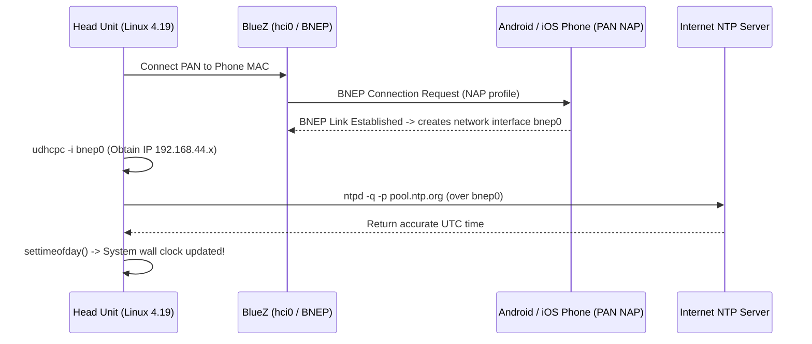

# Engineering Handoff: Realtek RTL8761B & BlueZ Subsystem on Linux 4.19

## Target Audience
This document is prepared for the **Kernel & Systems Engineer Agent** maintaining and compiling the **Linux 4.19** kernel tree for the **ARK1680 (ARM Cortex-A5)** head unit platform.

---

## 1. Hardware Topology & System Specs

| Parameter | Value / Implementation |
|---|---|
| **SoC** | ARK1680 (ARM Cortex-A5), Little Endian |
| **Kernel Target** | Linux 4.19.x LTS |
| **Bluetooth Module** | Feasycom BW121 |
| **Bluetooth Silicon** | **Realtek RTL8761BT** (Dual-mode Bluetooth 5.0 baseband) |
| **Serial Bus** | `/dev/ttyHS1` (`ark1680_hsuart`) |
| **UART Protocol** | **H5 (3-Wire UART)** with hardware RTS/CTS flow control |
| **Operating Baud Rate** | **1,500,000 baud (1.5 Mbps)** |
| **Hardware Reset Pin** | **GPIO 91** (`/sys/class/gpio/gpio91`) |
| **Firmware Blobs on Disk**| `/etc/rtl8761bt_fw` (43,980 bytes), `/etc/rtl8761bt_config` |

```
+───────────────────────────────────────────────────────────────────────────────────+
|                                HARDWARE TOPOLOGY                                  |
|                                                                                   |
|  [ ARK1680 SoC (ARM Cortex-A5, Linux 4.19) ]                                      |
|         │                                                                         |
|         ├── GPIO 91 (Output) ───────────────> [ Hardware Reset (Active Low) ]     |
|         └── /dev/ttyHS1 (ark1680_hsuart) ───> [ 1.5 Mbps 3-Wire UART (H5) ]       |
|                                                     │                             |
|                                                     ▼                             |
|                                     [ Realtek RTL8761BT Silicon ]                 |
|                                     [ Feasycom BW121 Module ]                     |
+───────────────────────────────────────────────────────────────────────────────────+
```

---

## 2. Kernel Source Analysis (`btrtl.c` vs `rtk_hciattach`)

### Why Stock Linux 4.19 `btrtl.c` Only Lists RTL8761A
* In mainline Linux, `drivers/bluetooth/btrtl.c` support for **RTL8761B** was upstreamed in **Linux 5.8** (Commit [`9d38f887b47b`](https://git.kernel.org/pub/scm/linux/kernel/git/torvalds/linux.git/commit/?id=9d38f887b47b): *"Bluetooth: btrtl: Add support for RTL8761B"*).
* Stock Linux 4.19 only contains tables for older chips (`RTL8723A/B/D`, `RTL8821A`, `RTL8822B`, `RTL8761A`).

### The Two Solutions for Linux 4.19

#### Approach A: User-Space Attachment via `radxa/rtkbt` (RECOMMENDED — Zero Kernel Driver Patches)
Realtek designed its embedded UART Bluetooth chips to be driven by a user-space patcher tool called **`rtk_hciattach`** (available open-source at [github.com/radxa/rtkbt](https://github.com/radxa/rtkbt) in the `uart/` directory).
1. `rtk_hciattach` opens `/dev/ttyHS1`, speaks Realtek vendor HCI commands over 3-Wire H5, uploads `/etc/rtl8761bt_fw`, switches the baud to 1.5 Mbps, and calls `ioctl(fd, HCIUARTSETPROTO, HCI_UART_3WIRE)`.
2. The standard Linux kernel H5 line discipline registers the interface as **`hci0`**.
3. **No patches to `drivers/bluetooth/btrtl.c` are required.**

#### Approach B: In-Kernel Driver Backport (Optional)
If you prefer in-kernel firmware loading:
1. Backport commit `9d38f887b47b` from Linux 5.8 into `drivers/bluetooth/btrtl.c` and `hci_h5.c`.
2. Place `/etc/rtl8761bt_fw` into `/lib/firmware/rtl_bt/rtl8761b_fw.bin` and config into `/lib/firmware/rtl_bt/rtl8761b_config.bin`.
3. **Important Note (Bazzite #3339 Bug):** Ensure the driver requests `rtl8761b_fw.bin` (UART version), **not** `rtl8761bu_fw.bin` (USB version). Loading the `bu` firmware causes L2CAP socket creation to fail with `br-connection-create-socket`.

---

## 3. Required Kernel Configuration (`.config`)

To support native BlueZ, Bluetooth PAN (internet routing), and external USB peripherals, ensure the following kernel symbols are enabled in the 4.19 `.config`:

```ini
# Core Bluetooth Subsystem
CONFIG_BT=y
CONFIG_BT_BREDR=y
CONFIG_BT_RFCOMM=y
CONFIG_BT_RFCOMM_TTY=y
CONFIG_BT_BNEP=y
CONFIG_BT_BNEP_MC_FILTER=y
CONFIG_BT_BNEP_PROTO_FILTER=y
CONFIG_BT_HIDP=y

# Bluetooth HCI Drivers
CONFIG_BT_HCIUART=y
CONFIG_BT_HCIUART_H4=y
CONFIG_BT_HCIUART_3WIRE=y
CONFIG_BT_HCIUART_RTL=y

# Networking & Bridging for Internet Tethering (PAN)
CONFIG_NET=y
CONFIG_INET=y
CONFIG_BRIDGE=y
CONFIG_VLAN_8021Q=y

# Optional USB Support (for USB RTC / USB GPS / USB LTE dongles)
CONFIG_USB_SERIAL=y
CONFIG_USB_SERIAL_GENERIC=y
CONFIG_USB_SERIAL_CP210X=y
CONFIG_USB_SERIAL_FTDI_SIO=y
CONFIG_USB_SERIAL_PL2303=y
CONFIG_USB_SERIAL_CH341=y
CONFIG_USB_ACM=y
```

---

## 4. Hardware Reset & BlueZ Startup Sequence

Before attaching `hci0` or loading firmware, the Realtek chip must undergo a clean hardware power cycle via GPIO 91.

### Initialization Script Flow

```sh
#!/bin/sh
set -e

# 1. Hardware reset RTL8761BT
if [ ! -d /sys/class/gpio/gpio91 ]; then
    echo 91 > /sys/class/gpio/export
fi
echo out > /sys/class/gpio/gpio91/direction
echo 0 > /sys/class/gpio/gpio91/value
usleep 100000   # 100ms low pulse
echo 1 > /sys/class/gpio/gpio91/value
usleep 200000   # 200ms stabilization delay

# 2. Ensure D-Bus system bus daemon is running
if ! pidof dbus-daemon >/dev/null; then
    mkdir -p /var/run/dbus
    dbus-daemon --system --fork
fi

# 3. Attach RTL8761BT to BlueZ HCI stack
# (rtk_hciattach compiled from radxa/rtkbt/uart)
rtk_hciattach -n -s 1500000 /dev/ttyHS1 rtk_h5 &

# 4. Wait for hci0 to appear and bring it up
TIMEOUT=10
while [ $TIMEOUT -gt 0 ]; do
    if hciconfig hci0 2>/dev/null | grep -q "UP"; then
        break
    fi
    if hciconfig hci0 2>/dev/null | grep -q "DOWN"; then
        hciconfig hci0 up
        break
    fi
    sleep 1
    TIMEOUT=$((TIMEOUT - 1))
done

# 5. Start BlueZ daemon
if ! pidof bluetoothd >/dev/null; then
    /usr/libexec/bluetooth/bluetoothd -n &
fi
```

---

## 5. Clock Synchronization & Internet Routing via Bluetooth PAN (BNEP)

With `CONFIG_BT_BNEP=y` and BlueZ running on `hci0`, the head unit can connect to the phone's **Bluetooth Tethering / Personal Area Network (PAN)**:



### Steps to Test:
1. Enable **Bluetooth Tethering** in phone Settings.
2. Pair with the phone: `bluetoothctl pair <PHONE_MAC>` and `bluetoothctl trust <PHONE_MAC>`.
3. Connect network: `bt-network -c <PHONE_MAC> nap` (or via D-Bus Network1 interface).
4. Run DHCP client: `udhcpc -i bnep0 -n -q`.
5. Sync time: `ntpd -n -q -p time.google.com` or `sntp -s 216.239.35.0`.

---

## 6. Mutual Exclusion with Stock `blueware`

* **Stock Mode**: `/usr/bin/blueware /etc/blueware-bw121.properties` opens `/dev/ttyHS1` and creates `/dev/bw_serial`.
* **BlueZ Mode**: `rtk_hciattach` opens `/dev/ttyHS1` and creates `hci0`.
* **Rule**: `/dev/ttyHS1` can only be opened by **one process at a time**. If switching between them, kill the active process, pulse GPIO 91 to clear the chip's internal SRAM, and start the desired stack.

---

## 7. Reference Links
* **Realtek Linux Bluetooth UART Driver & `rtk_hciattach` Source**: [radxa/rtkbt (GitHub)](https://github.com/radxa/rtkbt)
* **Linux Kernel Mainline Commit for RTL8761B**: [Commit 9d38f887b47b](https://git.kernel.org/pub/scm/linux/kernel/git/torvalds/linux.git/commit/?id=9d38f887b47b)
* **Firmware Mismatch Diagnostic (Bazzite #3339)**: [ublue-os/bazzite #3339](https://github.com/ublue-os/bazzite/issues/3339)
